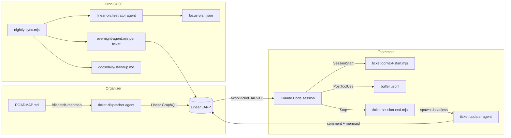

# Linear-Driven Team Workflow

Auto-loads when working in `ROADMAP.md`, `.claude/commands/dispatch-roadmap.md`, `scripts/linear/**`, `.claude/hooks/ticket-*`, `.claude/agents/ticket-*`, or `.claude/agents/linear-orchestrator.md`.

This rule explains the full loop between the roadmap, Linear, Claude Code hooks, and the nightly QA cron. If you are modifying any of those files, read this first.

## Goal

Brett is shifting from "primary developer" to "organizer + developer". `CLAUDE.md` is the source of truth for what the system is. `ROADMAP.md` is the source of truth for what is coming next and who is doing it. Linear is the timeline of what is happening _right now_. Hooks keep Linear fresh without anyone having to remember to update it.

## The loop



## Components

| Component | File | Role |
|-----------|------|------|
| Roadmap | `ROADMAP.md` | Hand-edited by Brett. One `### Feature:` block per future ticket. |
| Crew roster | `.claude/crew.json` | handle → Linear user id + `owns` categories. Fill via `node scripts/linear/list-crew.mjs`. |
| Dispatch command | `.claude/commands/dispatch-roadmap.md` | Slash command. Parses roadmap, runs dispatcher agent, shows preview, writes to Linear on approval. |
| Dispatcher agent | `.claude/agents/ticket-dispatcher.md` | Opus. Produces ticket drafts with embedded `## Claude Code Prompt` block. Never writes to Linear. |
| GraphQL client | `scripts/linear/graphql-client.mjs` | Shared Linear client used by hooks + scripts. Never throws — returns null on failure. |
| Token cost util | `scripts/linear/token-cost.mjs` | Parses Claude transcript, produces footer line for the Stop comment. |
| SessionStart hook | `.claude/hooks/ticket-context-start.mjs` | Parses branch, fetches ticket, seeds buffer + marker, emits scope + AC as `additionalContext`. |
| PostToolUse hook | `.claude/hooks/ticket-track-changes.mjs` | Appends compact tool-use events to the buffer. Debounced. No file contents. |
| Stop hook | `.claude/hooks/ticket-session-end.mjs` | Spawns `ticket-updater` headless with a payload JSON. Detached so Claude Code can exit. |
| Updater agent | `.claude/agents/ticket-updater.md` | Sonnet. Composes comment + mermaid + AC delta + token/cost footer. Posts via Linear MCP. |
| Pre-commit | `.claude/hooks/typecheck-pre-commit.js` | Blocks commits missing `(JAR-XX)` tag when branch is jar-*. Escape hatch: `SKIP_JAR_TAG=1`. |
| Nightly sync | `scripts/linear/nightly-sync.mjs` | Local cron entry point. Builds cross-ticket graph, invokes orchestrator, runs focused QA. |
| Orchestrator agent | `.claude/agents/linear-orchestrator.md` | Opus. Writes focus plan + daily-standup narrative. Never touches Linear directly. |
| Branch status | `scripts/linear/branch-status.mjs` | Pure-git helpers: ahead/behind, `git merge-tree` conflict probes, disposable worktrees. Used by the Stop hook and nightly. |

## Environment variables

- `LINEAR_API_KEY` — required for everything except the roadmap edit loop. Hooks silently no-op when unset.
- `LINEAR_TEAM_KEY` — optional override for the Linear team key (default `JAR`).
- `JARBLE_BASE_BRANCH` — base branch used for ahead/behind and conflict checks (default `develop`).
- `JARBLE_REMOTE` — git remote name (default `origin`).
- `SKIP_JAR_TAG=1` — bypass the pre-commit JAR-tag enforcement for a single commit.

## Per-branch QA & merge-conflict awareness

Each teammate runs Claude Code on their own fork/clone with their own GitHub auth. The runtime QA stack (`dev.jarble.ai`, `overnight-agent.mjs`) historically only tested `develop`, which meant a branch had to be merged before its behavior could be exercised. That is no longer required.

- **Session-end** (`ticket-session-end.mjs`) calls `branchHealth(HEAD)` from `branch-status.mjs` and stuffs `{ base, ahead, behind, conflictsWithBase, conflictFiles, needsRebase }` into the payload. The `ticket-updater` agent then renders a **Branch status** section on the Linear comment with an explicit rebase nudge when the branch is ≥ 20 behind or would conflict on merge.
- **Nightly** (`nightly-sync.mjs`):
  - Resolves each open ticket's remote branch via `git ls-remote --heads origin "*jar-N*"`.
  - Computes per-branch `ahead/behind` + conflict-with-base via `conflictsWithBase()`.
  - Computes pairwise conflicts between all open branches via `computePairConflicts()` → `conflictsBetween()` (O(N²) on small N).
  - Feeds both into `graph.json` so the orchestrator can narrate merge-conflict risk in `docs/daily-standup.md`.
  - For runtime QA, spins up a disposable `git worktree` at the ticket's branch via `createWorktree(ref)`, runs `npm run typecheck` + `pnpm run check` in it (5-minute timeout each), then disposes. Results attached to the Linear comment under `**Static QA (this branch, in worktree)**`.
  - Runtime QA still targets `dev.jarble.ai` (develop) because spinning up ephemeral prod-env per branch is out of scope. The per-ticket comment labels the two passes separately so a green runtime pass on a red static pass is not mistaken for approval.

`git merge-tree` is used in its modern form (`--write-tree --name-only --merge-base=X A B`) with a fallback to the legacy syntax + conflict-marker grep for older gits. Worktrees land in `<repo>/.worktrees/` (gitignored) and self-dispose; if one leaks, `git worktree prune` cleans it.

### Nightly CLI flags

| Flag | Default | Effect |
|------|---------|--------|
| `--dry-run` | off | Skip all Linear writes. |
| `--cycles <n>` | 1 | Runtime QA cycles per ticket. `0` = graph + standup only. |
| `--no-static-qa` | off | Skip the worktree typecheck pass (useful when the runner is slow). |
| `--max-tickets <n>` | 10 | Cap tickets processed in a single run. |
| `--states "a,b"` | `In Progress,In Review` | Linear states to include. |
| `--base <branch>` | `develop` (or `JARBLE_BASE_BRANCH`) | Base branch for ahead/behind + conflict checks. |
| `--verbose` | off | Stream orchestrator + subprocess stdio. |

## Cost distribution (why this shape)

Every teammate runs `claude -p --agent ticket-updater` from their own Stop hook on their own Claude Max subscription. That means:
- Dispatch (Brett's machine): one agent run per dispatch.
- Development: 0 extra Claude cost beyond what the teammate was already paying to run Claude Code.
- Nightly cron (Brett's machine): one `linear-orchestrator` pass + N `overnight-agent.mjs` runs. These live on Brett's subscription.

The token-cost footer on every session comment makes per-ticket spend visible so the team can later discuss rebalancing if one area of code is an unusually expensive to work on.

## Cron stanza

Install once, on the machine that runs the nightly sync (typically Brett's). Linux/macOS:

```cron
0 4 * * *  cd /absolute/path/to/jarble && LINEAR_API_KEY=lin_api_... node scripts/linear/nightly-sync.mjs >> scripts/linear/.nightly.log 2>&1
```

Windows Task Scheduler: create a daily task at 04:00 that runs `node C:\path\to\jarble\scripts\linear\nightly-sync.mjs` with working directory `C:\path\to\jarble` and `LINEAR_API_KEY` set in the task environment.

The log is per-machine and is not committed.

## Smoke test (run after any change to this loop)

1. Put one small feature in `ROADMAP.md`.
2. Run `/dispatch-roadmap` — confirm a JAR-XXX is created with the `## Claude Code Prompt` block.
3. Create a branch matching the ticket: `git checkout -b cleanup/jar-XXX-smoke`.
4. Open Claude Code. Confirm SessionStart injected the scope + AC. Make a trivial edit. Exit with `/quit`.
5. Confirm a rich comment appears on JAR-XXX within ~60s (mermaid, AC delta, token footer).
6. Run `node scripts/linear/nightly-sync.mjs --dry-run --cycles 0` — confirm `docs/daily-standup.md` is written.
7. Clean up the test ticket in Linear.

## Things to never change without reading this file

- The buffer path format `.claude/sessions/JAR-XX-<ts>.jsonl` is parsed by both hooks and the agent. Change all three together.
- The `## Claude Code Prompt` block name is required — `work-ticket` users grep for it.
- The branch regex `jar-\d+` is shared across `ticket-context-start.mjs`, `ticket-session-end.mjs`, and `typecheck-pre-commit.js`. Keep them in sync.
- The `branchStatus` payload shape (`{ base, ahead, behind, conflictsWithBase, conflictFiles, needsRebase }`) is produced by `branch-status.mjs:branchHealth` and consumed by both the `ticket-updater` agent's Branch status section and the orchestrator's merge-conflict narrative. Changing the shape requires updating all three.
- The `.worktrees/` directory name is gitignored and baked into `createWorktree()`. Do not rename without updating `.gitignore`.
- The nightly cron is local-only by design. Do not move it to GitHub Actions without making the subscription cost story explicit.
