# Jarble API Endpoints Reference

> Complete reference for every API endpoint in the Jarble platform. Covers all 45 tRPC procedures and 10 REST endpoints.

---

## Table of Contents

1. [Request Flow](#1-request-flow)
2. [Authentication](#2-authentication)
3. [Rate Limiting](#3-rate-limiting)
4. [tRPC Procedures](#4-trpc-procedures)
   - [User Router](#user-router-5-procedures)
   - [Deployment Router](#deployment-router-18-procedures)
   - [OpenRouter Router](#openrouter-router-8-procedures)
   - [Billing Router](#billing-router-3-procedures)
   - [Platform Credentials Router](#platform-credentials-router-6-procedures)
   - [Runtime Catalog Router](#runtime-catalog-router-4-procedures)
   - [Template Router](#template-router-1-procedure)
5. [REST Endpoints](#5-rest-endpoints)
   - [Webhooks](#webhooks)
   - [Payment Routes](#payment-routes)
   - [SSE Streaming](#sse-streaming)
   - [Health & Debug](#health--debug)
6. [Summary Table](#6-summary-table)

---

## 1. Request Flow

Every request passes through the following middleware chain:

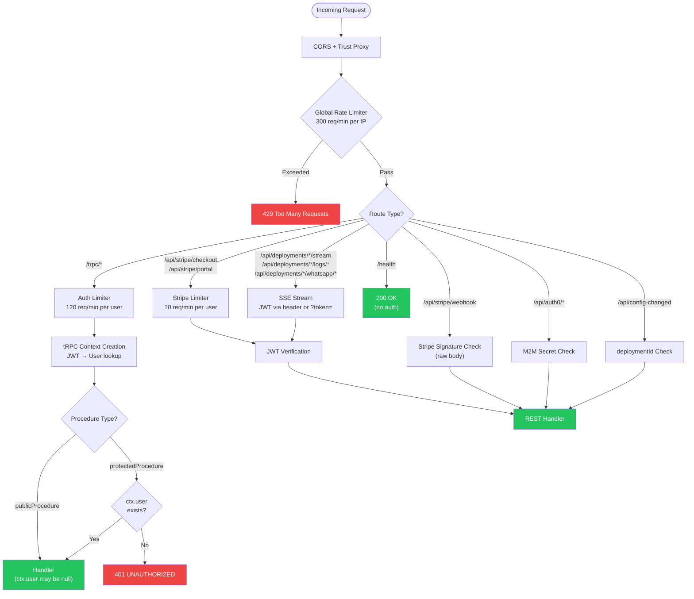

---

## 2. Authentication

### JWT Verification Flow

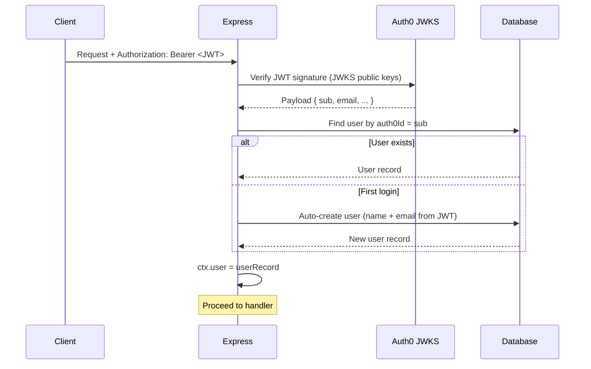

### Auth Methods by Endpoint Type

| Endpoint Type | Auth Method | Where Token Lives |
|---|---|---|
| tRPC procedures | JWT Bearer token | `Authorization` header |
| SSE streams | JWT token | `Authorization` header OR `?token=` query param |
| Stripe webhook | Stripe signature | `stripe-signature` header |
| Auth0 webhook | M2M shared secret | `Authorization: Bearer <M2M_SECRET>` |
| Config changed | Deployment ID | Request body (pod-only) |
| Health check | None | N/A |

---

## 3. Rate Limiting

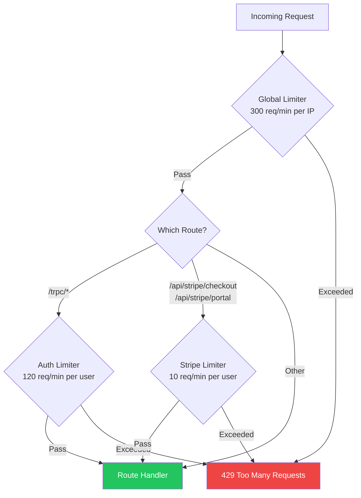

| Limiter | Scope | Limit | Key | Exempt Routes |
|---------|-------|-------|-----|---------------|
| `globalLimiter` | All traffic | 300/min | Client IP | `/health`, `/api/stripe/webhook`, `/api/auth0/email-verified` |
| `authLimiter` | tRPC endpoints | 120/min | User ID (JWT `sub`) | -- |
| `stripeActionLimiter` | Payment actions | 10/min | User ID (JWT `sub`) | -- |

**User identification:** The rate limiter extracts the `sub` claim from the JWT by base64url-decoding the payload. Falls back to client IP if no token present.

**Response headers:** All limiters use `standardHeaders: "draft-7"` (`RateLimit-Limit`, `RateLimit-Remaining`, `RateLimit-Reset`).

---

## 4. tRPC Procedures

All tRPC endpoints are at `/trpc/<router>.<procedure>`. Types flow automatically to the frontend via `@trpc/react-query`.

### Router Architecture

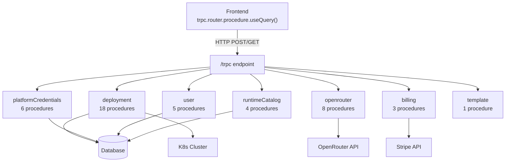

---

### User Router (5 procedures)

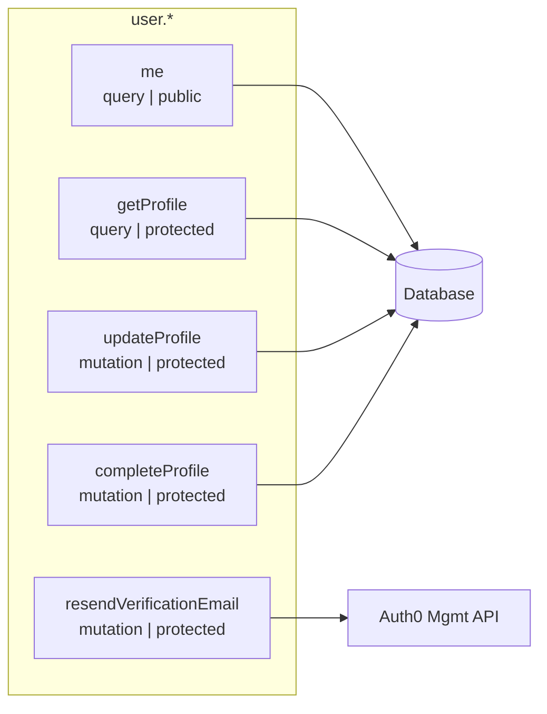

| Procedure | Type | Auth | Input | Description |
|---|---|---|---|---|
| `user.me` | query | public | -- | Returns current user from context (null if unauthenticated) |
| `user.getProfile` | query | protected | -- | Full user profile from DB |
| `user.updateProfile` | mutation | protected | `{ name?: string, email?: string }` | Update name and/or email |
| `user.completeProfile` | mutation | protected | `{ firstName: string, lastName: string }` | Set name after email verification (email auth flow) |
| `user.resendVerificationEmail` | mutation | protected | -- | Resend Auth0 verification email. Errors if already verified |

---

### Deployment Router (18 procedures)

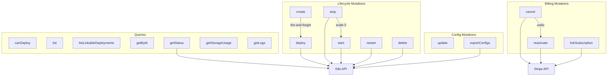

| Procedure | Type | Input | Description |
|---|---|---|---|
| `deployment.canDeploy` | query | -- | Check free tier status (`freeUsed`, `freeExpired`, `freeExpiresAt`) |
| `deployment.list` | query | -- | All user deployments, newest first, with runtime catalog data |
| `deployment.listLinkableDeployments` | query | -- | Deployments eligible as credit pool owners (included mode, not linked) |
| `deployment.getById` | query | `{ id }` | Single deployment with ownership check |
| `deployment.getStatus` | query | `{ id }` | Live pod status from K8s (running/failed/pending/creating/not_found) |
| `deployment.getStorageUsage` | query | `{ id }` | Live storage usage via `df` in pod (`usedGb`, `allocatedGb`) |
| `deployment.getLogs` | query | `{ id, tailLines?: 1-5000 }` | Pod logs snapshot (non-streaming, default 200 lines) |
| `deployment.create` | mutation | See below | Create DB record + optional LLM key provisioning. Does NOT deploy |
| `deployment.deploy` | mutation | `deploymentId` | Trigger K8s deployment (fire-and-forget). Creates PVC + Secret + Deployment |
| `deployment.update` | mutation | `{ id, name?, systemPrompt?, llmMode?, llmProvider?, llmModel?, llmApiKey?, ... }` | Update settings. Syncs config to PVC if running |
| `deployment.stop` | mutation | `{ id }` | Scale K8s replicas to 0. PVC preserved |
| `deployment.start` | mutation | `{ id }` | Scale K8s replicas to 1 (fire-and-forget) |
| `deployment.restart` | mutation | `{ id }` | Delete pod + reschedule (fire-and-forget) |
| `deployment.cancel` | mutation | `{ id }` | Cancel Stripe subscription at period end |
| `deployment.reactivate` | mutation | `{ id }` | Remove `cancel_at_period_end` flag on Stripe |
| `deployment.linkSubscription` | mutation | `{ deploymentId }` | Link pending/unlinked Stripe subscription to deployment |
| `deployment.exportConfigs` | mutation | `{ id }` | Export PVC config files as base64-encoded ZIP |
| `deployment.delete` | mutation | `{ id }` | Delete deployment + all K8s resources. Blocks if credit pool owner with children |

#### `deployment.create` Input Schema

```typescript
{
  name: string                           // required, min 1 char
  runtimeCatalogId: number               // required
  platform?: string
  image?: string                         // custom Docker image
  llmMode?: "included" | "byok"          // default: "byok"
  llmProvider?: "openrouter" | "openai" | "anthropic" | "google"
  llmModel?: string                      // e.g., "anthropic/claude-sonnet-4-20250514"
  llmApiKey?: string                     // required if llmMode="byok"
  systemPrompt?: string
  creditLimitDollars?: number            // 1-1000, included mode only
  linkToDeploymentId?: string            // link to existing credit pool
  cpuLimit?: string                      // e.g., "2.0"
  memoryMb?: number                      // RAM in MB
  storageMb?: number                     // storage in MB
}
```

---

### OpenRouter Router (8 procedures)

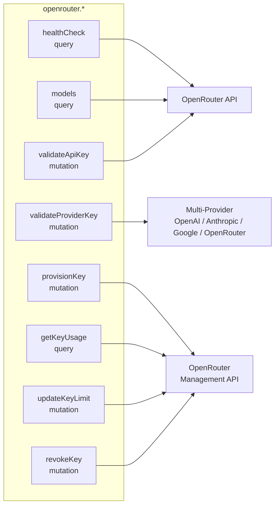

| Procedure | Type | Input | Description |
|---|---|---|---|
| `openrouter.healthCheck` | query | -- | Test OpenRouter connectivity using server API key |
| `openrouter.models` | query | -- | List all available models from OpenRouter |
| `openrouter.validateApiKey` | mutation | `{ apiKey }` | Validate an OpenRouter key (legacy) |
| `openrouter.validateProviderKey` | mutation | `{ provider, apiKey }` | Multi-provider key validation (OpenAI, Anthropic, Google, OpenRouter) |
| `openrouter.provisionKey` | mutation | `{ deploymentId, limitDollars? }` | Provision tenant API key via Management API. Encrypts + stores |
| `openrouter.getKeyUsage` | query | `{ deploymentId }` | Credit usage for "included" mode deployments. Resolves to owner if linked |
| `openrouter.updateKeyLimit` | mutation | `{ deploymentId, limitDollars: 1-1000 }` | Update monthly credit cap. Must be owner (not linked) |
| `openrouter.revokeKey` | mutation | `{ deploymentId }` | Disable tenant key, clear from DB, switch to BYOK mode |

---

### Billing Router (3 procedures)

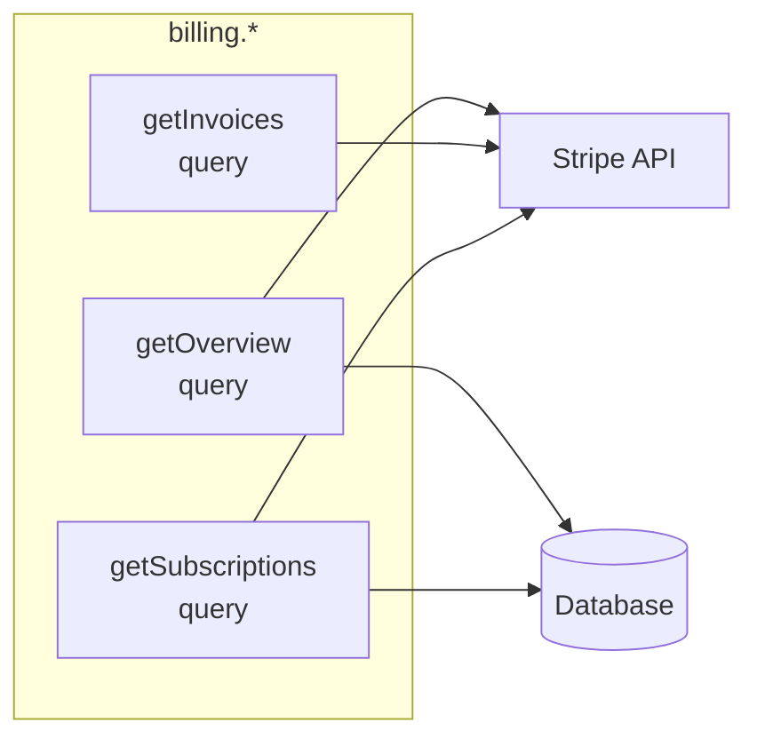

| Procedure | Type | Input | Description |
|---|---|---|---|
| `billing.getOverview` | query | -- | Billing summary: total monthly spend, active subs count, next billing date, payment method last4 |
| `billing.getInvoices` | query | -- | All Stripe invoices (id, date, amount, status, PDF URL) |
| `billing.getSubscriptions` | query | -- | Subscription details per deployment (Stripe status, billing period, cancellation info) |

#### `billing.getOverview` Output

```typescript
{
  totalMonthlyCents: number         // sum of all paid deployments
  activeSubscriptionCount: number
  nextBillingDate: string | null    // ISO date from first active subscription
  paymentMethodLast4: string | null // card last 4 digits
}
```

---

### Platform Credentials Router (6 procedures)

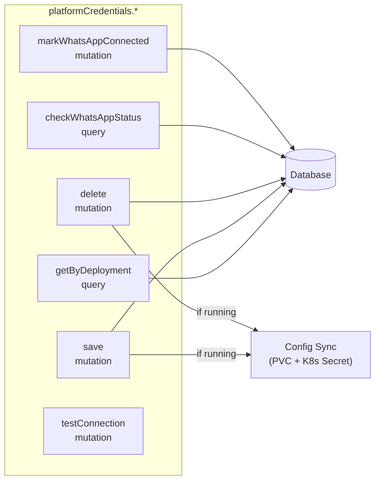

| Procedure | Type | Input | Description |
|---|---|---|---|
| `platformCredentials.getByDeployment` | query | `{ deploymentId }` | List credentials with masked values (first4 + last4 visible) |
| `platformCredentials.save` | mutation | `{ deploymentId, platformId, credentials }` | Upsert encrypted credentials. Syncs to PVC if running |
| `platformCredentials.delete` | mutation | `{ deploymentId, platformId }` | Delete credentials. Syncs to PVC if running |
| `platformCredentials.checkWhatsAppStatus` | query | `{ deploymentId }` | Check if WhatsApp is connected (DB row exists) |
| `platformCredentials.markWhatsAppConnected` | mutation | `{ deploymentId }` | Mark WhatsApp connected (called by QR SSE endpoint) |
| `platformCredentials.testConnection` | mutation | `{ deploymentId, platformId, credentials }` | Validate credential format (required fields present) |

#### Supported Platforms

| Platform | Credential Fields | K8s Env Vars |
|---|---|---|
| Discord | `botToken` | `DISCORD_BOT_TOKEN` |
| Telegram | `botToken` | `TELEGRAM_BOT_TOKEN` |
| Slack | `botToken`, `appToken` | `SLACK_BOT_TOKEN`, `SLACK_APP_TOKEN` |
| WhatsApp | (QR pairing) | -- |
| Teams | `appId`, `appPassword` | `TEAMS_APP_ID`, `TEAMS_APP_PASSWORD` |
| Messenger | `pageAccessToken`, `verifyToken` | `MESSENGER_PAGE_ACCESS_TOKEN`, `MESSENGER_VERIFY_TOKEN` |
| Web | `allowedDomains` | -- |

---

### Runtime Catalog Router (4 procedures)

| Procedure | Type | Auth | Input | Description |
|---|---|---|---|---|
| `runtimeCatalog.list` | query | public | -- | All active runtimes (OpenClaw, ZeroClaw, etc.) |
| `runtimeCatalog.getById` | query | public | `{ id: number }` | Single runtime by catalog ID |
| `runtimeCatalog.getBySlug` | query | public | `{ slug }` | Single runtime by slug (e.g., "openclaw") |
| `runtimeCatalog.getCapabilities` | query | public | `{ slug }` | Runtime capabilities + config files from handler registry |

---

### Template Router (1 procedure)

| Procedure | Type | Auth | Input | Description |
|---|---|---|---|---|
| `template.list` | query | public | -- | Hardcoded bot templates (personal, business, support) |

---

## 5. REST Endpoints

REST endpoints handle use cases that don't fit tRPC: webhooks (external POST), SSE streaming (long-lived connections), and file uploads.

### Webhooks

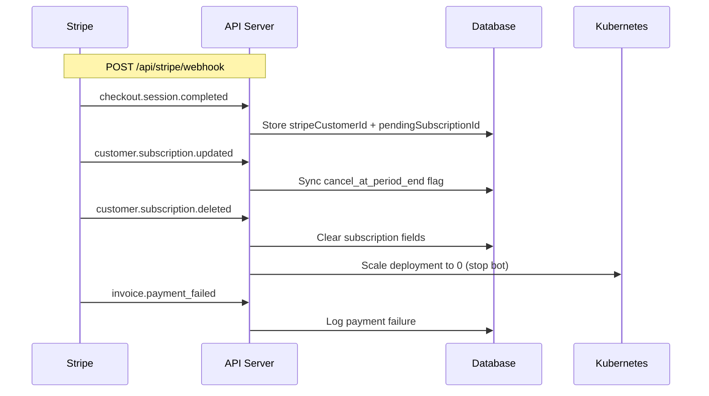

| Method | Path | Auth | Rate Limit | Description |
|---|---|---|---|---|
| POST | `/api/stripe/webhook` | Stripe signature (`stripe-signature` header) | Exempt | Handles 4 event types: `checkout.session.completed`, `customer.subscription.updated`, `customer.subscription.deleted`, `invoice.payment_failed` |
| POST | `/api/auth0/email-verified` | M2M Bearer secret (`AUTH0_M2M_SECRET`) | Exempt | Auth0 Post Login Action webhook. Updates `emailVerified` flag in DB |
| POST | `/api/config-changed` | deploymentId in body | Global | Called by pod file-watcher when PVC config files change. Triggers reverse sync (PVC → DB) |

---

### Payment Routes

| Method | Path | Auth | Rate Limit | Description |
|---|---|---|---|---|
| POST | `/api/stripe/checkout` | JWT Bearer | 10 req/min per user | Creates Stripe checkout session. Returns checkout URL or portal redirect flag |
| POST | `/api/stripe/portal` | JWT Bearer | 10 req/min per user | Creates Stripe billing portal session for subscription management |

---

### SSE Streaming

All SSE endpoints accept JWT via `Authorization` header **or** `?token=` query parameter (EventSource can't set headers).

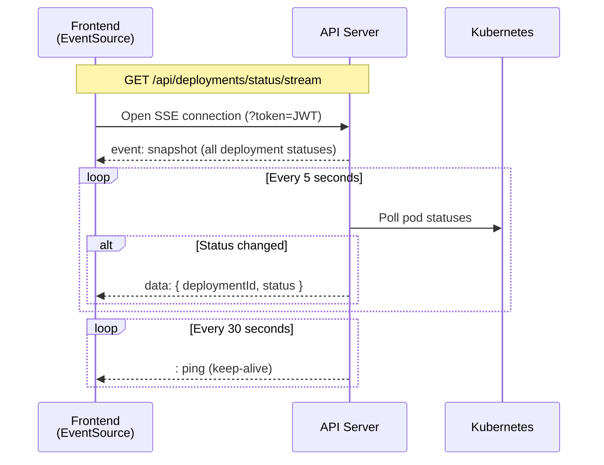

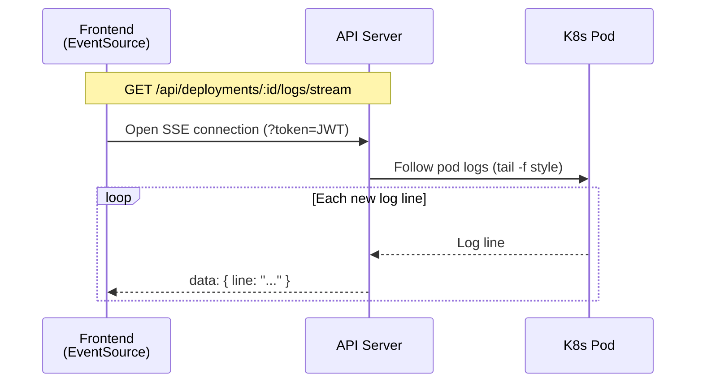

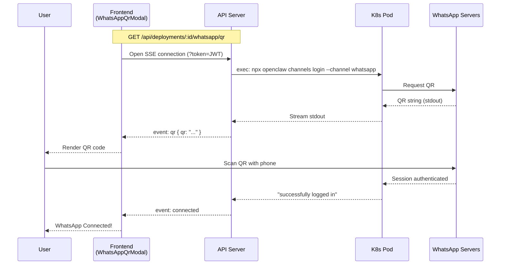

| Method | Path | Auth | Events | Description |
|---|---|---|---|---|
| GET | `/api/deployments/status/stream` | JWT (header or `?token=`) | `snapshot`, delta `data`, `: ping` | Real-time status for all user deployments. Polls K8s every 5s, sends deltas |
| GET | `/api/deployments/:id/logs/stream` | JWT (header or `?token=`) | `data` (log lines), `end`, `error`, `: ping` | Live pod log streaming. `?tailLines=` (default 100, max 1000) |
| GET | `/api/deployments/:id/whatsapp/qr` | JWT (header or `?token=`) | `qr`, `connected`, `log`, `timeout`, `error`, `: ping` | WhatsApp QR pairing via K8s exec. 90-second timeout |

---

### Health & Debug

| Method | Path | Auth | Description |
|---|---|---|---|
| GET | `/health` | None | K8s liveness/readiness probe. Returns `{ status: "ok", timestamp }` |
| GET | `/debug/db` | None | **Dev only** (`NODE_ENV=development`). Dumps all DB tables |

---

## 6. Summary Table

| Category | Count | Auth | Rate Limit | Streaming |
|----------|-------|------|-----------|-----------|
| tRPC Queries | 17 | public/protected | 120 req/min | No |
| tRPC Mutations | 28 | protected | 120 req/min | No |
| REST Webhooks | 3 | signature/M2M/deploymentId | global/exempt | No |
| REST Payment | 2 | JWT Bearer | 10 req/min | No |
| SSE Streams | 3 | JWT (header or query) | 120 req/min | Yes |
| Health/Debug | 2 | none | exempt | No |
| **Total** | **55** | -- | -- | -- |

### Quick Reference by Router

| Router | Queries | Mutations | Total |
|--------|---------|-----------|-------|
| `deployment` | 7 | 11 | 18 |
| `openrouter` | 3 | 5 | 8 |
| `user` | 2 | 3 | 5 |
| `runtimeCatalog` | 4 | 0 | 4 |
| `billing` | 3 | 0 | 3 |
| `platformCredentials` | 2 | 4 | 6 |
| `template` | 1 | 0 | 1 |
| **tRPC Total** | **22** | **23** | **45** |
| REST endpoints | -- | -- | **10** |
| **Grand Total** | -- | -- | **55** |

### Key Files

| File | What It Contains |
|---|---|
| `jarble-api-main/src/index.ts` | Express server, REST endpoints, SSE streams, webhooks |
| `jarble-api-main/src/trpc/index.ts` | tRPC router composition (merges all routers) |
| `jarble-api-main/src/trpc/middleware.ts` | `publicProcedure`, `protectedProcedure` definitions |
| `jarble-api-main/src/middleware/rateLimit.ts` | Three-tier rate limiting configuration |
| `jarble-api-main/src/services/auth.ts` | Auth0 JWT verification + user provisioning |
| `jarble-api-main/src/services/stripe.ts` | Stripe checkout, portal, subscriptions |
| `jarble-api-main/src/trpc/routers/deployment.ts` | 18 procedures (CRUD, lifecycle, billing) |
| `jarble-api-main/src/trpc/routers/openrouter.ts` | 8 procedures (LLM key management) |
| `jarble-api-main/src/trpc/routers/user.ts` | 5 procedures (profile, email verification) |
| `jarble-api-main/src/trpc/routers/billing.ts` | 3 procedures (overview, invoices, subscriptions) |
| `jarble-api-main/src/trpc/routers/platformCredentials.ts` | 6 procedures (credential CRUD, WhatsApp QR) |
| `jarble-api-main/src/trpc/routers/runtimeCatalog.ts` | 4 procedures (runtime listing) |
| `jarble-api-main/src/trpc/routers/template.ts` | 1 procedure (bot templates) |
