# Jarble Platform Architecture

> **Last Updated:** February 2026
> Monorepo: `jarble-api-main` (Express/tRPC API) + `Jarble-mvp` (Next.js frontend)

---

## 1. High-Level System Overview

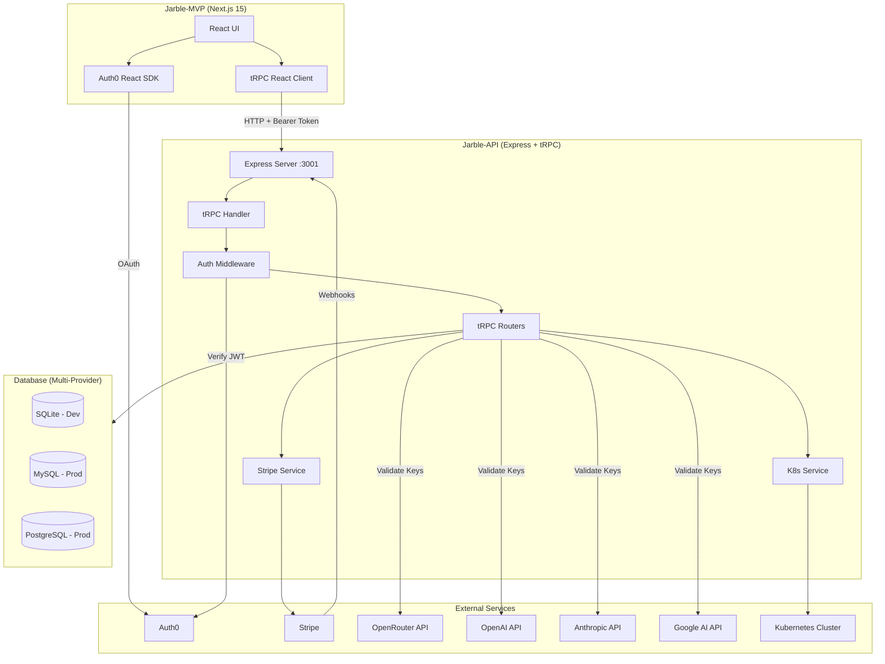

---

## 2. Monorepo Structure

```
develop-monorepo/
├── jarble-api-main/                # Express + tRPC backend
│   └── src/
│       ├── index.ts                # Server entry (Express, CORS, Stripe, tRPC)
│       ├── db/
│       │   ├── index.ts            # Multi-DB client factory + table exports
│       │   ├── init.ts             # SQLite DDL + seed data
│       │   ├── schema.sqlite.ts    # SQLite schema (dev)
│       │   ├── schema.ts           # MySQL schema (prod)
│       │   └── schema.pg.ts        # PostgreSQL schema (prod)
│       ├── trpc/
│       │   ├── index.ts            # Router composition + AppRouter type
│       │   ├── context.ts          # Request context (user + db)
│       │   ├── middleware.ts        # public / protectedProcedure
│       │   └── routers/
│       │       ├── deployment.ts    # Deployment CRUD + K8s + auto-provision
│       │       ├── user.ts          # User profile
│       │       ├── runtimeCatalog.ts# Runtime catalog queries
│       │       ├── openrouter.ts    # Multi-provider validation + provisioning
│       │       └── template.ts      # Bot templates
│       ├── k8s/
│       │   └── deployment.ts       # K8s lifecycle (PVC, Secret, Deployment)
│       ├── services/
│       │   ├── auth.ts             # Auth0 JWT verify + user upsert
│       │   └── stripe.ts           # Stripe webhook handling
│       └── utils/
│           ├── env.ts              # Zod env validation
│           └── logger.ts           # Pino logger
│
├── Jarble-mvp/                     # Next.js 15 frontend
│   ├── app/                        # App Router pages
│   │   ├── layout.tsx / providers.tsx
│   │   ├── page.tsx                # Landing (/)
│   │   ├── dashboard/page.tsx      # Dashboard (/dashboard)
│   │   ├── pricing/page.tsx        # Pricing (/pricing)
│   │   ├── onboarding/[id]/page.tsx# Wizard (/onboarding/new)
│   │   └── d/[id]/configure/page.tsx
│   ├── views/
│   │   ├── OnboardingWizard.tsx    # Dynamic step wizard
│   │   ├── Dashboard.tsx           # Deployment grid
│   │   ├── Pricing.tsx             # Runtime catalog + LLM pricing
│   │   ├── DeploymentConfiguration.tsx
│   │   ├── onboarding/
│   │   │   └── wizardStepConfig.ts # Step configs, provider defs
│   │   └── deployment-config/
│   │       ├── GeneralTab.tsx
│   │       ├── ModelTab.tsx
│   │       ├── PlatformsTab.tsx
│   │       ├── SkillsTab.tsx
│   │       └── AdvancedTab.tsx
│   ├── components/
│   │   ├── ui/                     # 70+ shadcn/ui components
│   │   ├── auth/                   # Auth0Provider, LoginButton
│   │   └── WizardLoader.tsx        # Animated deploy loader
│   └── lib/
│       └── trpc.ts                 # tRPC React client
│
└── ARCHITECTURE.md                 # ← This file
```

---

## 3. Database Schema (Entity Relationship)

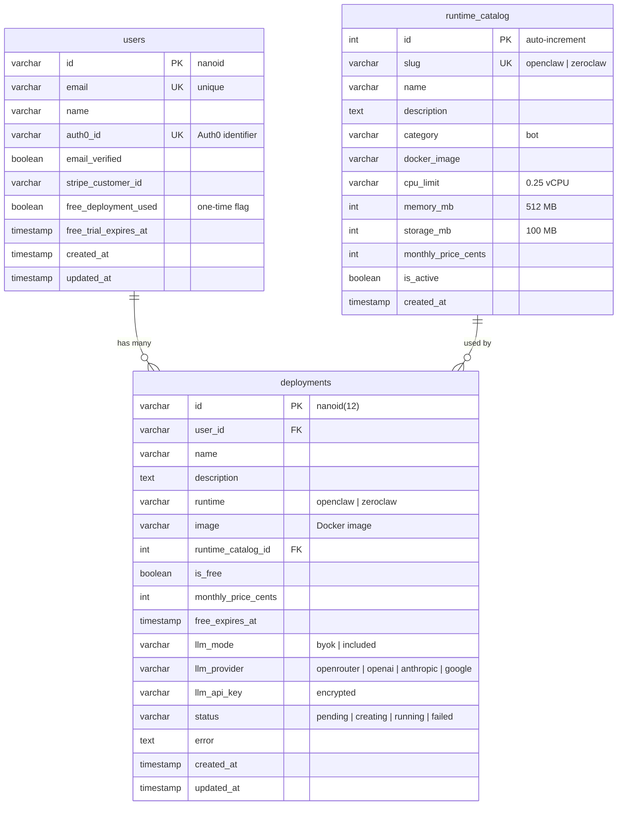

---

## 4. tRPC Router Architecture

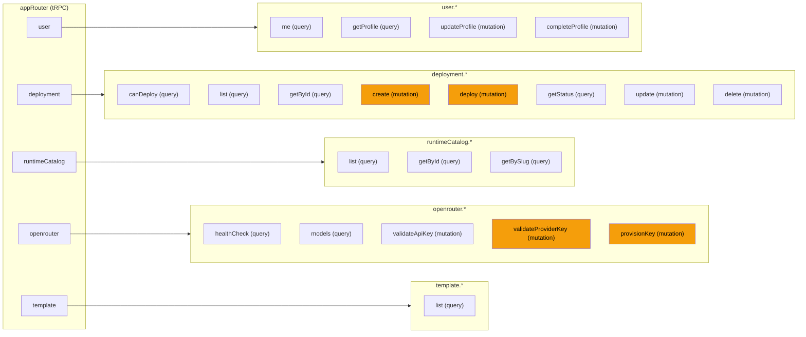

---

## 5. Authentication Flow

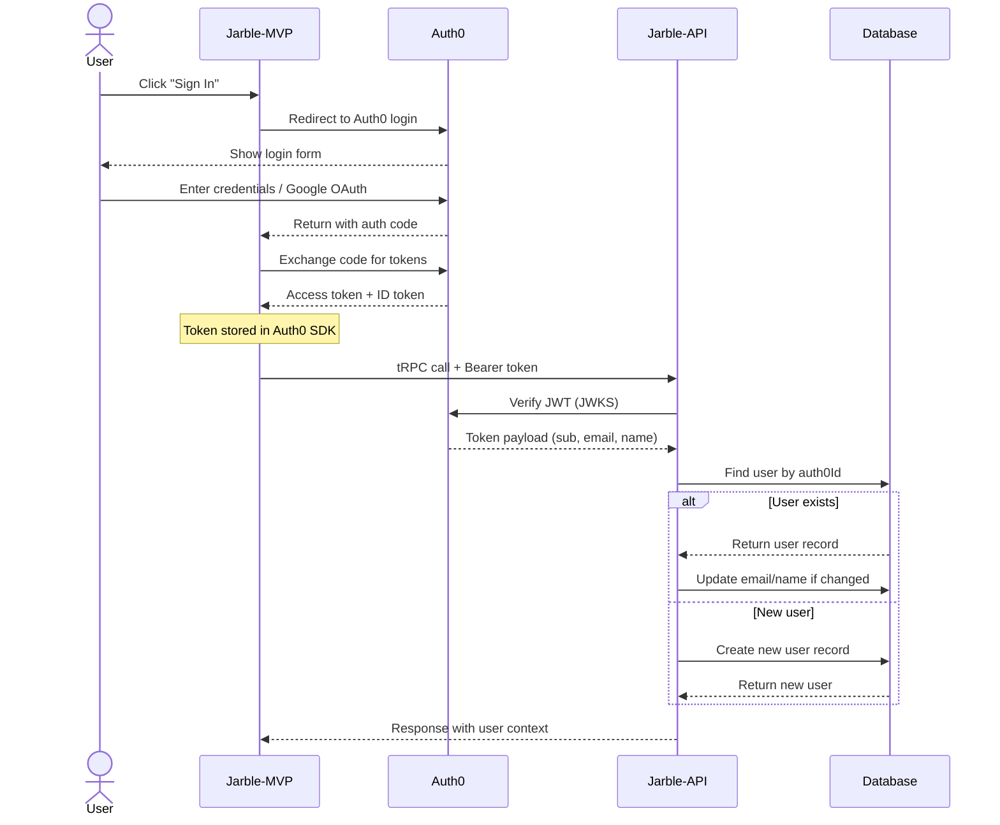

---

## 6. Deployment Creation Flow

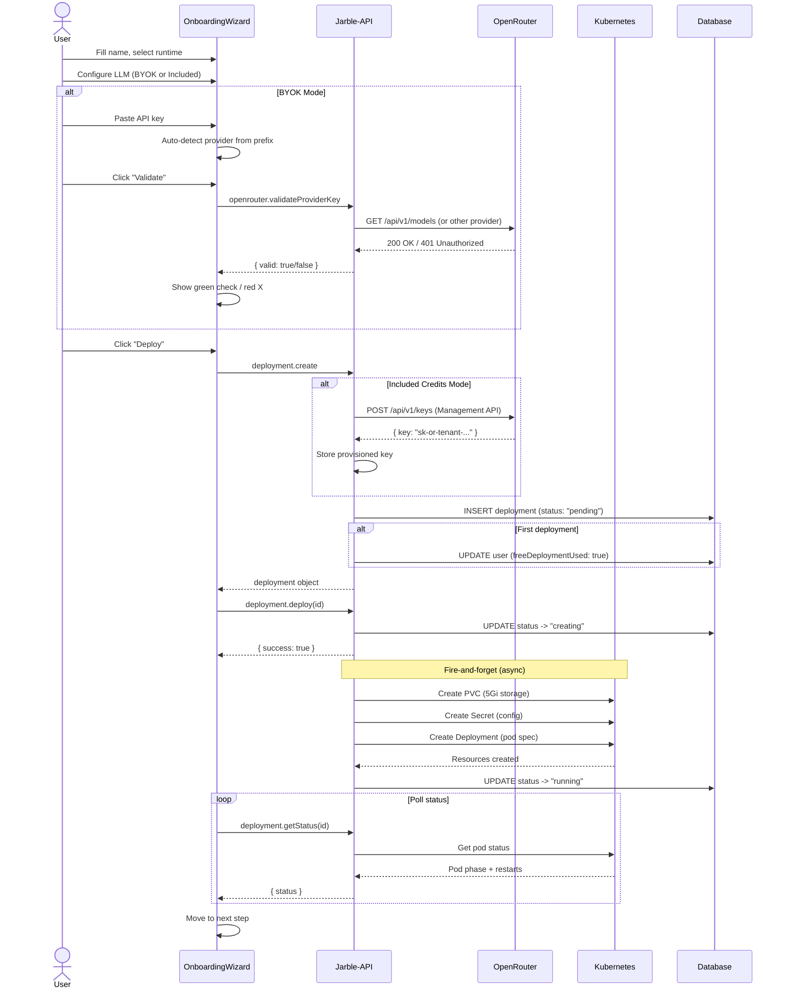

---

## 7. Dynamic Wizard Step System

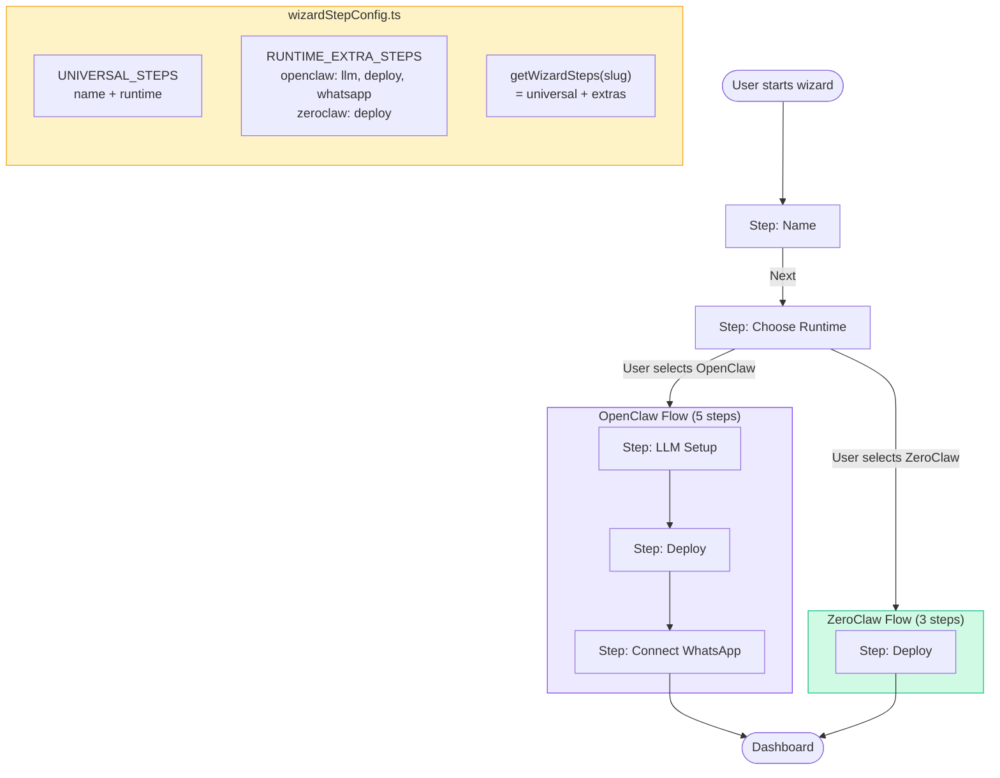

---

## 8. LLM Provider Key Auto-Detection

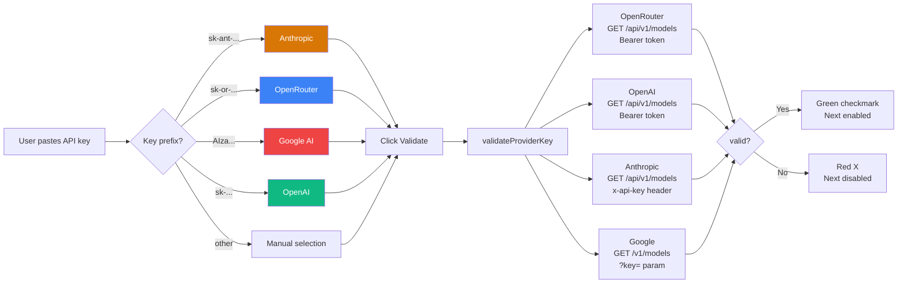

---

## 9. Kubernetes Deployment Lifecycle

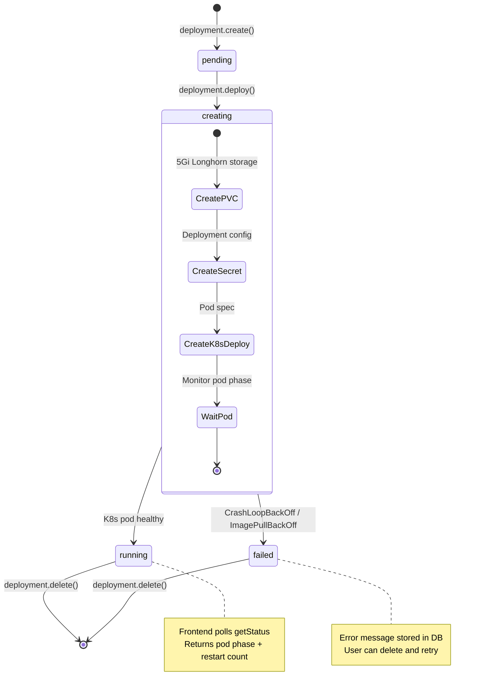

---

## 10. Frontend Page & Component Tree

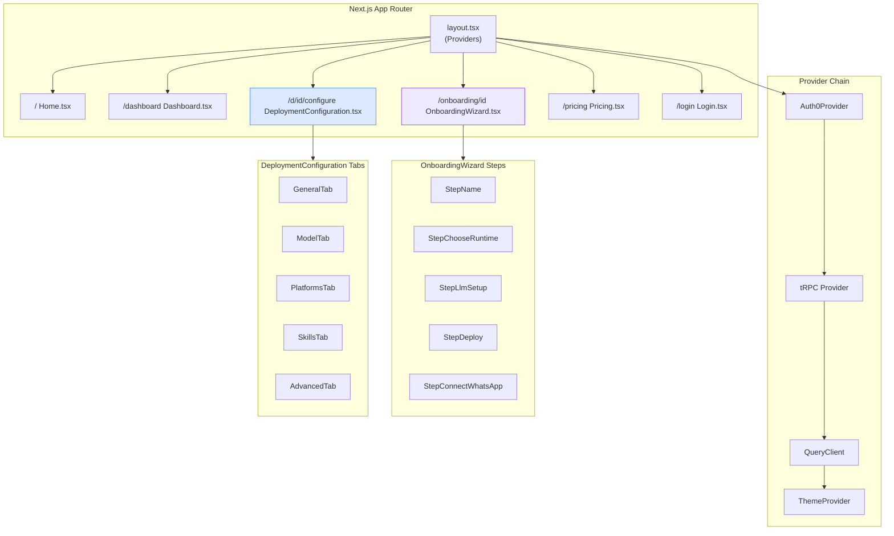

---

## 11. Stripe Payment Flow

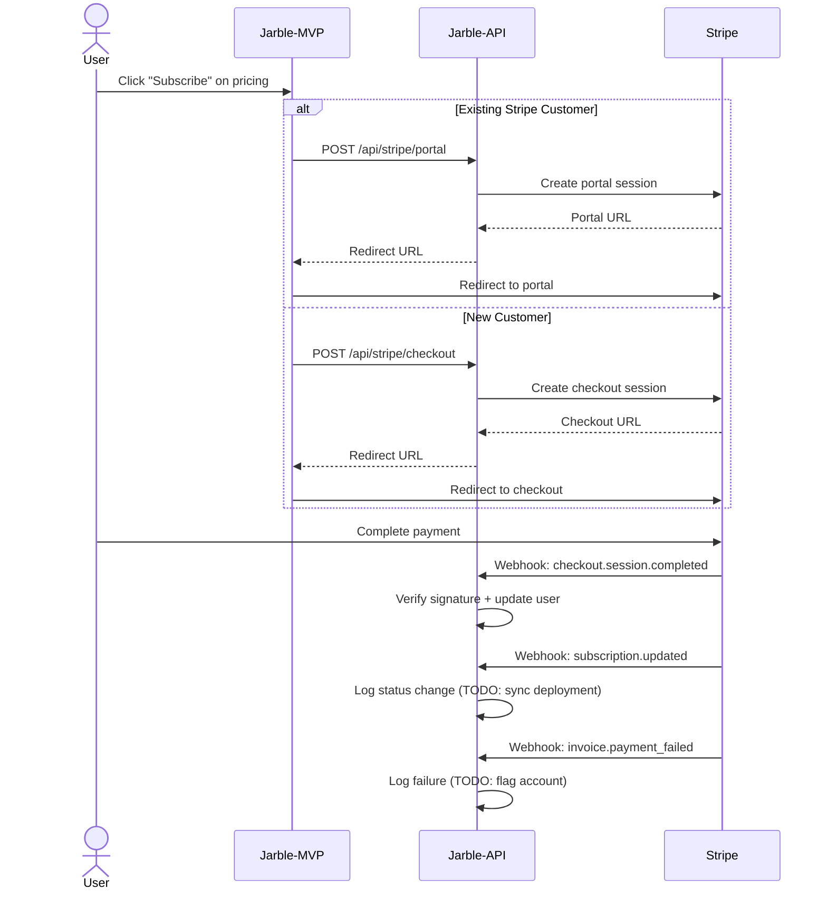

---

## 12. Multi-Database Provider Strategy

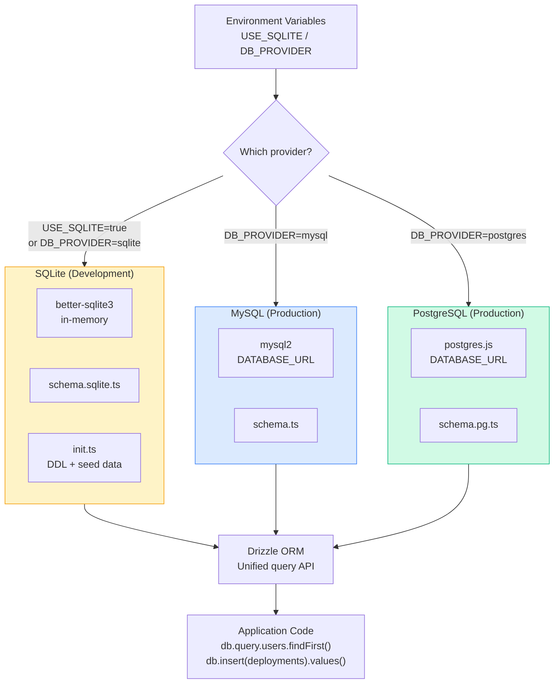

---

## 13. Express Server Route Map

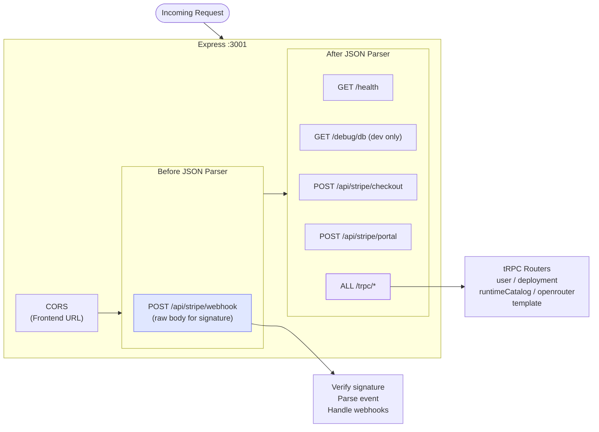

---

## 14. OpenRouter Tenant Key Provisioning (Included Credits)

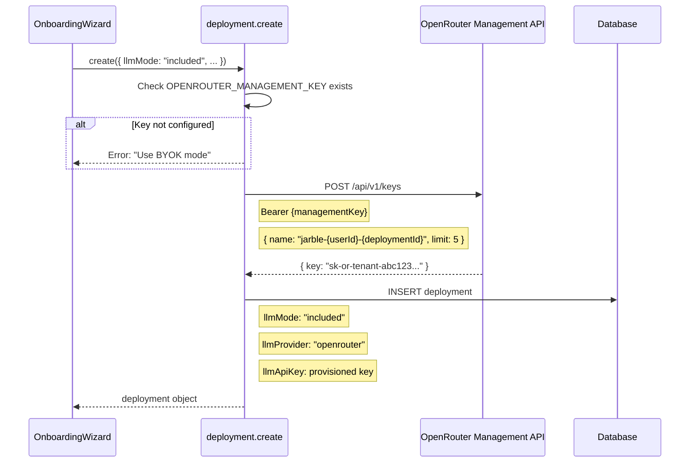

---

## 15. Free Trial Logic

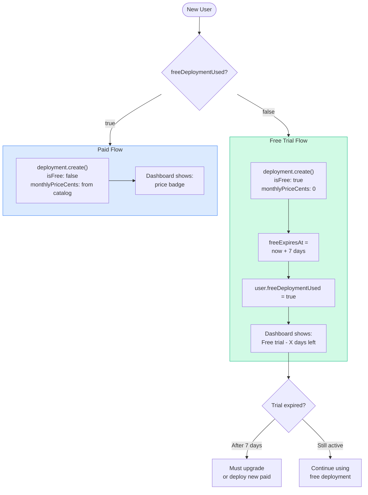

---

## 16. Tech Stack

### Backend (`jarble-api-main`)

| Layer | Technology |
|-------|-----------|
| Runtime | Node.js 20 |
| Framework | Express 4 |
| API Layer | tRPC 11 (SuperJSON) |
| ORM | Drizzle ORM |
| Database | MySQL / PostgreSQL (prod) / SQLite (dev) |
| Auth | Auth0 + jose (JWT) |
| K8s Client | @kubernetes/client-node |
| Validation | Zod 3 |
| Logging | Pino |

### Frontend (`Jarble-mvp`)

| Layer | Technology |
|-------|-----------|
| Framework | Next.js 15 (App Router) |
| UI | React 19 + Tailwind CSS 4 + shadcn/ui |
| State | React Query 5 (via tRPC) |
| Auth | @auth0/auth0-react |
| Icons | Lucide React |
| Toasts | Sonner |

### Infrastructure

| Component | Technology |
|-----------|-----------|
| Frontend | Vercel |
| API | K3s on Hetzner |
| Database | AWS RDS (MySQL) |
| Storage | Longhorn |
| Ingress | Traefik |
| Auth | Auth0 |
| LLM | OpenRouter (+ OpenAI, Anthropic, Google via BYOK) |
| Billing | Stripe |
