# Jarble Platform Architecture

> **Last Updated:** February 2025
> Current state of the monorepo: `jarble-api-main` (Express/tRPC API) + `Jarble-mvp` (Next.js frontend)

---

## Table of Contents

1. [High-Level Architecture](#1-high-level-architecture)
2. [Monorepo Structure](#2-monorepo-structure)
3. [System Architecture Diagram](#3-system-architecture-diagram)
4. [API Architecture](#4-api-architecture)
5. [Database Schema](#5-database-schema)
6. [tRPC API Surface](#6-trpc-api-surface)
7. [Kubernetes Deployment Layer](#7-kubernetes-deployment-layer)
8. [Authentication Flow](#8-authentication-flow)
9. [Frontend Architecture](#9-frontend-architecture)
10. [User Flows](#10-user-flows)
11. [Configuration & Environment](#11-configuration--environment)
12. [Tech Stack Summary](#12-tech-stack-summary)

---

## 1. High-Level Architecture

Jarble is a platform for deploying containerized AI workloads (currently OpenClaw, extensible to other runtimes) with a no-code onboarding experience. Users create "deployments" that run as Kubernetes pods on a K3s cluster. OpenClaw is initially configured with WhatsApp as its user interface (as a starting point), but the platform is designed to support additional interfaces in the future.

```
Production Stack:
  Frontend:  Next.js 15 on Vercel
  API:       Express + tRPC on K3s (Hetzner)
  Database:  AWS RDS (MySQL) | In-memory SQLite (dev)
  Compute:   K3s pods (Hetzner) with Longhorn storage
  Auth:      Auth0 (JWT)
  External:  OpenRouter (LLM), Stripe (billing)
```

---

## 2. Monorepo Structure

```
develop-monorepo/
├── jarble-api-main/             # Express + tRPC backend
│   ├── src/
│   │   ├── index.ts             # Server entry (Express, CORS, tRPC handler)
│   │   ├── db/
│   │   │   ├── schema.ts        # MySQL schema (Drizzle ORM)
│   │   │   ├── schema.sqlite.ts # SQLite schema (dev mirror)
│   │   │   ├── index.ts         # DB client factory + table exports
│   │   │   └── init.ts          # SQLite table creation + seed data
│   │   ├── trpc/
│   │   │   ├── index.ts         # Router composition + AppRouter type export
│   │   │   ├── context.ts       # Request context (user + db)
│   │   │   ├── middleware.ts     # publicProcedure / protectedProcedure
│   │   │   └── routers/
│   │   │       ├── deployment.ts # Deployment CRUD + K8s operations
│   │   │       ├── user.ts      # User profile
│   │   │       ├── tier.ts      # Subscription tiers
│   │   │       ├── template.ts  # Hardcoded bot templates
│   │   │       └── openrouter.ts# OpenRouter health/models/validate
│   │   ├── k8s/
│   │   │   └── deployment.ts    # K8s client (PVC, Secret, Deployment CRUD)
│   │   ├── services/
│   │   │   └── auth.ts          # Auth0 JWT verification + user upsert
│   │   └── utils/
│   │       ├── env.ts           # Zod env validation
│   │       └── logger.ts        # Pino logger
│   ├── k8s/
│   │   └── deployment.yaml      # K8s manifests for the API pod itself
│   ├── Dockerfile
│   ├── package.json
│   └── tsconfig.json
│
├── Jarble-mvp/                  # Next.js 15 frontend
│   ├── app/                     # App Router pages
│   │   ├── layout.tsx           # Root layout (fonts, meta, providers)
│   │   ├── providers.tsx        # Auth0 → tRPC → Theme → Error Boundary
│   │   ├── globals.css          # Tailwind v4 theme + CSS variables
│   │   ├── page.tsx             # Landing page (/)
│   │   ├── login/page.tsx       # Auth0 login (/login)
│   │   ├── dashboard/page.tsx   # Dashboard (/dashboard)
│   │   ├── pricing/page.tsx     # Pricing (/pricing)
│   │   ├── about/page.tsx       # About (/about)
│   │   ├── onboarding/
│   │   │   └── [id]/page.tsx    # Wizard (/onboarding/[id])
│   │   └── d/[id]/
│   │       └── configure/page.tsx # Config (/d/[id]/configure)
│   ├── views/                   # Page-level view components
│   │   ├── Home.tsx             # Landing page content
│   │   ├── Login.tsx            # Login view
│   │   ├── Dashboard.tsx        # Deployment list + management
│   │   ├── OnboardingWizard.tsx # 4-step deployment creation
│   │   ├── DeploymentConfiguration.tsx # Config hub (5 tabs)
│   │   ├── Pricing.tsx          # Pricing tiers
│   │   ├── About.tsx            # About page
│   │   └── deployment-config/   # Configuration tab components
│   │       ├── types.ts         # DeploymentFormData, Tab types, platform configs
│   │       ├── GeneralTab.tsx   # Name, description, system prompt
│   │       ├── ModelTab.tsx     # Provider, model, temperature, max tokens
│   │       ├── PlatformsTab.tsx # Platform integrations + credential modal
│   │       ├── SkillsTab.tsx    # Pre-built skill toggles
│   │       └── AdvancedTab.tsx  # Rate limits, webhooks, deployment info
│   ├── components/              # Shared components
│   │   ├── ui/                  # 50+ shadcn/ui components
│   │   ├── auth/                # Auth0Provider, LoginButton, LogoutButton
│   │   ├── WizardLoader.tsx     # Animated deployment loader
│   │   ├── ErrorBoundary.tsx    # Error boundary
│   │   └── ...                  # IntegrationsMarquee, DevNav, etc.
│   ├── lib/
│   │   ├── trpc.ts              # tRPC React client (imports AppRouter from API)
│   │   ├── utils.ts             # cn() helper
│   │   └── platformConfigs.ts   # Platform credential schemas + validation
│   ├── contexts/
│   │   └── ThemeContext.tsx      # Light/dark theme provider
│   ├── hooks/
│   │   └── useMobile.tsx        # Breakpoint detection (768px)
│   ├── package.json
│   └── tsconfig.json
│
├── ARCHITECTURE.md              # ← This file
└── MIGRATION_PLAN.md            # Future 7-table schema migration plan
```

---

## 3. System Architecture Diagram

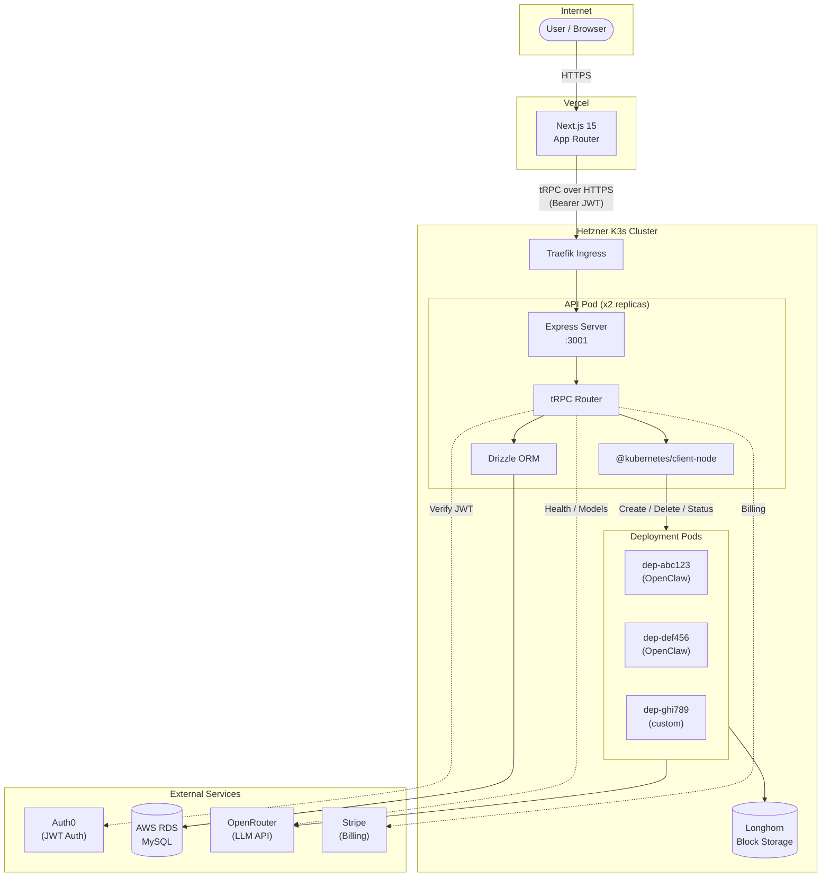

---

## 4. API Architecture

### Request Lifecycle

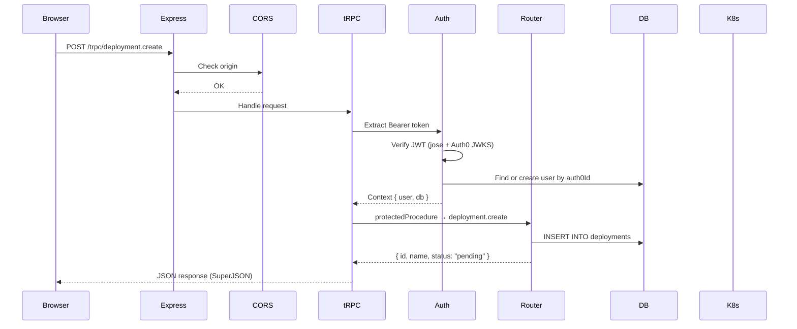

### Express Server Configuration

| Setting | Value |
|---------|-------|
| Port | `env.PORT` (default 3001) |
| CORS | Dynamic origin check (frontend URL + localhost variants) |
| Body Parser | `express.json()` |
| tRPC Adapter | `createExpressMiddleware` at `/trpc` |
| Health Check | `GET /health` → `{ status: "ok", timestamp }` |
| Debug (dev) | `GET /debug/db` → dumps all tables |

### Middleware Stack

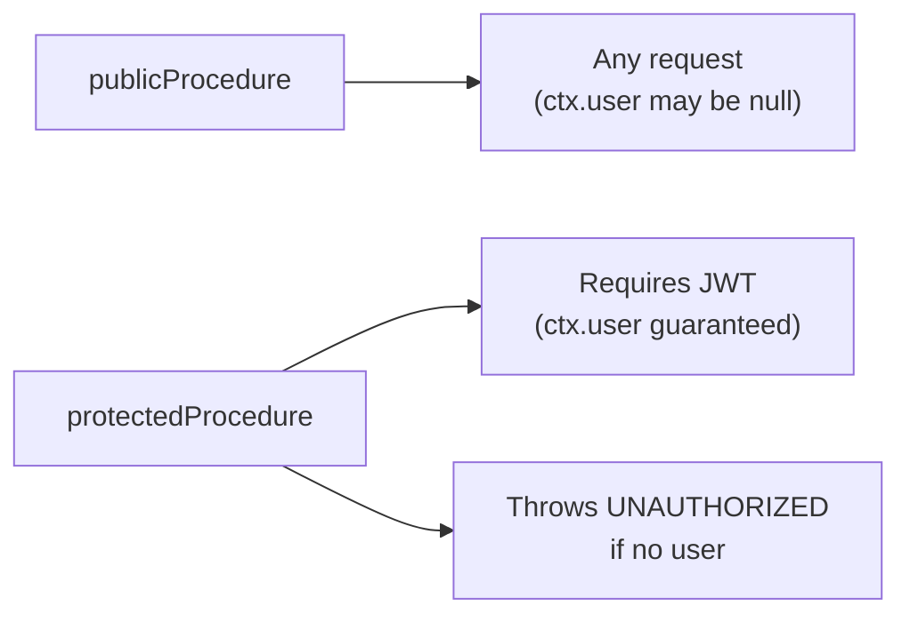

---

## 5. Database Schema

### Entity Relationship Diagram

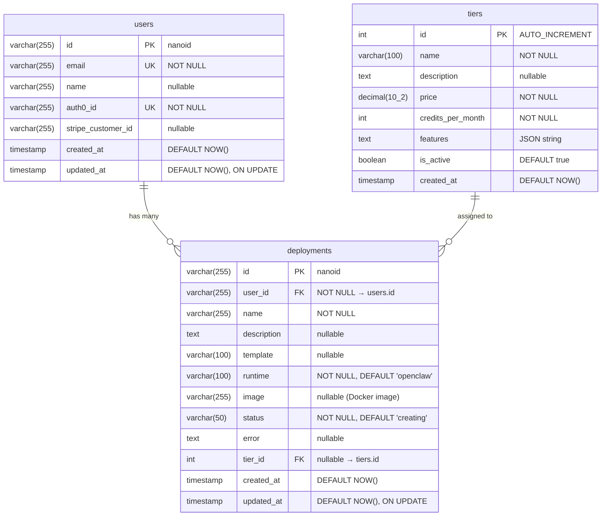

### Deployment Status Values

```
pending → creating → running
                  ↘ failed
```

| Status | Meaning |
|--------|---------|
| `pending` | DB record created, not yet deployed to K8s |
| `creating` | K8s deployment in progress |
| `running` | Pod is healthy and serving |
| `failed` | K8s deployment or pod crashed |

### Dual-Database Strategy

| Mode | Database | Driver | Use Case |
|------|----------|--------|----------|
| Production | AWS RDS MySQL | `mysql2` + Drizzle | Real data |
| Development | In-memory SQLite | `better-sqlite3` + Drizzle | `USE_SQLITE=true` |

Both schemas are kept in sync. `db/index.ts` exports a unified `tables` object and `db` client regardless of which backend is active.

### Seed Data (SQLite dev mode)

| Table | Records |
|-------|---------|
| tiers | Free ($0, 1k credits), Pro ($19, 10k), Agency ($99, 100k) |
| users | test@jarble.ai (auth0\|test123) |
| deployments | "My First Deployment" (running, openclaw) |

---

## 6. tRPC API Surface

### Router Map

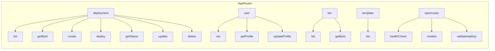

### Deployment Router (Protected)

| Procedure | Type | Input | Output | Side Effects |
|-----------|------|-------|--------|-------------|
| `list` | query | — | `Deployment[]` | — |
| `getById` | query | `{ id }` | `Deployment \| undefined` | — |
| `create` | mutation | `{ name, template?, platform?, runtime?, image? }` | `Deployment` | INSERT into DB |
| `deploy` | mutation | `deploymentId` (string) | `{ success, deploymentId }` | Creates K8s PVC + Secret + Deployment (fire-and-forget) |
| `getStatus` | query | `{ id }` | `{ status, phase?, restarts?, error? }` | Queries K8s pod status |
| `update` | mutation | `{ id, name?, description? }` | `Deployment` | UPDATE in DB |
| `delete` | mutation | `{ id }` | `{ success }` | Deletes K8s resources + DB record |

### User Router

| Procedure | Type | Auth | Input | Output |
|-----------|------|------|-------|--------|
| `me` | query | public | — | `User \| null` |
| `getProfile` | query | protected | — | `User` |
| `updateProfile` | mutation | protected | `{ name?, email? }` | `User` |

### Tier Router (Public)

| Procedure | Type | Input | Output |
|-----------|------|-------|--------|
| `list` | query | — | `Tier[]` (sorted by price) |
| `getById` | query | `{ id }` | `Tier \| undefined` |

### Template Router (Public)

| Procedure | Type | Output |
|-----------|------|--------|
| `list` | query | 3 hardcoded templates: Personal Assistant, Business Helper, Support Agent |

### OpenRouter Router (Protected)

| Procedure | Type | Input | Output |
|-----------|------|-------|--------|
| `healthCheck` | query | — | `{ ok, status?, error? }` |
| `models` | query | — | Model list from OpenRouter API |
| `validateApiKey` | mutation | `{ apiKey }` | `{ valid }` |

---

## 7. Kubernetes Deployment Layer

### Resources Created Per Deployment

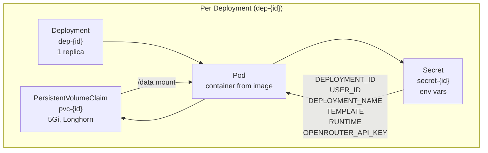

### Resource Configuration

| Resource | Name Pattern | Details |
|----------|-------------|---------|
| PVC | `pvc-{deploymentId}` | 5Gi, ReadWriteOnce, storageClass: longhorn |
| Secret | `secret-{deploymentId}` | 6 env vars (deployment ID, user ID, name, template, runtime, API key) |
| Deployment | `dep-{deploymentId}` | 1 replica, labels: `jarble.ai/deployment-id` |
| Container | — | Image: `config.image \|\| DEFAULT_IMAGE`, requests: 500m/2Gi, limits: 1000m/4Gi |

### K8s Functions

```
createDeployment(deploymentId, userId, config)
  → Creates PVC → Secret → Deployment

deleteDeployment(deploymentId)
  → Deletes Deployment → Secret → PVC (ignores 404s)

getDeploymentPodStatus(deploymentId)
  → Queries pods by label → Returns { status, phase, restarts, error }
```

### Pod Status Determination

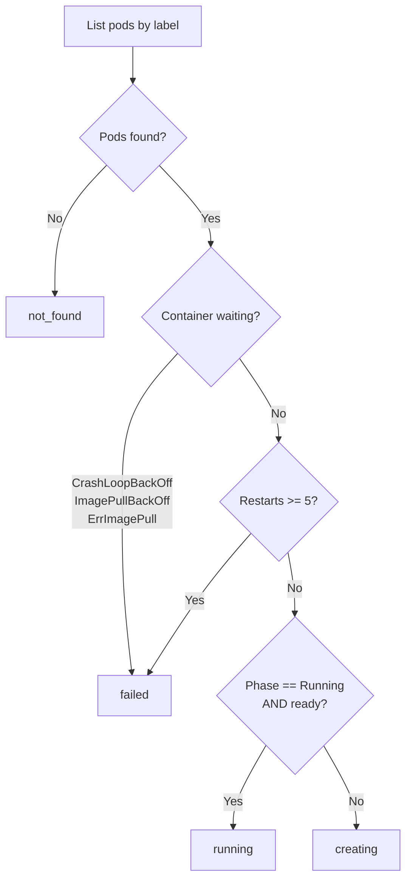

---

## 8. Authentication Flow

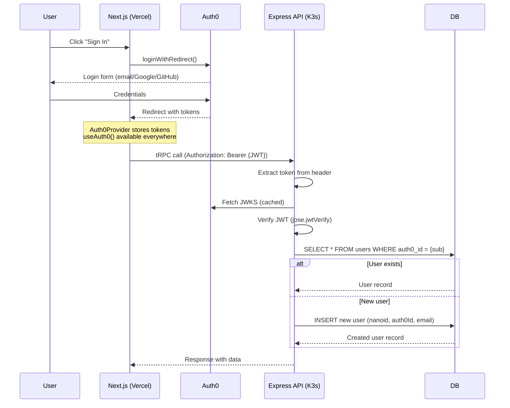

### Provider Stack (Frontend)

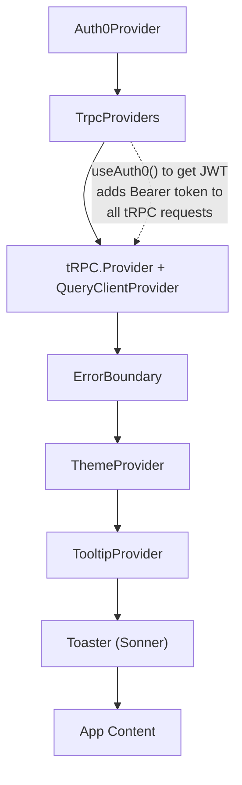

---

## 9. Frontend Architecture

### Route Map

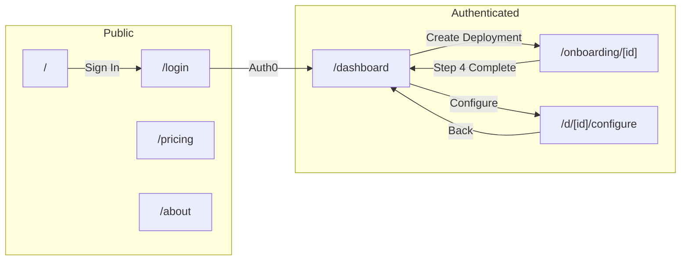

### Page Components

| Route | View Component | Key Features |
|-------|---------------|--------------|
| `/` | `Home.tsx` | Hero, integration marquee (20+ platforms), features grid |
| `/login` | `Login.tsx` | Auth0 login (email, Google, GitHub) |
| `/dashboard` | `Dashboard.tsx` | Deployment grid, status badges, create/delete |
| `/onboarding/[id]` | `OnboardingWizard.tsx` | 4-step wizard (Name → Runtime → Deploy → Connect) |
| `/d/[id]/configure` | `DeploymentConfiguration.tsx` | 5-tab config (General, Model, Platforms, Skills, Advanced) |
| `/pricing` | `Pricing.tsx` | 4 tiers (Bronze/Silver/Gold/Platinum), monthly/annual toggle |
| `/about` | `About.tsx` | Mission, problem/solution, team |

### Configuration Tabs

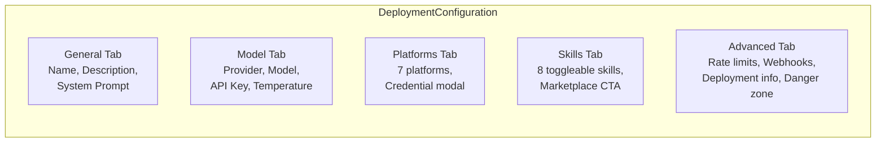

### Supported Platforms (PlatformsTab)

| Platform | Credential Fields | Docs |
|----------|------------------|------|
| Discord | Bot Token, App ID, Server IDs | discord.com/developers |
| Slack | Bot Token, Signing Secret, App-Level Token | api.slack.com |
| Telegram | Bot Token, Webhook Secret | core.telegram.org/bots |
| WhatsApp | (QR code pairing) | Initial UI for OpenClaw deployments; more interfaces planned |
| Web Chat | Allowed Domains, Primary Color, Welcome Message | — |
| Microsoft Teams | App ID, App Password, Tenant ID | learn.microsoft.com |
| Facebook Messenger | Page Access Token, Verify Token, App Secret | developers.facebook.com |

### Available AI Models (ModelTab)

| Provider | Models |
|----------|--------|
| Jarble Managed | Auto (Recommended) |
| Anthropic | Claude Opus 4.5, Claude Sonnet 4, Claude Haiku |
| OpenAI | GPT-4o, GPT-4 Turbo, GPT-3.5 Turbo |
| Google | Gemini 2.0 Pro, Gemini 2.0 Flash |

### Pre-Built Skills (SkillsTab)

Customer Support, FAQ Bot, Ticket Creation, Appointment Booking, Lead Qualification, Order Tracking, Product Recommendations, Sentiment Analysis

---

## 10. User Flows

### Deployment Creation Flow

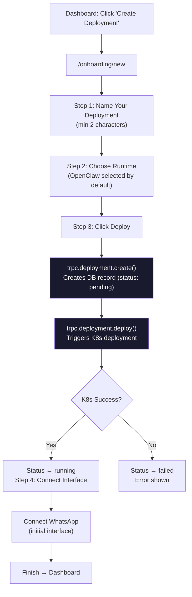

### Deployment Configuration Flow

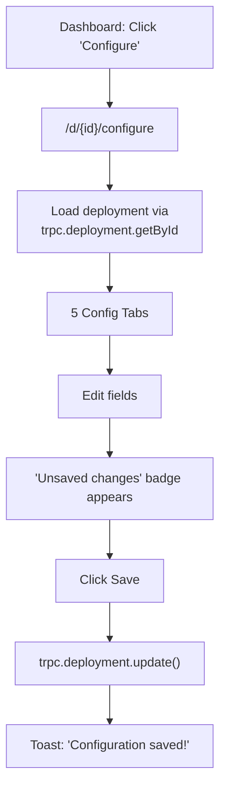

### K8s Deployment Lifecycle

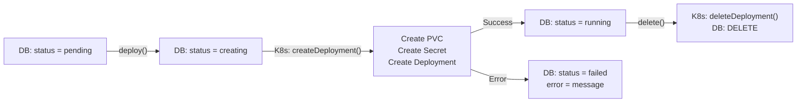

---

## 11. Configuration & Environment

### API Environment Variables

| Variable | Required | Default | Description |
|----------|----------|---------|-------------|
| `PORT` | No | `3001` | Server port |
| `NODE_ENV` | No | `development` | Environment mode |
| `FRONTEND_URL` | No | `http://localhost:3000` | CORS origin |
| `USE_SQLITE` | No | — | `"true"` for in-memory SQLite |
| `DATABASE_URL` | Conditional | — | MySQL connection (required if not SQLite) |
| `AUTH0_DOMAIN` | No | `test.auth0.com` | Auth0 tenant domain |
| `AUTH0_AUDIENCE` | No | `https://api.jarble.ai` | Auth0 API audience |
| `OPENROUTER_API_KEY` | No | `sk-test-key` | OpenRouter API key |
| `STRIPE_SECRET_KEY` | No | — | Stripe secret key |
| `STRIPE_WEBHOOK_SECRET` | No | — | Stripe webhook signing secret |

### Frontend Environment Variables

| Variable | Default | Description |
|----------|---------|-------------|
| `NEXT_PUBLIC_API_URL` | `http://localhost:3001` | API base URL |
| `NEXT_PUBLIC_AUTH0_DOMAIN` | `jarble-dev.us.auth0.com` | Auth0 domain |
| `NEXT_PUBLIC_AUTH0_CLIENT_ID` | — | Auth0 client ID |
| `NEXT_PUBLIC_AUTH0_AUDIENCE` | `https://api.jarble.ai` | Auth0 audience |

### K8s API Pod Manifest

| Setting | Value |
|---------|-------|
| Replicas | 2 |
| CPU | 250m request / 500m limit |
| Memory | 256Mi request / 512Mi limit |
| Health | Liveness: `GET /health` (30s), Readiness: `GET /health` (10s) |
| Ingress | `api.jarble.ai` via Traefik with TLS |
| RBAC | Pods, Secrets, PVCs, Deployments (CRUD in `jarble` namespace) |

### K8s Deployment Pod Resources

| Setting | Value |
|---------|-------|
| Replicas | 1 per deployment |
| CPU | 500m request / 1000m limit |
| Memory | 2Gi request / 4Gi limit |
| Storage | 5Gi PVC (Longhorn, ReadWriteOnce) |
| Image | `config.image` or `jarble/bot-base:latest` |

---

## 12. Tech Stack Summary

### Backend (`jarble-api-main`)

| Layer | Technology |
|-------|-----------|
| Runtime | Node.js 20 (Alpine) |
| Framework | Express 4 |
| API Layer | tRPC 11 (SuperJSON transformer) |
| ORM | Drizzle ORM 0.45 |
| Database | MySQL 8 or PostgreSQL (production) / SQLite (dev) |
| Auth | Auth0 + jose (JWT verification) |
| K8s Client | @kubernetes/client-node 0.20 |
| Validation | Zod 3 |
| Logging | Pino 8 |
| Language | TypeScript 5.3 (strict mode) |

### Frontend (`Jarble-mvp`)

| Layer | Technology |
|-------|-----------|
| Framework | Next.js 15.3 (App Router) |
| Language | TypeScript 5.9 (strict mode) |
| UI | React 19 |
| Styling | Tailwind CSS 4 + shadcn/ui (New York style) |
| Animation | Framer Motion 12 |
| State | React Query 5 (via tRPC) |
| API Client | tRPC React Query 11 |
| Auth | @auth0/auth0-react 2 |
| Forms | React Hook Form 7 + Zod 4 |
| Icons | Lucide React |
| Toasts | Sonner 2 |
| Charts | Recharts 2 |

### Infrastructure

| Component | Technology |
|-----------|-----------|
| Frontend Hosting | Vercel |
| API Hosting | K3s on Hetzner VPS |
| Database | AWS RDS (MySQL) |
| Storage | Longhorn (distributed block storage) |
| Ingress | Traefik |
| Auth | Auth0 |
| LLM | OpenRouter |
| Billing | Stripe |
| Container Registry | Docker Hub (`jarble/*`) |

---

## Pricing Tiers (Frontend)

| Tier | Monthly | Annual | Connections | Skills | Requests/mo |
|------|---------|--------|-------------|--------|-------------|
| Bronze | Free | Free | 2 | 5 | 1,000 |
| Silver | $19.99 | $159.92 | 5 | 15 | 10,000 |
| Gold | $49.99 | $399.92 | 15 | 50 | 100,000 |
| Platinum | $99.99 | $799.92 | Unlimited | Unlimited | Unlimited |

---

## What's Next

See [`MIGRATION_PLAN.md`](./MIGRATION_PLAN.md) for the planned expansion to a 7-table schema including:
- Expanded `users` table (tier, subscription status, phone number)
- Expanded `deployments` table (personality, model, LLM API key, storage tracking)
- `platforms` table (API-driven platform registry)
- `deploymentPlatforms` table (deployment-platform connections)
- `usageRecords` table (token/credit tracking)
- `deploymentTasks` table (pod lifecycle history)
- Expanded `tiers` table (resource limits, Stripe price IDs)
