# Jarble Platform — Complete Overview & Roadmap

*Last updated: February 16, 2026*

---

## 1. Platform Architecture

Jarble is a **no-code AI deployment platform** that lets users deploy AI-powered bots (powered by LLMs) to messaging platforms in under 2 minutes — no coding required.

### Tech Stack

| Layer | Technology |
|-------|-----------|
| **Frontend** | Next.js 15 (App Router), React 18, TypeScript |
| **Styling** | Tailwind CSS v4, shadcn/ui (40+ components), Framer Motion |
| **API** | Express + tRPC, SuperJSON serialization |
| **Database** | Drizzle ORM — MySQL (prod), PostgreSQL (alt), SQLite (dev) |
| **Auth** | Auth0 (Email/Password, Google OAuth, GitHub OAuth) |
| **Payments** | Stripe (subscriptions, checkout, webhooks) |
| **Infrastructure** | Hetzner Cloud, Terraform IaC, K3s (Longhorn storage, Traefik ingress) |
| **LLM Providers** | OpenRouter, OpenAI, Anthropic, Google |
| **State Management** | React Query + tRPC hooks |

### System Architecture Diagram

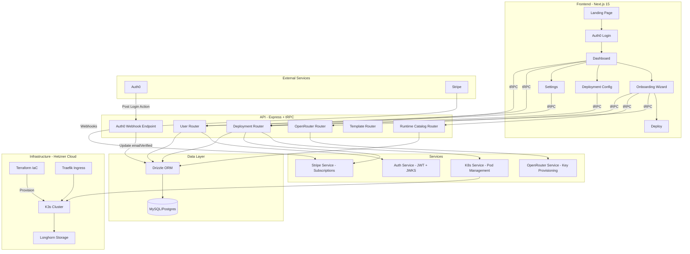

---

## 2. Frontend — Pages & Routes

### Route Map

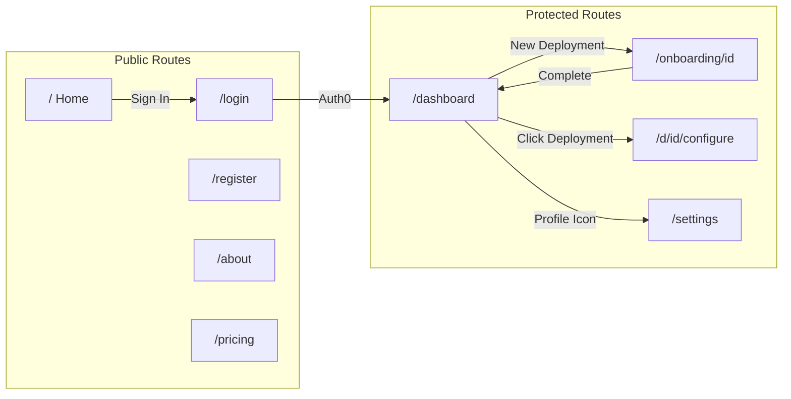

### Pages Inventory

| Route | View | Description | Status |
|-------|------|-------------|--------|
| `/` | Home.tsx | Hero, integrations marquee, features grid, CTA | ✅ Complete |
| `/login` | Login.tsx | Auth0 Email/Google/GitHub sign-in | ✅ Complete |
| `/register` | — | Registration flow | ✅ Complete |
| `/about` | About.tsx | Company story, market stats, team | ✅ Complete (team placeholder) |
| `/pricing` | Pricing.tsx | Runtime catalog pricing, LLM credits, FAQ | ✅ Complete |
| `/dashboard` | Dashboard.tsx | Deployment cards, create/delete, status badges, email verification banner | ✅ Complete |
| `/onboarding/[id]` | OnboardingWizard.tsx | 5-step wizard: Name → Runtime → LLM → Deploy → WhatsApp | ✅ Complete |
| `/d/[id]/configure` | DeploymentConfiguration.tsx | Tabbed config (General, Model, Platforms, Skills, Advanced) | ✅ Complete |
| `/settings` | Settings.tsx | Profile, theme, password reset (email/password users), account info | ✅ Complete |

---

## 3. Onboarding Wizard Flow

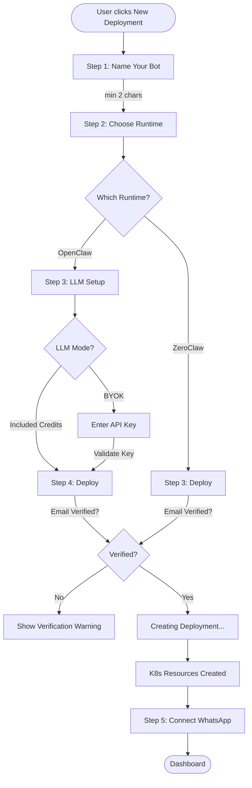

---

## 4. Backend — API Routers & Procedures

### tRPC Router Map

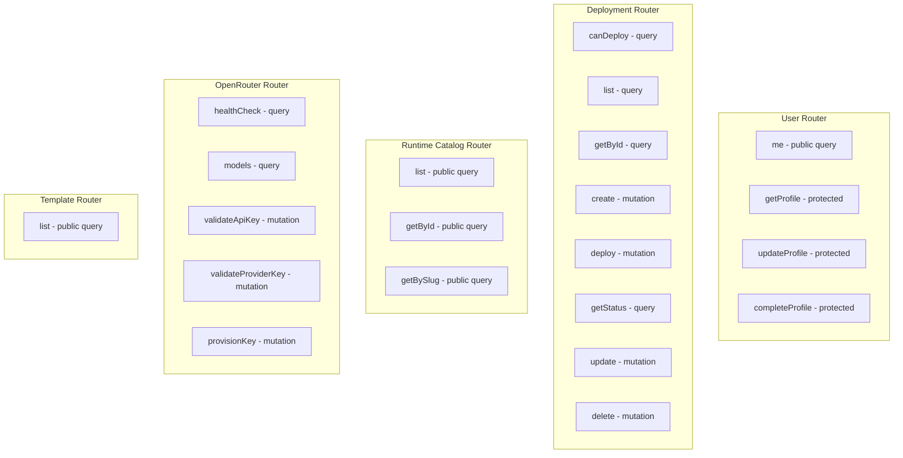

### REST Endpoints (Non-tRPC)

| Method | Path | Auth | Description |
|--------|------|------|-------------|
| `GET` | `/health` | None | K8s liveness/readiness probe |
| `POST` | `/api/stripe/webhook` | Stripe signature | Stripe event webhooks (raw body) |
| `POST` | `/api/stripe/checkout` | JWT Bearer | Create Stripe checkout session |
| `POST` | `/api/stripe/portal` | JWT Bearer | Create Stripe billing portal session |
| `POST` | `/api/auth0/email-verified` | M2M Bearer | Auth0 email verification sync webhook |
| `GET` | `/debug/db` | None (dev only) | View all database tables |

### Procedures Detail

| Router | Procedure | Type | Auth | Description |
|--------|-----------|------|------|-------------|
| **user** | me | query | public | Current user from context |
| **user** | getProfile | query | protected | Full user profile from DB |
| **user** | updateProfile | mutation | protected | Update name/email |
| **user** | completeProfile | mutation | protected | Complete profile for email signups |
| **deployment** | canDeploy | query | protected | Check free deployment eligibility |
| **deployment** | list | query | protected | All user deployments |
| **deployment** | getById | query | protected | Single deployment |
| **deployment** | create | mutation | protected | Create deployment record + provision LLM key |
| **deployment** | deploy | mutation | protected | Trigger K8s deployment (async) |
| **deployment** | getStatus | query | protected | Pod status from K8s |
| **deployment** | update | mutation | protected | Update deployment config |
| **deployment** | delete | mutation | protected | Delete K8s resources + DB record |
| **runtimeCatalog** | list | query | public | All active runtimes |
| **openrouter** | validateProviderKey | mutation | protected | Multi-provider key validation |
| **openrouter** | provisionKey | mutation | protected | Provision OpenRouter tenant key |
| **template** | list | query | public | Hardcoded templates (3) |

---

## 5. Database Schema

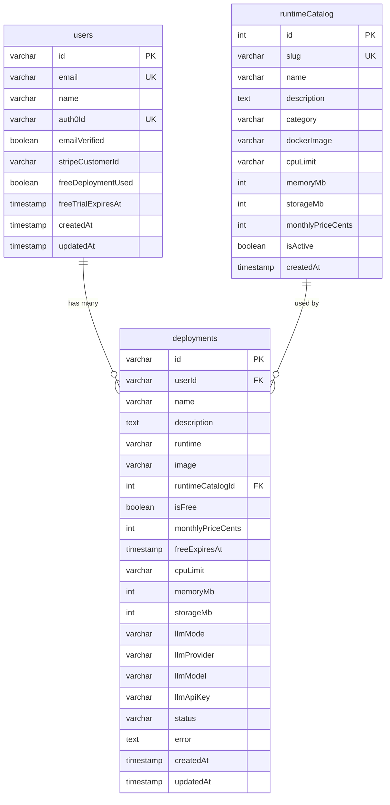

### Field Details

**users table**
- `id` — nanoid(12) primary key
- `emailVerified` — synced from Auth0 via Post Login Action webhook
- `freeDeploymentUsed` — one-time flag, user gets exactly 1 free deployment

**deployments table**
- `llmMode` — "included" or "byok" (bring-your-own-key)
- `llmProvider` — "openrouter", "openai", "anthropic", or "google"
- `status` — "pending", "creating", "running", or "failed"

---

## 6. Deployment Flow (End-to-End)

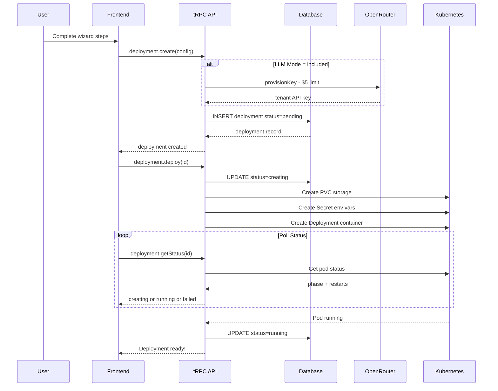

---

## 7. Infrastructure — Hetzner Cloud + Terraform

### Cluster Provisioning Architecture

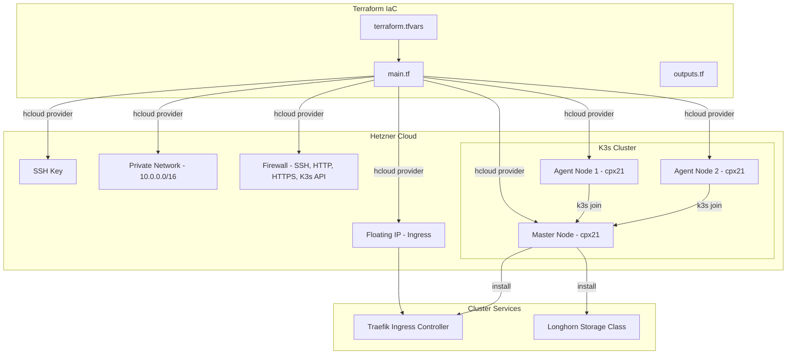

### Terraform Configuration

| File | Purpose |
|------|---------|
| `main.tf` | SSH key, private network, firewall, K3s master + agents, floating IP, Longhorn install |
| `variables.tf` | hcloud_token, SSH keys, cluster_name, location, server types, agent_count, k3s_version, domain |
| `outputs.tf` | Master/agent IPs, floating IP, kubeconfig command, SSH command, DNS records |
| `terraform.tfvars.example` | Template config with Hetzner pricing and location references |
| `.gitignore` | Excludes state files, tfvars (secrets), kubeconfig |

### Default Cluster Specs

| Resource | Default | Notes |
|----------|---------|-------|
| **Master Node** | cpx21 (3 vCPU, 4 GB RAM) | ~$7.59/mo |
| **Agent Nodes** | 2x cpx21 | Scales via `agent_count` variable |
| **Network** | 10.0.0.0/16 private | Internal K3s communication |
| **Storage** | Longhorn (default StorageClass) | Replicated persistent volumes |
| **Ingress** | Traefik (bundled with K3s) | TLS termination, host-based routing |
| **Location** | Ashburn, VA (ash) | Also supports: Falkenstein, Nuremberg, Helsinki |
| **K3s Version** | v1.29.2+k3s1 | Lightweight Kubernetes |

### Firewall Rules

| Port | Protocol | Description |
|------|----------|-------------|
| 22 | TCP | SSH access |
| 80 | TCP | HTTP (Traefik redirect) |
| 443 | TCP | HTTPS (Traefik TLS) |
| 6443 | TCP | K3s API server |
| 10250 | TCP | Kubelet metrics (internal) |
| 8472 | UDP | VXLAN (Flannel networking) |

### Quick Start

```bash
cd infrastructure/terraform
cp terraform.tfvars.example terraform.tfvars
# Edit terraform.tfvars with your Hetzner token + SSH key path
terraform init
terraform plan
terraform apply
# Fetch kubeconfig
scp root@<MASTER_IP>:/etc/rancher/k3s/k3s.yaml ./kubeconfig.yaml
```

---

## 8. Kubernetes Resource Architecture

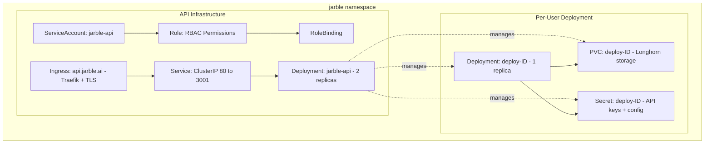

### K8s Resources Per Deployment

| Resource | Details |
|----------|---------|
| **PVC** | Longhorn storage class, ReadWriteOnce, size from config (min 1Gi) |
| **Secret** | DEPLOYMENT_ID, USER_ID, DEPLOYMENT_NAME, TEMPLATE, RUNTIME, OPENROUTER_API_KEY |
| **Deployment** | 1 replica, custom CPU/RAM limits, volume mount at /data |

### API Infrastructure

| Component | Spec |
|-----------|------|
| **Replicas** | 2 |
| **CPU** | 250m request / 500m limit |
| **RAM** | 256Mi request / 512Mi limit |
| **Probes** | Liveness: /health (10s delay, 30s period), Readiness: /health (5s delay, 10s period) |
| **Ingress** | Traefik, TLS, host: api.jarble.ai |

---

## 9. Auth & Security Flow

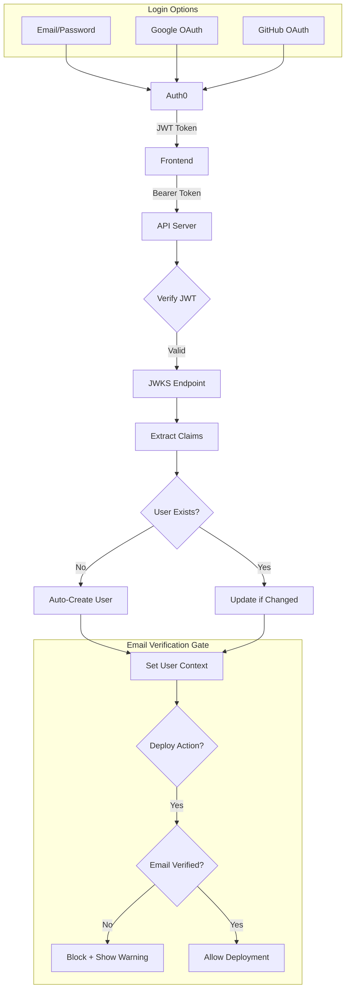

### Auth0 Email Verification Sync

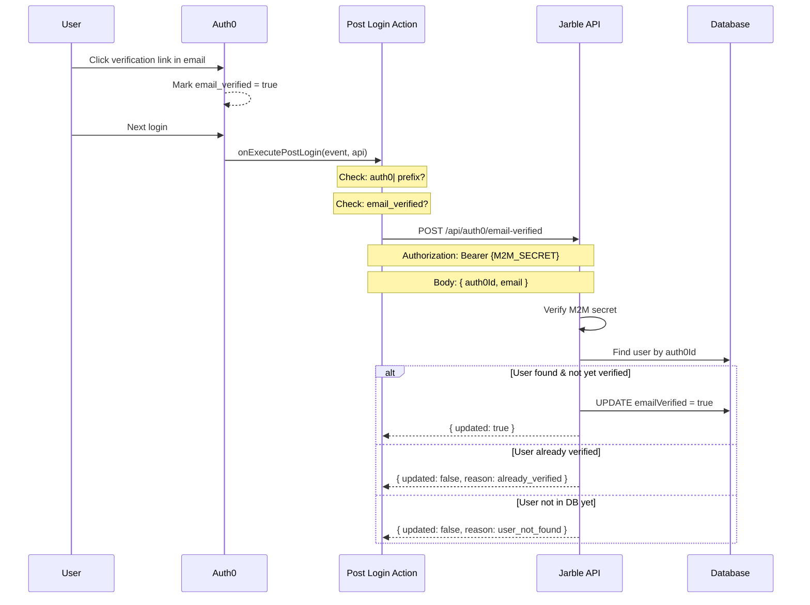

### Auth Details

| Feature | Implementation |
|---------|---------------|
| **JWT Verification** | jose library, JWKS caching |
| **Issuer** | `https://{AUTH0_DOMAIN}/` |
| **Audience** | `https://api.jarble.ai` |
| **User Provisioning** | Auto-create on first login with nanoid(12) IDs |
| **Google Users** | Auto-verified email, account linking by email |
| **Email/Password** | Reset password via Auth0 `dbconnections/change_password` |
| **Email Gate** | Deployments blocked until `email_verified === true` |
| **Email Sync** | Auth0 Post Login Action webhook → `POST /api/auth0/email-verified` |
| **M2M Auth** | Shared secret (`AUTH0_M2M_SECRET`) in Bearer token header |

### Auth0 Action Setup

The Post Login Action (`infrastructure/auth0/post-email-verification-action.js`) requires two secrets in the Auth0 Dashboard:

| Secret | Value |
|--------|-------|
| `JARBLE_API_URL` | `https://api.jarble.ai` (or `http://localhost:3001` for dev) |
| `JARBLE_M2M_SECRET` | Same value as `AUTH0_M2M_SECRET` in the API `.env` |

---

## 10. Payment Flow (Stripe)

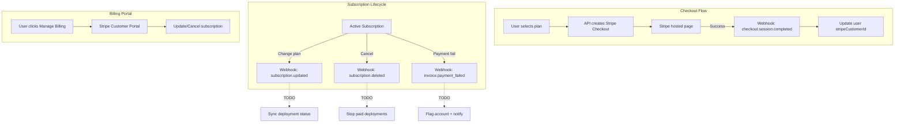

### Stripe Integration Status

| Feature | Status |
|---------|--------|
| Checkout session creation | ✅ Implemented |
| Portal session creation | ✅ Implemented |
| Webhook signature verification | ✅ Implemented |
| checkout.session.completed | ✅ Implemented |
| subscription.updated → sync deployments | ❌ TODO |
| subscription.deleted → stop deployments | ❌ TODO |
| invoice.payment_failed → flag account | ❌ TODO |

---

## 11. What's Built (Complete)

### Frontend ✅

- [x] Landing page with hero animation, features grid, integrations marquee
- [x] Auth0 login/register with Google, GitHub, Email/Password
- [x] Protected route guards with auth redirects
- [x] Dashboard with deployment cards (status, pricing, delete)
- [x] Email verification banner on dashboard (blocks deployment creation)
- [x] 5-step onboarding wizard (Name → Runtime → LLM → Deploy → WhatsApp)
- [x] Deploy step blocks unverified email users with warning
- [x] Deployment configuration (General, Model, Platforms, Skills, Advanced tabs)
- [x] Settings page (profile, theme toggle, account info)
- [x] Password reset button for email/password auth users
- [x] Dark mode with localStorage persistence + system preference detection
- [x] Profile dropdown (avatar, settings, theme, logout) — shown on all pages
- [x] About page (company narrative, market stats)
- [x] Pricing page (runtime catalog, LLM credits, FAQ)
- [x] Error boundaries + toast notifications
- [x] Responsive design (mobile + desktop)
- [x] 40+ shadcn/ui components

### Backend ✅

- [x] Auth0 JWT verification + auto user provisioning
- [x] Deployment CRUD (create, read, update, delete)
- [x] Kubernetes deployment orchestration (PVC, Secret, Deployment)
- [x] K8s pod status monitoring (phase, restarts, errors)
- [x] Free tier system (1 free deployment, 7-day expiry)
- [x] Runtime catalog management
- [x] Multi-LLM provider support (OpenRouter, OpenAI, Anthropic, Google)
- [x] API key validation per provider
- [x] OpenRouter tenant key provisioning ($5/mo limit)
- [x] Stripe checkout + portal + webhook handling
- [x] Auth0 email verification webhook (`POST /api/auth0/email-verified`)
- [x] M2M shared secret authentication for webhooks
- [x] CORS configuration
- [x] Health checks (K8s liveness/readiness probes)
- [x] Multi-database support (MySQL, PostgreSQL, SQLite)

### Infrastructure ✅

- [x] Terraform config for Hetzner Cloud K3s cluster provisioning
- [x] Master node + configurable agent nodes with auto-join
- [x] Private networking (10.0.0.0/16) for internal cluster communication
- [x] Firewall rules (SSH, HTTP, HTTPS, K3s API, VXLAN)
- [x] Floating IP for ingress load balancing
- [x] Longhorn storage class auto-installation
- [x] Traefik ingress (bundled with K3s)
- [x] Auth0 Post Login Action script for email verification sync
- [x] K8s deployment manifests (ServiceAccount, Role, RoleBinding, Deployment, Service, Ingress)

---

## 12. What's NOT Built Yet — Roadmap

### 🔴 Critical (Must-Have for Launch)

| # | Task | Description | Effort |
|---|------|-------------|--------|
| 1 | **Platform credential storage** | Wire PlatformsTab to API — save WhatsApp/Discord/Slack/Telegram credentials to DB, test connections, disconnect | Medium |
| 2 | **Stripe subscription → deployment sync** | When subscription changes/cancels, update deployment status. Handle payment failures. | Medium |
| 3 | **Deployment status toggle (stop/start)** | Pause/resume deployments from dashboard and config page — scale K8s replicas to 0/1 | Medium |
| 4 | **Drizzle migrations regeneration** | Current migrations are stale — regenerate from updated schemas | Small |
| 5 | **Webhook configuration** | Save webhook URLs, send events on deployment status changes | Medium |
| 6 | **WhatsApp QR integration** | Replace mock QR code with real WhatsApp Business API connection | Large |
| 7 | **Email verification resend** | Add "Resend verification email" button for unverified users | Small |

### 🟡 Important (Post-Launch)

| # | Task | Description | Effort |
|---|------|-------------|--------|
| 8 | **Deployment logs** | Stream container logs from K8s pods to frontend | Medium |
| 9 | **Real-time status updates** | WebSocket/SSE for live deployment status instead of polling | Medium |
| 10 | **Usage analytics dashboard** | Track API calls, message counts, costs per deployment | Large |
| 11 | **Billing management page** | Show invoices, usage, upgrade/downgrade plans | Medium |
| 12 | **API key management** | Rotate, revoke, regenerate LLM keys from dashboard | Small |
| 13 | **Rate limiting** | Add rate limiting on API routes to prevent abuse | Small |
| 14 | **Templates database** | Move hardcoded templates to DB, allow custom templates | Medium |
| 15 | **Deployment history** | Track config changes, restarts, status transitions | Medium |
| 16 | **Terraform CI/CD** | GitHub Actions pipeline for `terraform plan` on PR, `terraform apply` on merge | Medium |

### 🟢 Nice-to-Have (Future)

| # | Task | Description | Effort |
|---|------|-------------|--------|
| 17 | **Multi-deployment management** | Bulk actions, deployment groups, labels | Medium |
| 18 | **Custom domain support** | Allow users to point custom domains to their bots | Large |
| 19 | **Team/organization support** | Multi-user orgs, role-based access, shared deployments | Large |
| 20 | **Chat testing playground** | In-browser chat interface to test bot before deploying | Medium |
| 21 | **Skill marketplace** | Browse, install, configure pre-built skills/plugins | Large |
| 22 | **CI/CD integration** | GitHub Actions / GitLab CI for deployment automation | Medium |
| 23 | **Image upload for avatar** | Settings page avatar change | Small |
| 24 | **Guided tour** | Interactive onboarding tour for new users | Small |
| 25 | **About page team section** | Replace placeholder team cards with real profiles | Small |
| 26 | **LLM fine-tuning integration** | Allow users to fine-tune models on their data | Large |
| 27 | **Multi-region cluster support** | Terraform modules for deploying K3s to multiple Hetzner regions | Large |
| 28 | **Cluster auto-scaling** | Scale agent nodes based on deployment count/resource usage | Large |

---

## 13. Component Inventory

### Shared Components

| Component | Purpose |
|-----------|---------|
| ProfileDropdown | User avatar dropdown (settings, theme, logout) |
| IntegrationsMarquee | Scrolling platform integration logos with search |
| TemplateSelector | Template selection for deployment creation |
| WizardLoader | Animated deployment progress indicator |
| ErrorBoundary | Graceful error handling wrapper |
| ThemeToggle | Light/dark mode toggle button |
| PlatformConfigForm | Generic form builder for platform credentials |
| SubscribeButton | Stripe subscription button |
| DevNav | Development-only navigation bar |

### Auth Components

| Component | Purpose |
|-----------|---------|
| Auth0Provider | Auth0 SDK wrapper with config |
| LoginButton | Auth0 login trigger |
| LogoutButton | Auth0 logout trigger |

### UI Library (shadcn/ui)

40+ components including: Accordion, Alert, Avatar, Badge, Button, Card, Checkbox, Dialog, Dropdown Menu, Input, Label, Popover, Progress, Select, Separator, Sheet, Skeleton, Slider, Switch, Table, Tabs, Textarea, Toast (Sonner), Toggle, Tooltip

---

## 14. Environment Variables

### Frontend (.env.local)

| Variable | Description |
|----------|-------------|
| `NEXT_PUBLIC_AUTH0_DOMAIN` | Auth0 tenant domain (jarble-dev.us.auth0.com) |
| `NEXT_PUBLIC_AUTH0_CLIENT_ID` | Auth0 application client ID |
| `NEXT_PUBLIC_AUTH0_AUDIENCE` | Auth0 API audience (https://api.jarble.ai) |

### Backend (.env)

| Variable | Required | Description |
|----------|----------|-------------|
| `PORT` | No (default: 3001) | Server port |
| `NODE_ENV` | No (default: development) | Environment |
| `FRONTEND_URL` | No (default: http://localhost:3000) | CORS origin |
| `DATABASE_URL` | Yes (unless SQLite) | Database connection string |
| `DB_PROVIDER` | No (default: mysql) | mysql, postgres, or sqlite |
| `USE_SQLITE` | No | Legacy flag — same as DB_PROVIDER=sqlite |
| `AUTH0_DOMAIN` | Yes | Auth0 tenant domain |
| `AUTH0_AUDIENCE` | Yes | Auth0 API audience |
| `AUTH0_M2M_SECRET` | No | Shared secret for Auth0 Action webhooks (generate with `openssl rand -hex 32`) |
| `OPENROUTER_API_KEY` | No | OpenRouter API key |
| `OPENROUTER_MANAGEMENT_KEY` | No | OpenRouter Management API key for provisioning |
| `STRIPE_SECRET_KEY` | No | Stripe secret key (Stripe disabled if not set) |
| `STRIPE_WEBHOOK_SECRET` | If Stripe enabled | Stripe webhook signing secret |
| `STRIPE_PRICE_PRO` | If Stripe enabled | Stripe price ID for Pro tier |
| `STRIPE_PRICE_AGENCY` | If Stripe enabled | Stripe price ID for Agency tier |

### Terraform (terraform.tfvars)

| Variable | Required | Description |
|----------|----------|-------------|
| `hcloud_token` | Yes | Hetzner Cloud API token |
| `ssh_public_key_path` | No (default: ~/.ssh/id_rsa.pub) | Path to SSH public key |
| `cluster_name` | No (default: jarble) | K3s cluster name prefix |
| `location` | No (default: ash) | Hetzner datacenter (ash, fsn1, nbg1, hel1) |
| `master_server_type` | No (default: cpx21) | Master node instance type |
| `agent_server_type` | No (default: cpx21) | Worker node instance type |
| `agent_count` | No (default: 2) | Number of worker nodes |
| `k3s_version` | No (default: v1.29.2+k3s1) | K3s version |
| `domain` | No (default: jarble.ai) | Base domain for DNS records |

### Auth0 Action Secrets

| Secret | Description |
|--------|-------------|
| `JARBLE_API_URL` | API base URL (https://api.jarble.ai or http://localhost:3001) |
| `JARBLE_M2M_SECRET` | Must match `AUTH0_M2M_SECRET` in API .env |

---

## 15. File Structure Overview

```
monorepo/
├── Jarble-mvp/                        # Frontend (Next.js 15)
│   ├── app/                           # App Router routes
│   │   ├── layout.tsx                 # Root layout
│   │   ├── providers.tsx              # Auth0 + tRPC + Theme providers
│   │   ├── page.tsx                   # Home page
│   │   ├── globals.css                # Global styles + CSS variables
│   │   ├── login/page.tsx
│   │   ├── register/page.tsx
│   │   ├── about/page.tsx
│   │   ├── pricing/page.tsx
│   │   ├── dashboard/page.tsx
│   │   ├── settings/page.tsx
│   │   ├── onboarding/[id]/page.tsx
│   │   └── d/[id]/configure/page.tsx
│   ├── views/                         # Page-level view components
│   │   ├── Home.tsx
│   │   ├── Dashboard.tsx
│   │   ├── OnboardingWizard.tsx
│   │   ├── DeploymentConfiguration.tsx
│   │   ├── Settings.tsx
│   │   ├── Login.tsx
│   │   ├── About.tsx
│   │   ├── Pricing.tsx
│   │   ├── NotFound.tsx
│   │   ├── onboarding/
│   │   │   └── wizardStepConfig.ts
│   │   └── deployment-config/
│   │       ├── GeneralTab.tsx
│   │       ├── ModelTab.tsx
│   │       ├── PlatformsTab.tsx
│   │       ├── SkillsTab.tsx
│   │       ├── AdvancedTab.tsx
│   │       └── types.ts
│   ├── components/                    # Shared components
│   │   ├── auth/                      # Auth0 wrappers
│   │   ├── ui/                        # 40+ shadcn components
│   │   ├── ProfileDropdown.tsx
│   │   ├── IntegrationsMarquee.tsx
│   │   ├── WizardLoader.tsx
│   │   ├── TemplateSelector.tsx
│   │   ├── PlatformConfigForm.tsx
│   │   ├── SubscribeButton.tsx
│   │   ├── ErrorBoundary.tsx
│   │   ├── ThemeToggle.tsx
│   │   ├── GuidedTour.tsx
│   │   └── DevNav.tsx
│   ├── contexts/
│   │   └── ThemeContext.tsx
│   ├── hooks/
│   │   ├── useMobile.tsx
│   │   ├── useComposition.ts
│   │   └── usePersistFn.ts
│   ├── lib/
│   │   ├── trpc.ts
│   │   ├── const.ts
│   │   ├── platformConfigs.ts
│   │   └── utils.ts
│   ├── docs/
│   │   └── JARBLE_PLATFORM_OVERVIEW.md
│   └── public/                        # Static assets
│       ├── hero-animation.webm
│       ├── hero-mobile.webp
│       └── ...
│
├── jarble-api-main/                   # Backend (Express + tRPC)
│   ├── src/
│   │   ├── index.ts                   # Server entry + Stripe/Auth0 webhooks
│   │   ├── trpc/
│   │   │   ├── index.ts               # Router exports
│   │   │   ├── context.ts             # tRPC context (auth + DB)
│   │   │   └── routers/
│   │   │       ├── user.ts
│   │   │       ├── deployment.ts
│   │   │       ├── runtimeCatalog.ts
│   │   │       ├── openrouter.ts
│   │   │       └── template.ts
│   │   ├── db/
│   │   │   ├── schema.ts             # MySQL schema (Drizzle)
│   │   │   ├── schema.pg.ts          # Postgres schema
│   │   │   ├── schema.sqlite.ts      # SQLite schema
│   │   │   └── init.ts               # DB init + test data seeding
│   │   ├── services/
│   │   │   ├── auth.ts               # JWT verification + user provisioning
│   │   │   └── stripe.ts             # Stripe checkout/portal/webhooks
│   │   ├── k8s/
│   │   │   └── deployment.ts         # K8s orchestration (PVC, Secret, Deployment)
│   │   └── utils/
│   │       └── env.ts                # Zod env validation
│   ├── k8s/
│   │   └── deployment.yaml           # K8s manifests (SA, Role, Deployment, Service, Ingress)
│   ├── drizzle/                       # MySQL migrations (stale)
│   └── drizzle-pg/                    # Postgres migrations (stale)
│
├── infrastructure/                    # Infrastructure-as-Code
│   ├── terraform/                     # Hetzner Cloud K3s provisioning
│   │   ├── main.tf                    # SSH, network, firewall, K3s master + agents, floating IP
│   │   ├── variables.tf               # All configurable variables
│   │   ├── outputs.tf                 # IPs, kubeconfig command, DNS records
│   │   ├── terraform.tfvars.example   # Template config
│   │   ├── .gitignore                 # Excludes state, tfvars, kubeconfig
│   │   └── README.md                  # Quick start guide
│   └── auth0/
│       └── post-email-verification-action.js  # Auth0 Post Login Action (email sync webhook)
```

---

*This document provides a complete snapshot of the Jarble platform as of February 16, 2026. Use the roadmap section to prioritize next steps.*
