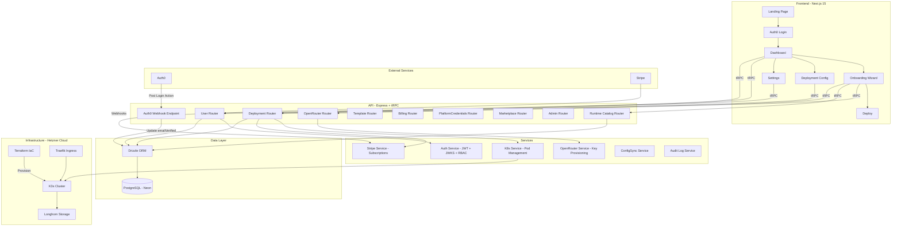
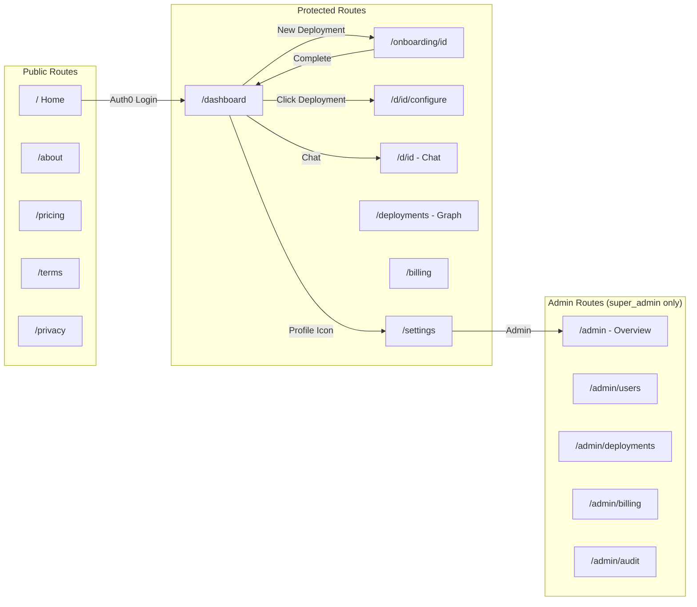
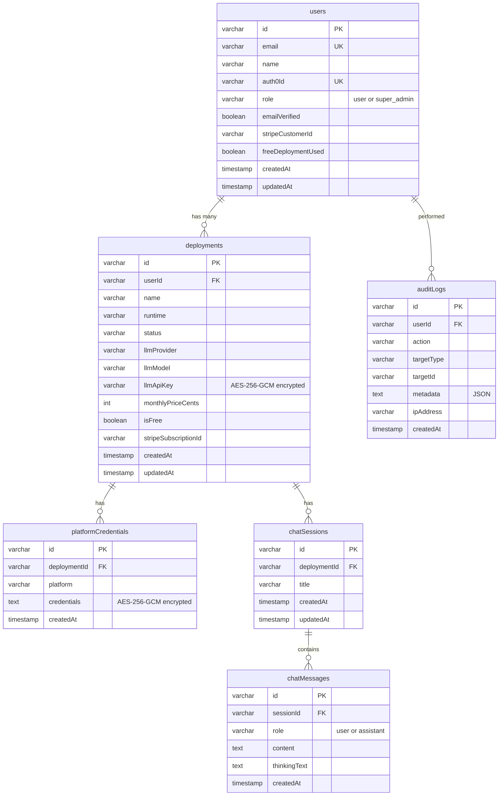
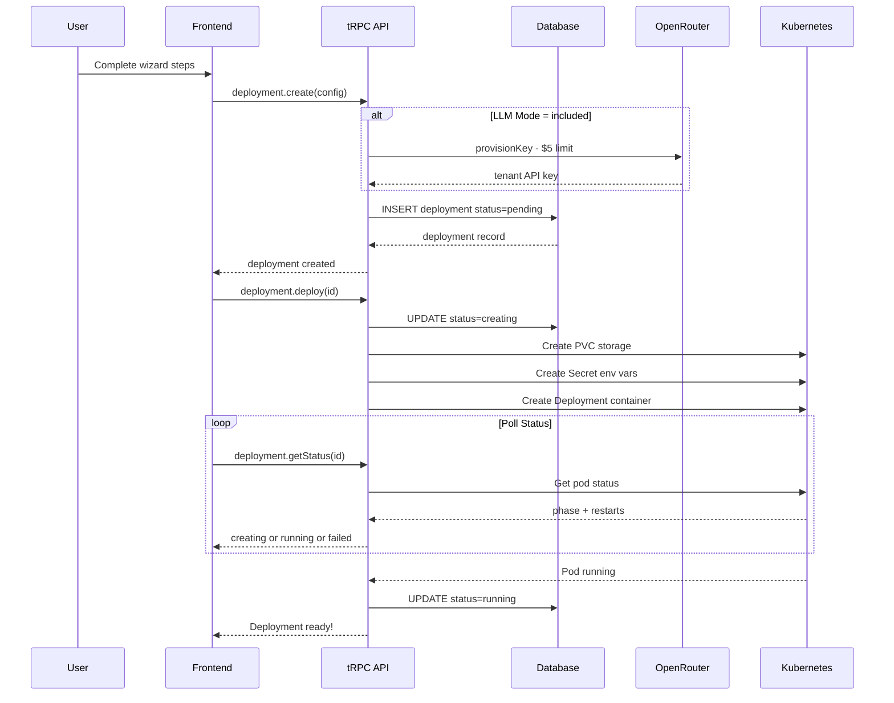
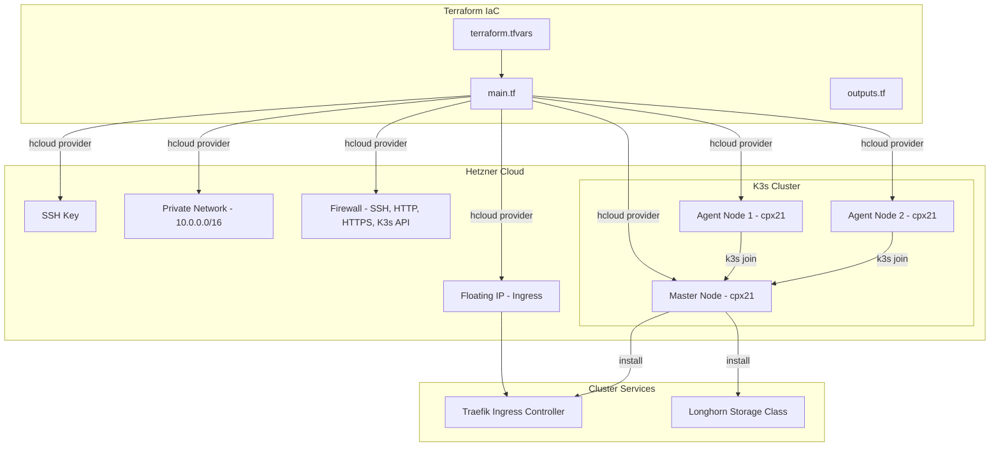
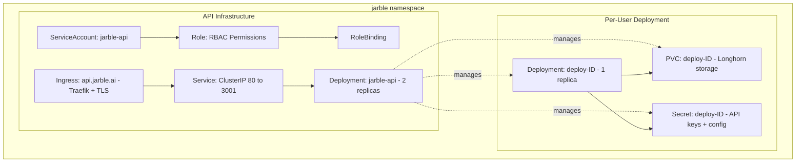
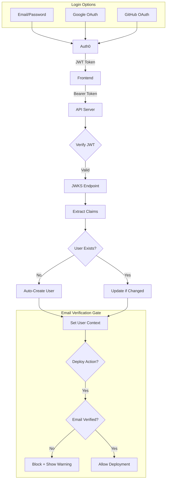
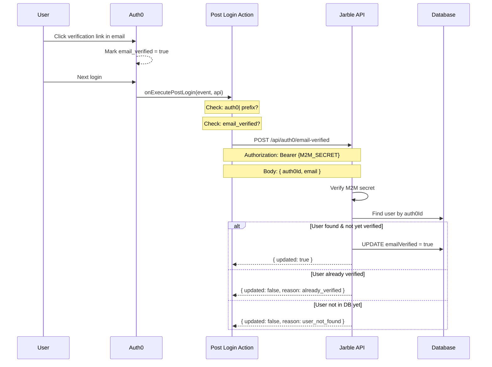
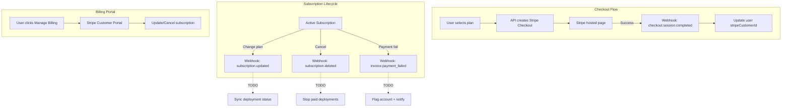

# Jarble Platform — Complete Overview & Roadmap

*Last updated: March 11, 2026*

> **Note**: For the most up-to-date architectural reference, see `CLAUDE.md` in the repo root. For operational procedures, see `docs/RUNBOOK.md`. This document provides visual diagrams and flow documentation that complement those files.

---

## 1. Platform Architecture

Jarble is a **no-code AI agent deployment platform** that lets users deploy LLM-powered agents to messaging platforms (WhatsApp, Discord, Slack, Telegram) without coding. Each deployment gets a web chat interface (`/d/[id]`) with rich UI components via an MCP server.

### Tech Stack

| Layer | Technology |
|-------|-----------|
| **Frontend** | Next.js 15 (App Router), React 19, TypeScript |
| **Styling** | Tailwind CSS v4, shadcn/ui, Framer Motion |
| **API** | Express + tRPC, SuperJSON serialization |
| **Database** | Drizzle ORM — PostgreSQL via Neon (prod), SQLite (dev) |
| **Auth** | Auth0 (Google OAuth), RBAC (`super_admin` / `user` roles) |
| **Payments** | Stripe (dynamic pricing via price_data, subscriptions, webhooks) |
| **Infrastructure** | Hetzner Cloud, Terraform IaC, K3s (Longhorn storage, Traefik ingress) |
| **LLM Providers** | OpenRouter, OpenAI, Anthropic, Google |
| **MCP** | Custom stdio MCP server (`jarble-ui-server.js`) — `render_ui`, `define_component`, `list_components` |
| **Chat** | @assistant-ui/react, SSE streaming (text deltas + UI blocks) |
| **State Management** | React Query + tRPC hooks |

### System Architecture Diagram



---

## 2. Frontend — Pages & Routes

### Route Map



### Pages Inventory

| Route | View | Description | Status |
|-------|------|-------------|--------|
| `/` | Home.tsx | Hero, integrations marquee, features grid, CTA | ✅ Complete |
| `/about` | About.tsx | Company story, market stats, team | ✅ Complete |
| `/pricing` | Pricing.tsx | Runtime catalog pricing, LLM credits, FAQ | ✅ Complete |
| `/terms` | Terms.tsx | Terms of Service | ✅ Complete |
| `/privacy` | Privacy.tsx | Privacy Policy | ✅ Complete |
| `/dashboard` | Dashboard.tsx | Deployment cards, SSE status, resource metrics, create/delete | ✅ Complete |
| `/deployments` | — | React Flow node graph of deployments with credit pool edges | ✅ Complete |
| `/onboarding/[id]` | OnboardingWizard.tsx | Multi-step wizard: Name → Runtime → LLM → Deploy → Platforms | ✅ Complete |
| `/d/[id]` | — | Web chat interface (assistant-ui), canvas grid, chat session sidebar | ✅ Complete |
| `/d/[id]/configure` | DeploymentConfiguration.tsx | Tabbed config (General, Model, Platforms, Skills, Advanced) | ✅ Complete |
| `/billing` | Billing.tsx | Stripe subscription management | ✅ Complete |
| `/settings` | Settings.tsx | Profile, theme, account info | ✅ Complete |
| `/admin` | AdminOverview.tsx | Platform stats (users, deployments, revenue, active pods) | ✅ Complete |
| `/admin/users` | AdminUsers.tsx | Searchable user table, role management | ✅ Complete |
| `/admin/users/[id]` | AdminUserDetail.tsx | User detail + deployments + role toggle | ✅ Complete |
| `/admin/deployments` | AdminDeployments.tsx | All deployments with start/stop/restart/delete | ✅ Complete |
| `/admin/billing` | AdminBilling.tsx | Revenue stats, MRR, free vs paid | ✅ Complete |
| `/admin/system` | AdminSystem.tsx | Pod status breakdown | ✅ Complete |
| `/admin/audit` | AdminAudit.tsx | Audit log table | ✅ Complete |
| `/admin/marketplace` | AdminMarketplace.tsx | Moderation queue (placeholder) | 🔲 Placeholder |

---

## 3. Onboarding Wizard Flow


---

## 4. Backend — API Routers & Procedures

### tRPC Router Map (9 routers)

See `CLAUDE.md` for the full procedure list. Key routers:

- **user** — Profile management, auth state
- **deployment** — CRUD, lifecycle (start/stop/restart), K8s operations (admins bypass ownership)
- **runtimeCatalog** — Available agent runtimes
- **openrouter** — LLM key provisioning, validation, multi-provider support
- **billing** — Stripe checkout, subscriptions
- **platformCredentials** — Encrypted messaging platform credentials, pairing flows
- **template** — Agent configuration templates
- **marketplace** — Component marketplace (22 procedures): browse, install, publish, review, admin moderation
- **admin** — Platform admin (13 procedures, `adminProcedure`-guarded): stats, users, deployments, billing, audit

### REST Endpoints (Non-tRPC)

| Method | Path | Auth | Description |
|--------|------|------|-------------|
| `GET` | `/health` | None | K8s liveness/readiness probe |
| `POST` | `/api/stripe/webhook` | Stripe signature | Stripe event webhooks (raw body) |
| `POST` | `/api/tambo-agent` | JWT Bearer | Chat SSE endpoint — streams text + UI blocks |
| `GET` | `/api/tambo-agent/sessions/:deploymentId` | JWT Bearer | Chat session history |
| `GET` | `/api/tambo-agent/sessions/:deploymentId/:sessionId` | JWT Bearer | Single session messages |
| `GET` | `/api/deployments/status/stream` | JWT (query param) | SSE status stream for all user deployments |
| `GET` | `/api/deployments/:id/logs` | JWT (query param) | SSE log stream |
| `GET` | `/api/deployments/:id/whatsapp/qr` | JWT (query param) | SSE QR code stream |
| `POST` | `/api/auth0/email-verified` | M2M Bearer | Auth0 email verification sync |
| `GET` | `/debug/db` | None (dev only) | View all database tables |

---

## 5. Database Schema

See `CLAUDE.md` for the full table list. Core tables:



Additional tables (marketplace): `marketplaceComponents`, `componentVersions`, `componentInstalls`, `componentPurchases`, `componentReviews`, `marketplaceCreators`

Additional tables (other): `runtimeCatalog`, `skillsCatalog`, `deploymentSkills`, `processedWebhookEvents`

### Field Details

**users table**
- `id` — nanoid(12) primary key
- `role` — `"user"` (default) or `"super_admin"` (DB is authoritative, not JWT)
- `emailVerified` — synced from Auth0 via Post Login Action webhook

**deployments table**
- `llmMode` — "included" or "byok" (bring-your-own-key)
- `llmProvider` — "openrouter", "openai", "anthropic", or "google"
- `status` — "pending", "creating", "running", "stopped", "failed", or "error"

---

## 6. Deployment Flow (End-to-End)



---

## 7. Infrastructure — Hetzner Cloud + Terraform

### Cluster Provisioning Architecture



### Terraform Configuration

| File | Purpose |
|------|---------|
| `main.tf` | SSH key, private network, firewall, K3s master + agents, floating IP, Longhorn install |
| `variables.tf` | hcloud_token, SSH keys, cluster_name, location, server types, agent_count, k3s_version, domain |
| `outputs.tf` | Master/agent IPs, floating IP, kubeconfig command, SSH command, DNS records |
| `terraform.tfvars.example` | Template config with Hetzner pricing and location references |
| `.gitignore` | Excludes state files, tfvars (secrets), kubeconfig |

### Default Cluster Specs

| Resource | Default | Notes |
|----------|---------|-------|
| **Master Node** | cpx21 (3 vCPU, 4 GB RAM) | ~$7.59/mo |
| **Agent Nodes** | 2x cpx21 | Scales via `agent_count` variable |
| **Network** | 10.0.0.0/16 private | Internal K3s communication |
| **Storage** | Longhorn (default StorageClass) | Replicated persistent volumes |
| **Ingress** | Traefik (bundled with K3s) | TLS termination, host-based routing |
| **Location** | Ashburn, VA (ash) | Also supports: Falkenstein, Nuremberg, Helsinki |
| **K3s Version** | v1.29.2+k3s1 | Lightweight Kubernetes |

### Firewall Rules

| Port | Protocol | Description |
|------|----------|-------------|
| 22 | TCP | SSH access |
| 80 | TCP | HTTP (Traefik redirect) |
| 443 | TCP | HTTPS (Traefik TLS) |
| 6443 | TCP | K3s API server |
| 10250 | TCP | Kubelet metrics (internal) |
| 8472 | UDP | VXLAN (Flannel networking) |

### Quick Start

```bash
cd infrastructure/terraform
cp terraform.tfvars.example terraform.tfvars
# Edit terraform.tfvars with your Hetzner token + SSH key path
terraform init
terraform plan
terraform apply
# Fetch kubeconfig
scp root@<MASTER_IP>:/etc/rancher/k3s/k3s.yaml ./kubeconfig.yaml
```

---

## 8. Kubernetes Resource Architecture



### K8s Resources Per Deployment

| Resource | Details |
|----------|---------|
| **PVC** | Longhorn storage class, ReadWriteOnce, size from config (min 1Gi) |
| **Secret** | DEPLOYMENT_ID, USER_ID, DEPLOYMENT_NAME, TEMPLATE, RUNTIME, OPENROUTER_API_KEY |
| **Deployment** | 1 replica, custom CPU/RAM limits, volume mount at /data |

### API Infrastructure

| Component | Spec |
|-----------|------|
| **Replicas** | 2 |
| **CPU** | 250m request / 500m limit |
| **RAM** | 256Mi request / 512Mi limit |
| **Probes** | Liveness: /health (10s delay, 30s period), Readiness: /health (5s delay, 10s period) |
| **Ingress** | Traefik, TLS, host: api.jarble.ai |

---

## 9. Auth & Security Flow



### Auth0 Email Verification Sync



### Auth Details

| Feature | Implementation |
|---------|---------------|
| **JWT Verification** | jose library, JWKS caching |
| **Issuer** | `https://{AUTH0_DOMAIN}/` |
| **Audience** | `https://api.jarble.ai` |
| **User Provisioning** | Auto-create on first login with nanoid(12) IDs |
| **RBAC** | `super_admin` / `user` roles in DB (authoritative). JWT claim is informational only. |
| **Beta Gating** | Auth0 Post Login Action blocks users without `app_metadata.beta_approved` |
| **Admin Middleware** | `adminProcedure` composed from `protectedProcedure` + `isAdmin()` check |
| **Ownership Bypass** | Admins skip `userId` checks on deployment queries via `deploymentWhere()` |
| **Google Users** | Auto-verified email, account linking by email |
| **Email Gate** | Deployments blocked until `email_verified === true` |
| **Email Sync** | Auth0 Post Login Action webhook → `POST /api/auth0/email-verified` |

### Auth0 Tenants

| Environment | Tenant | Client ID |
|-------------|--------|-----------|
| **Production** | `jarble.us.auth0.com` | Set in Vercel + K8s secret |
| **Dev/Local** | `jarble-dev.us.auth0.com` | Set in `.env.local` |

### Auth0 Post Login Action (Production)

The `Beta Gate + Role Claim` action on the prod tenant:
1. Blocks unapproved users (checks `app_metadata.beta_approved`)
2. Sets role claim (`https://api.jarble.ai/role`) from `app_metadata.role`

---

## 10. Payment Flow (Stripe)



### Stripe Integration Status

| Feature | Status |
|---------|--------|
| Dynamic pricing via `price_data` | ✅ Implemented |
| Checkout session creation | ✅ Implemented |
| Portal session creation | ✅ Implemented |
| Webhook signature verification | ✅ Implemented |
| checkout.session.completed | ✅ Implemented |
| customer.subscription.updated | ✅ Implemented |
| customer.subscription.deleted → stop deployment | ✅ Implemented |
| invoice.payment_failed | ✅ Implemented |
| Pending subscription handoff (race condition handling) | ✅ Implemented |
| Webhook idempotency (`processedWebhookEvents` table) | ✅ Implemented |

---

## 11. What's Built (Complete)

### Frontend ✅

- [x] Landing page with hero animation, features grid, integrations marquee
- [x] Auth0 login with Google OAuth
- [x] Protected route guards with auth redirects
- [x] Dashboard with deployment cards, SSE status, resource metrics (CPU/memory)
- [x] Deployment node graph with React Flow (@xyflow/react) + dagre
- [x] Multi-step onboarding wizard (config-driven via `wizardStepConfig.ts`)
- [x] Web chat interface (`/d/[id]`) with @assistant-ui/react + SSE streaming
- [x] 37 canvas UI components (charts, tables, 3D sandbox, maps, etc.)
- [x] Chat session sidebar with history grouped by date
- [x] Deployment configuration (General, Model, Platforms, Skills, Advanced tabs)
- [x] Billing page with Stripe subscription management
- [x] Admin dashboard (8 pages: overview, users, deployments, marketplace, billing, system, audit)
- [x] AdminGuard (client-side role check, redirects non-admins)
- [x] Component marketplace UI (browse, install, publish, review)
- [x] Settings page (profile, theme toggle)
- [x] Terms of Service + Privacy Policy pages
- [x] Dark mode with localStorage persistence + system preference detection
- [x] Profile dropdown with conditional admin link
- [x] Error boundaries + toast notifications + Sentry error tracking
- [x] PostHog analytics integration

### Backend ✅

- [x] Auth0 JWT verification + auto user provisioning
- [x] RBAC (`super_admin` / `user` roles), `adminProcedure` middleware
- [x] Beta gating via Auth0 Post Login Action
- [x] Admin tRPC router (13 procedures): stats, users, deployments, billing, audit logs
- [x] Audit logging on all admin mutations (`logAdminAction()`)
- [x] Deployment CRUD + lifecycle (start/stop/restart/cancel/reactivate)
- [x] Deployment ownership bypass for admins via `deploymentWhere()`
- [x] Kubernetes orchestration (Deployment, PVC, Secret, Service per agent)
- [x] K8s pod status monitoring, CPU/memory metrics, node info
- [x] ConfigSync pipeline (DB → PVC + K8s Secret → restart → poll readiness)
- [x] SSE streaming: deployment status, logs, QR pairing
- [x] Chat SSE endpoint with text deltas + UI block streaming
- [x] Chat session/message persistence in DB
- [x] MCP server (`jarble-ui-server.js`) with render_ui, define_component, list_components
- [x] 37 canvas component schemas + autofix prop repair (20 rules)
- [x] Component marketplace (22 procedures, manifest validation)
- [x] Platform credentials (AES-256-GCM encrypted, configSync integration)
- [x] Telegram/WhatsApp pairing flows
- [x] Multi-LLM provider support (OpenRouter, OpenAI, Anthropic, Google)
- [x] Stripe: dynamic pricing, checkout, portal, webhooks, subscription lifecycle
- [x] Background status reconciler
- [x] Pod security: non-root, NetworkPolicy, capabilities dropped

### Infrastructure ✅

- [x] Terraform for Hetzner Cloud K3s cluster (3 nodes)
- [x] Longhorn storage, cert-manager TLS, Traefik ingress
- [x] GitHub Actions CI: API image build, runtime image build, Terraform plan/apply
- [x] Vercel frontend deployment (auto on push to main)
- [x] Neon PostgreSQL (production), SQLite (dev)
- [x] Automated deployment testing framework (4 agents, markdown reports)

---

## 12. Remaining Work

### 🔴 Active TODO (see `TaskList` tool for current items)

| # | Task | Description | Effort |
|---|------|-------------|--------|
| 1 | **Auth0 prod tenant finalization** | Verify API registered, callback URLs, Post Login Action deployed, beta gate working | Small |
| 2 | **Stripe live mode switch** | Update keys in K8s + Vercel, clear test customer IDs, verify webhooks | Small |
| 3 | **Admin marketplace moderation** | Build real UI for `/admin/marketplace` (currently placeholder) | Medium |
| 4 | **CD auto-restart** | GitHub Actions step to restart API pods after image build | Medium |
| 5 | **E2E deployment test** | Full flow: wizard → checkout → pod → chat → messaging | Medium |

### 🟡 Important (Post-Launch)

| # | Task | Description | Effort |
|---|------|-------------|--------|
| 6 | **Rate limiting** | Add rate limiting on API + admin endpoints | Small |
| 7 | **Usage analytics** | Track API calls, message counts, costs per deployment | Large |
| 8 | **API key rotation** | Rotate, revoke, regenerate LLM keys from dashboard | Small |
| 9 | **DB CHECK constraint** | Enforce `role` column values at database level | Small |

### 🟢 Nice-to-Have (Future)

| # | Task | Description | Effort |
|---|------|-------------|--------|
| 10 | **Custom domain support** | Allow users to point custom domains to their agents | Large |
| 11 | **Team/organization support** | Multi-user orgs, shared deployments | Large |
| 12 | **Multi-region cluster** | Terraform modules for multiple Hetzner regions | Large |
| 13 | **Cluster auto-scaling** | Scale agent nodes based on deployment count | Large |
| 14 | **LLM fine-tuning** | Allow users to fine-tune models on their data | Large |

---

## 13. Component Inventory

See `CLAUDE.md` for the full key files reference. Key component areas:

| Area | Components |
|------|-----------|
| **Auth** | `Auth0Provider`, `AdminGuard` |
| **Canvas** | 37 UI components + `CanvasRenderer`, `CanvasSandbox`, `SimpleCanvasGrid` |
| **Chat** | `AssistantUIChat`, `ChatSessionSidebar` |
| **Admin** | 8 admin views, `AdminGuard` |
| **Marketplace** | 6 marketplace UI components |
| **Dashboard** | `ProfileDropdown`, `ResourceMetrics`, `DeploymentStatus` |
| **Shared** | `ErrorBoundary`, `ThemeToggle`, `WizardLoader`, `TemplateSelector` |
| **UI Library** | shadcn/ui components |

---

## 14. Environment Variables

See `docs/RUNBOOK.md` for the full environment matrix with locations for dev vs prod.

### Frontend (.env.local)

| Variable | Description |
|----------|-------------|
| `NEXT_PUBLIC_AUTH0_DOMAIN` | Auth0 tenant domain |
| `NEXT_PUBLIC_AUTH0_CLIENT_ID` | Auth0 application client ID |
| `NEXT_PUBLIC_AUTH0_AUDIENCE` | Auth0 API audience (`https://api.jarble.ai`) |
| `NEXT_PUBLIC_API_URL` | API base URL (`http://localhost:3001` or `https://api.jarble.ai`) |
| `NEXT_PUBLIC_STRIPE_PUBLISHABLE_KEY` | Stripe publishable key |

### Backend (.env)

| Variable | Required | Description |
|----------|----------|-------------|
| `PORT` | No (default: 3001) | Server port |
| `NODE_ENV` | No (default: development) | Environment |
| `FRONTEND_URL` | No (default: http://localhost:3000) | CORS origin |
| `DATABASE_URL` | Yes (unless SQLite) | Database connection string |
| `USE_SQLITE` | No | Use file-based SQLite for local dev |
| `AUTH0_DOMAIN` | Yes | Auth0 tenant domain |
| `AUTH0_AUDIENCE` | Yes | Auth0 API audience |
| `OPENROUTER_API_KEY` | No | OpenRouter API key |
| `OPENROUTER_MANAGEMENT_KEY` | No | OpenRouter Management API key for provisioning |
| `STRIPE_SECRET_KEY` | No | Stripe secret key (Stripe disabled if not set) |
| `STRIPE_WEBHOOK_SECRET` | If Stripe enabled | Stripe webhook signing secret |
| `API_KEY_ENCRYPTION_KEY` | Yes | AES-256-GCM key for encrypting platform credentials |

---

## 15. File Structure Overview

See `CLAUDE.md` for the detailed key files reference. High-level structure:

```
monorepo/
├── Jarble-mvp/                        # Frontend (Next.js 15, React 19)
│   ├── app/                           # App Router routes
│   │   ├── admin/                     # Admin dashboard (8 pages)
│   │   ├── d/[id]/                    # Chat page + configure
│   │   ├── dashboard/
│   │   ├── deployments/               # Node graph view
│   │   ├── onboarding/[id]/
│   │   ├── billing/, settings/, pricing/, about/, terms/, privacy/
│   │   └── layout.tsx, providers.tsx
│   ├── views/                         # Page-level view components
│   │   ├── admin/                     # 8 admin views
│   │   ├── onboarding/
│   │   ├── deployment-config/
│   │   └── *.tsx
│   ├── components/
│   │   ├── admin/                     # AdminGuard
│   │   ├── auth/                      # Auth0Provider
│   │   ├── canvas/                    # 37 canvas components + registry
│   │   ├── chat/                      # AssistantUIChat, ChatSessionSidebar
│   │   ├── marketplace/               # Marketplace UI (6 files)
│   │   ├── workspace/                 # Canvas grid, reducer
│   │   └── ui/                        # shadcn components
│   ├── hooks/                         # useIsAdmin, useChatSessions, useStatusStream, etc.
│   └── lib/                           # trpc, autoFixProps, sanitize, posthog
│
├── jarble-api-main/                   # Backend (Express + tRPC)
│   ├── src/
│   │   ├── trpc/
│   │   │   ├── middleware.ts          # public/protected/admin procedures
│   │   │   ├── context.ts            # Auth context + IP
│   │   │   └── routers/              # 9 routers (user, deployment, admin, marketplace, etc.)
│   │   ├── db/
│   │   │   ├── schema.ts, schema.pg.ts, schema.sqlite.ts
│   │   │   ├── index.ts              # Multi-DB support
│   │   │   └── init.ts               # SQLite seed data
│   │   ├── services/
│   │   │   ├── auth.ts, stripe.ts, configSync.ts, auditLog.ts
│   │   │   └── manifestValidator.ts
│   │   ├── k8s/                       # lifecycle, exec, secrets, status, logs, metrics, etc.
│   │   ├── runtimes/handlers/         # OpenClaw, ZeroClaw runtime handlers
│   │   ├── mcp/                       # MCP server + tools
│   │   ├── routes/                    # tamboAgent.ts (chat SSE)
│   │   └── utils/                     # rbac.ts, encryption.ts, logger.ts
│   └── drizzle-pg/                    # PostgreSQL migrations (active)
│
├── shared/component-manifest/         # Component schemas, metadata (single source of truth)
├── scripts/deployment-testing/        # Automated deployment test framework
├── infrastructure/terraform/          # Hetzner Cloud K3s IaC
├── docs/RUNBOOK.md                    # Operational runbook
└── CLAUDE.md                          # Primary architecture reference
```

---

*This document provides a snapshot of the Jarble platform as of March 11, 2026. For the most current reference, see `CLAUDE.md` and `docs/RUNBOOK.md`.*
