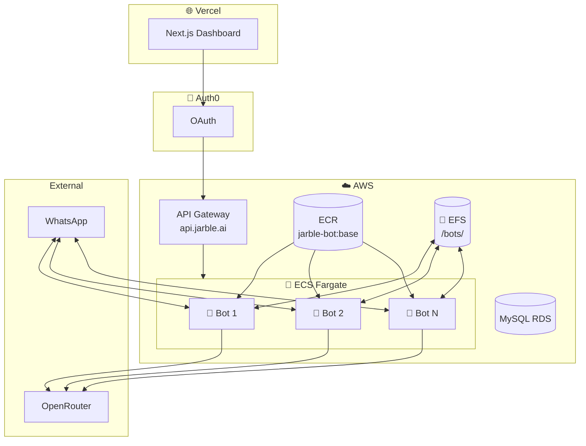
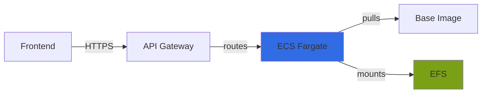
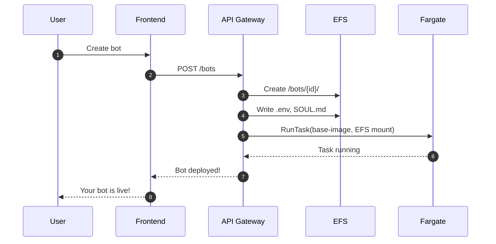
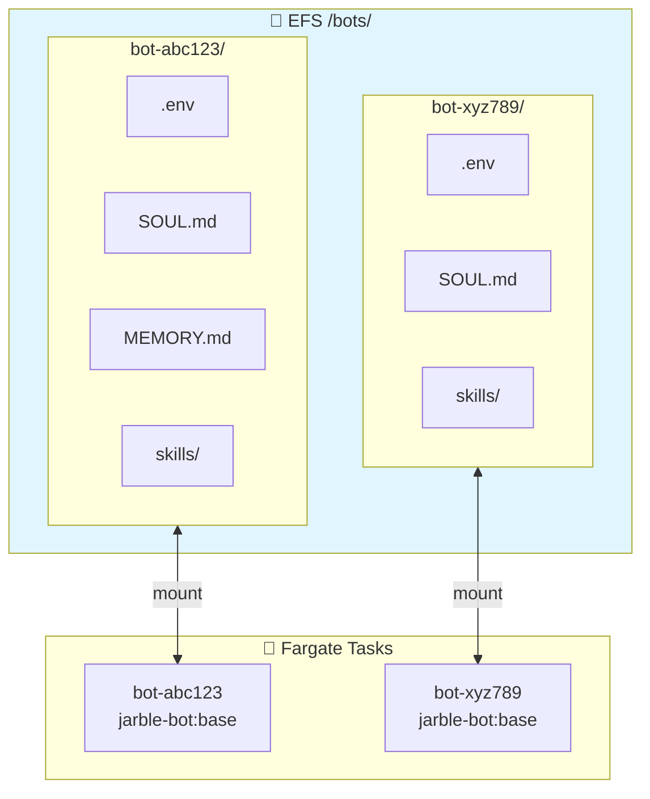
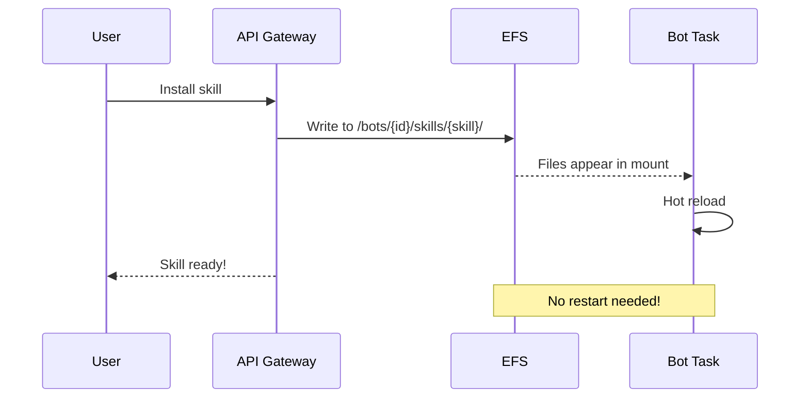
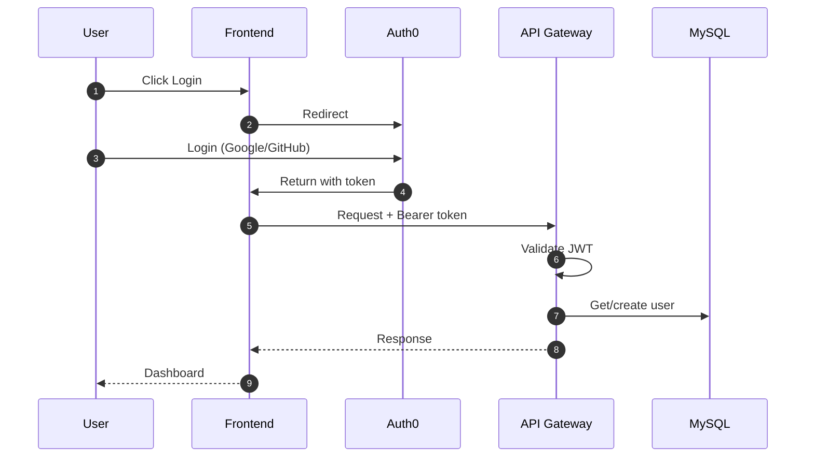
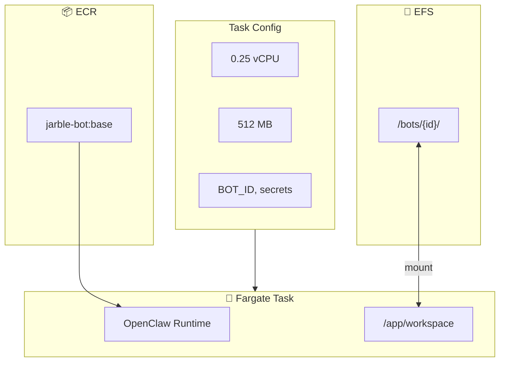
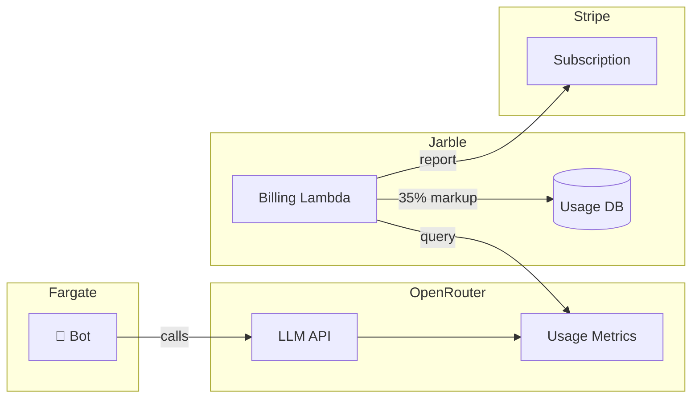
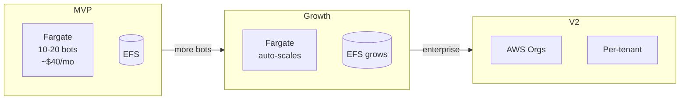
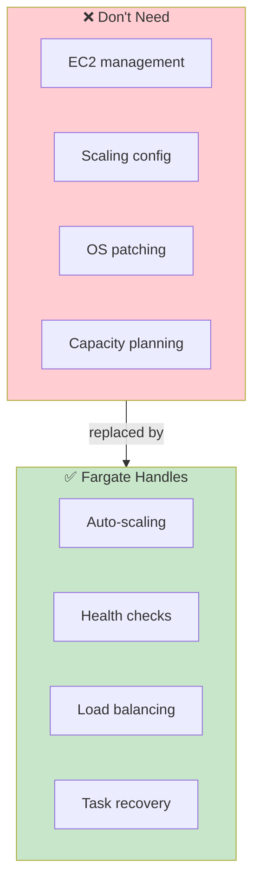

# Jarble Platform Diagrams (Mermaid)

> These diagrams render natively in Notion code blocks with `mermaid` language.
> **FINAL Architecture:** ECS Fargate + EFS + Single Base Image

---

## Architecture Overview

```
Frontend (Vercel) → API Gateway → ECS Fargate → Base Image + EFS
```

---

## 1. High-Level Architecture



---

## 2. Request Flow



Simple: Frontend → API Gateway → Fargate (base image + EFS mount)

---

## 3. Bot Deployment Flow



---

## 4. EFS Directory Structure



---

## 5. Skills Installation



Skills = files on EFS. Bot hot-reloads automatically.

---

## 6. Authentication Flow



---

## 7. Fargate Task Definition



---

## 8. Billing Flow



---

## 9. Scaling Path



Fargate auto-scales. EFS grows automatically. No infrastructure changes.

---

## 10. Why Fargate (20x Simpler)



---

## Key Points

- **Single base image** (`jarble-bot:base`) for ALL bots
- **EFS** stores bot identity (.env, SOUL.md, skills, memory)
- **Fargate** runs containers serverlessly
- **No CodeBuild** for bot creation
- **No per-bot images**
- **Flow:** Frontend → API Gateway → Fargate (base + EFS)

---

## Usage in Notion

1. Create a **Code Block**
2. Set language to **Mermaid**
3. Paste diagram code
4. Notion renders it automatically
