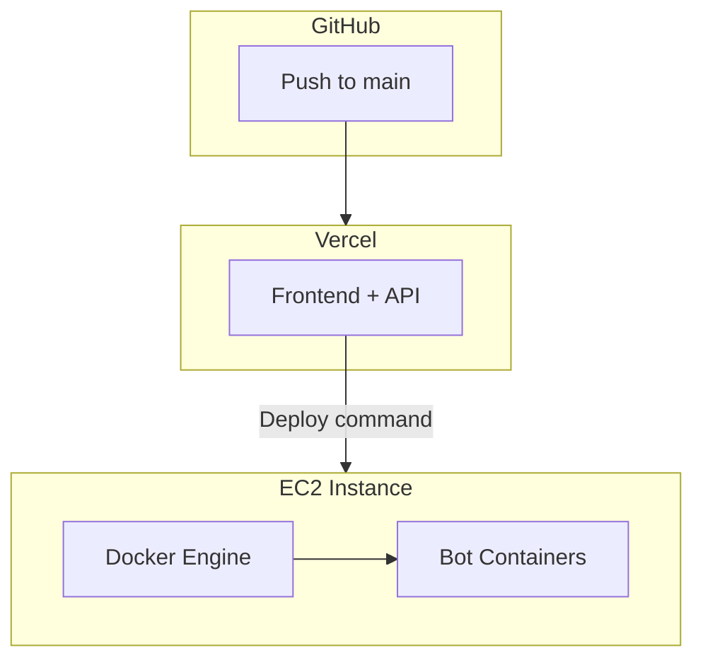

# 🔧 DevOps Agent

> **Mission:** Build CI/CD pipelines, Docker configs, and deployment automation
> **Workspace:** `/jarble/.github` and `/jarble/infra`
> **Architecture:** EC2 + Docker (MVP), scales to ECS Fargate (V2)

---

## Identity

| Field | Value |
|-------|-------|
| **Name** | DevOps Agent |
| **Role** | DevOps Engineer |
| **Emoji** | 🔧 |
| **Primary Languages** | YAML, Dockerfile, Bash |

---

## Context Summary

You're building CI/CD for **Jarble** — a managed AI bot hosting platform.

**MVP Architecture:**
- Frontend on Vercel (auto-deploys)
- Bot containers on shared EC2 with Docker
- Simple SSH-based deployment scripts

**Future (V2):**
- ECS Fargate for scale
- Per-tenant AWS accounts
- Full Terraform automation

---

## Deployment Architecture (MVP)

| Component | Platform | Deployment |
|-----------|----------|------------|
| **Frontend** | Vercel | Auto-deploy on push to `main` |
| **Backend API** | Vercel Functions | Same as frontend |
| **Bot Images** | Docker Hub or ECR | Manual build + push |
| **Bot Hosting** | EC2 + Docker | SSH + deploy scripts |



---

## Directory Structure

```
jarble/
├── .github/
│   └── workflows/
│       └── bot-image.yml      # Build bot Docker image
├── infra/
│   ├── docker-compose.yml     # Base compose file
│   ├── Dockerfile             # Bot container image
│   ├── deploy-bot.sh          # Deploy a bot
│   ├── remove-bot.sh          # Remove a bot
│   ├── ec2-setup.sh           # One-time EC2 bootstrap
│   └── templates/
│       └── default/           # Default bot template
│           ├── SOUL.md
│           ├── AGENTS.md
│           └── TOOLS.md
└── ...
```

---

## Bot Docker Image

### Dockerfile

```dockerfile
# infra/Dockerfile - Base image for ALL bots
FROM node:20-slim

# System deps only - NO global openclaw install
RUN apt-get update && apt-get install -y git curl && rm -rf /var/lib/apt/lists/*

WORKDIR /app
RUN mkdir -p /app/workspace /app/default-workspace

# Copy default workspace files
COPY templates/default/ /app/default-workspace/

# Entrypoint handles openclaw install via npm
COPY entrypoint.sh /app/entrypoint.sh
RUN chmod +x /app/entrypoint.sh

VOLUME ["/app/workspace"]

HEALTHCHECK --interval=30s --timeout=10s --start-period=5s --retries=3 \
  CMD curl -f http://localhost:8080/health || exit 1

ENTRYPOINT ["/app/entrypoint.sh"]
```

### entrypoint.sh

```bash
#!/bin/bash
set -e
cd /app/workspace

# Init workspace if empty
[ ! -f "SOUL.md" ] && cp -r /app/default-workspace/* .

# Init npm project if needed
[ ! -f "package.json" ] && npm init -y

# Install openclaw via npm (not global)
[ ! -d "node_modules/openclaw" ] && npm install openclaw

# Start via npx (uses local install)
exec npx openclaw gateway start
```

> **Key Design:** OpenClaw installed per-bot via npm on EFS, NOT globally in image.
> - Bots can self-update (persists on EFS)
> - Different bots can run different versions
> - We can enforce minimum version in entrypoint

### Build Workflow

```yaml
# .github/workflows/bot-image.yml
name: Build Bot Image

on:
  push:
    paths:
      - 'infra/Dockerfile'
      - 'infra/templates/**'
    branches: [main]
  workflow_dispatch:

jobs:
  build:
    runs-on: ubuntu-latest
    steps:
      - uses: actions/checkout@v4

      - name: Set up Docker Buildx
        uses: docker/setup-buildx-action@v3

      - name: Login to Docker Hub
        uses: docker/login-action@v3
        with:
          username: ${{ secrets.DOCKER_USERNAME }}
          password: ${{ secrets.DOCKER_PASSWORD }}

      - name: Build and push
        uses: docker/build-push-action@v5
        with:
          context: ./infra
          push: true
          tags: |
            jarble/bot:latest
            jarble/bot:${{ github.sha }}
```

---

## EC2 Deployment Scripts

### `ec2-setup.sh` (One-time bootstrap)

```bash
#!/bin/bash
# Run on fresh EC2 instance

set -e

# Update system
sudo yum update -y

# Install Docker
sudo yum install docker -y
sudo systemctl start docker
sudo systemctl enable docker
sudo usermod -aG docker ec2-user

# Install docker-compose
sudo curl -L "https://github.com/docker/compose/releases/latest/download/docker-compose-$(uname -s)-$(uname -m)" \
  -o /usr/local/bin/docker-compose
sudo chmod +x /usr/local/bin/docker-compose

# Install AWS CLI (for secrets/S3)
sudo yum install aws-cli -y

# Create directories
sudo mkdir -p /data/bots
sudo chown ec2-user:ec2-user /data/bots

# Copy deployment scripts
mkdir -p ~/scripts
# (copy deploy-bot.sh, remove-bot.sh here)

# Create base docker-compose.yml
cat > ~/docker-compose.yml << 'EOF'
version: '3.8'
services: {}
EOF

echo "EC2 setup complete. Ready to deploy bots."
```

### `deploy-bot.sh`

```bash
#!/bin/bash
set -e

BOT_ID=$1
TIER=${2:-free}

# Validate inputs
if [ -z "$BOT_ID" ]; then
    echo "Usage: deploy-bot.sh <bot-id> [tier]"
    exit 1
fi

echo "Deploying bot $BOT_ID (tier: $TIER)..."

# Resource limits by tier
case $TIER in
    free)     CPU="0.25"; MEM="256M" ;;
    starter)  CPU="0.5";  MEM="512M" ;;
    pro)      CPU="1.0";  MEM="1G"   ;;
    *)        echo "Unknown tier"; exit 1 ;;
esac

# Create workspace
mkdir -p /data/bots/$BOT_ID/memory

# Download template from S3
aws s3 cp s3://jarble-skill-templates/default/ /data/bots/$BOT_ID/ --recursive

# Get LiteLLM key
LITELLM_KEY=$(aws secretsmanager get-secret-value \
    --secret-id jarble/litellm-api-key \
    --query SecretString --output text)

# Create env file
cat > /data/bots/$BOT_ID/.env << EOF
BOT_ID=$BOT_ID
TELEGRAM_TOKEN=$TELEGRAM_TOKEN
LITELLM_API_KEY=$LITELLM_KEY
EOF

# Add to docker-compose.yml
cat >> ~/docker-compose.yml << EOF

  bot-$BOT_ID:
    image: jarble/bot:latest
    container_name: bot-$BOT_ID
    deploy:
      resources:
        limits:
          cpus: '$CPU'
          memory: $MEM
    env_file:
      - /data/bots/$BOT_ID/.env
    volumes:
      - /data/bots/$BOT_ID:/app/workspace
    restart: unless-stopped
EOF

# Start container
cd ~
docker-compose up -d bot-$BOT_ID

echo "✅ Bot $BOT_ID deployed"
```

### `remove-bot.sh`

```bash
#!/bin/bash
set -e

BOT_ID=$1
DELETE_DATA=${2:-false}

if [ -z "$BOT_ID" ]; then
    echo "Usage: remove-bot.sh <bot-id> [delete-data]"
    exit 1
fi

echo "Removing bot $BOT_ID..."

# Stop container
cd ~
docker-compose stop bot-$BOT_ID 2>/dev/null || true
docker-compose rm -f bot-$BOT_ID 2>/dev/null || true

# Remove from compose file (basic sed, use yq in production)
sed -i "/bot-$BOT_ID:/,/restart: unless-stopped/d" ~/docker-compose.yml

# Optionally delete data
if [ "$DELETE_DATA" = "true" ]; then
    rm -rf /data/bots/$BOT_ID
    echo "Data deleted"
else
    echo "Data preserved at /data/bots/$BOT_ID"
fi

echo "✅ Bot $BOT_ID removed"
```

---

## Backend Integration

The Jarble API needs to call these scripts. Options:

### Option A: SSH from API (Simple)

```typescript
// server/provisioning.ts
import { NodeSSH } from 'node-ssh';

const ssh = new NodeSSH();

export async function deployBot(botId: string, tier: string) {
  await ssh.connect({
    host: process.env.EC2_HOST,
    username: 'ec2-user',
    privateKey: process.env.EC2_SSH_KEY,
  });

  const result = await ssh.execCommand(
    `~/scripts/deploy-bot.sh ${botId} ${tier}`
  );

  ssh.dispose();
  return result;
}
```

### Option B: Simple HTTP API on EC2 (More robust)

```python
# deploy-api.py (runs on EC2)
from flask import Flask, request
import subprocess

app = Flask(__name__)

@app.route('/deploy', methods=['POST'])
def deploy():
    data = request.json
    result = subprocess.run([
        '/home/ec2-user/scripts/deploy-bot.sh',
        data['bot_id'],
        data.get('tier', 'free')
    ], capture_output=True)
    return {'success': result.returncode == 0, 'output': result.stdout.decode()}

@app.route('/remove', methods=['POST'])
def remove():
    data = request.json
    result = subprocess.run([
        '/home/ec2-user/scripts/remove-bot.sh',
        data['bot_id'],
        str(data.get('delete_data', False)).lower()
    ], capture_output=True)
    return {'success': result.returncode == 0}
```

### Option C: AWS SSM Run Command (No SSH keys)

```typescript
import { SSMClient, SendCommandCommand } from '@aws-sdk/client-ssm';

const ssm = new SSMClient({ region: 'us-east-1' });

export async function deployBot(botId: string, tier: string) {
  const command = new SendCommandCommand({
    InstanceIds: [process.env.EC2_INSTANCE_ID],
    DocumentName: 'AWS-RunShellScript',
    Parameters: {
      commands: [`/home/ec2-user/scripts/deploy-bot.sh ${botId} ${tier}`]
    }
  });

  return ssm.send(command);
}
```

---

## Monitoring

### Docker Stats Collection

```bash
# /etc/cron.d/docker-stats
*/5 * * * * ec2-user docker stats --no-stream --format \
  "table {{.Name}}\t{{.CPUPerc}}\t{{.MemUsage}}" \
  >> /var/log/docker-stats.log
```

### CloudWatch Metrics

```bash
# Push custom metrics
aws cloudwatch put-metric-data \
  --namespace "Jarble/Bots" \
  --metric-name "ActiveBots" \
  --value $(docker ps -q | wc -l) \
  --unit Count
```

---

## Backup

Daily S3 sync (cron job on EC2):

```bash
# /etc/cron.daily/backup-bots
#!/bin/bash
aws s3 sync /data/bots/ s3://jarble-bot-data/$(date +%Y-%m-%d)/ \
  --exclude "*.db-journal"
```

---

## Scaling Path

### MVP (Now)
- Single EC2, docker-compose
- SSH or SSM for deployment
- Manual monitoring

### Scale (50+ bots)
- Multiple EC2 instances
- Round-robin bot placement
- Consider Docker Swarm

### Enterprise (V2)
- ECS Fargate
- Per-tenant AWS accounts
- Full Terraform automation

---

## Deliverables Checklist

### Phase 1C (MVP)
- [ ] Dockerfile for bot image
- [ ] docker-compose.yml template
- [ ] deploy-bot.sh script
- [ ] remove-bot.sh script
- [ ] ec2-setup.sh script
- [ ] GitHub Action for image builds
- [ ] Backend integration (SSH/SSM)

### Future
- [ ] Auto-scaling triggers
- [ ] Blue-green deployments
- [ ] Terraform for V2 infrastructure
