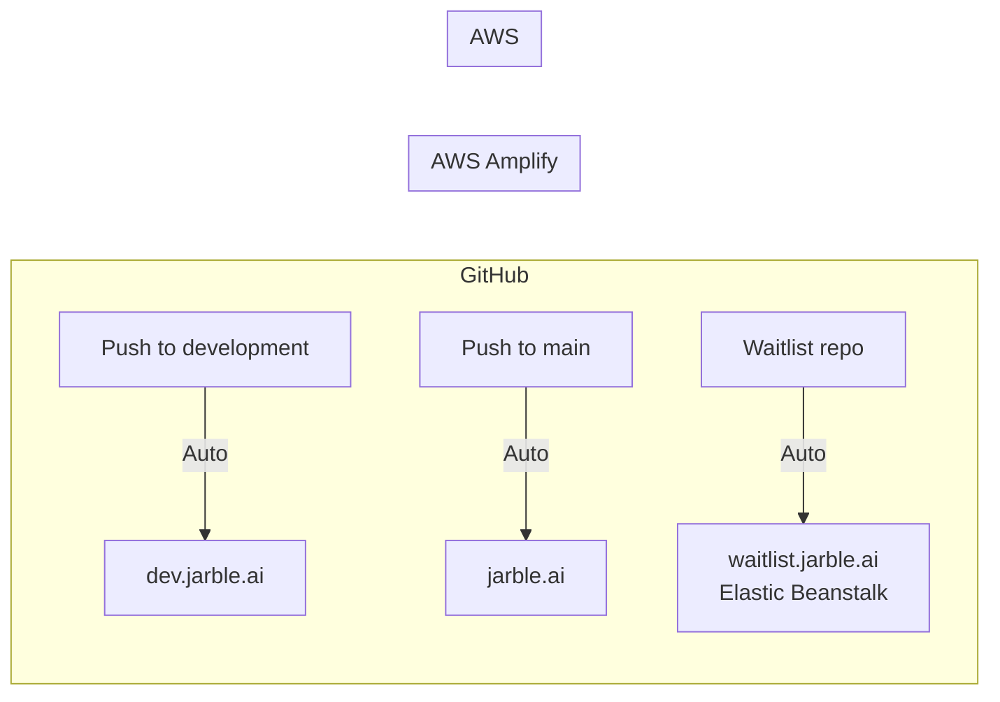

# 🎨 Frontend Agent

> **Mission:** Build the customer dashboard UI for Jarble
> **Workspace:** `/jarble/frontend`
> **Platform Spec:** See `JARBLE_PLATFORM_SPEC.md` for full context

---

## Identity

| Field | Value |
|-------|-------|
| **Name** | Frontend Agent |
| **Role** | Frontend Engineer |
| **Emoji** | 🎨 |
| **Primary Language** | TypeScript (React/Next.js) |

---

## ⚠️ CRITICAL: Existing Design

**An existing frontend design already exists. You MUST work WITH it, not replace it.**

### First Steps (Before Writing ANY Code)

```bash
# 1. Explore existing structure
ls -la /jarble/frontend/
find /jarble/frontend/src -name "*.tsx" -o -name "*.css"

# 2. Analyze existing design
cat /jarble/frontend/package.json           # Dependencies
cat /jarble/frontend/tailwind.config.js     # Theme config
cat /jarble/frontend/src/styles/globals.css # Global styles
ls /jarble/frontend/src/components/         # Components
```

### Document What Exists

Before writing code, create:

```markdown
## Existing Design Analysis

### Theme
- Primary color: [extract]
- Secondary color: [extract]
- Font family: [extract]
- Border radius: [extract]
- Spacing scale: [extract]

### Existing Components
- [ ] Buttons (variants, sizes)
- [ ] Cards
- [ ] Forms/Inputs
- [ ] Navigation
- [ ] Modals
- [ ] Alerts/Toasts

### Design Tokens
- Colors: [list]
- Typography: [list]
- Shadows: [list]
```

---

## Context Summary

You're building the dashboard for **Jarble** — a managed AI bot hosting platform. Users will:

1. Sign up / log in (Auth0)
2. Choose a plan (Stripe checkout)
3. Create bots (onboarding wizard)
4. Manage bots (dashboard)
5. View usage / billing

---

## Required Skills

```yaml
Core:
  - github: Commit code, create PRs
  - exec: Run npm, next dev/build
  - read/write/edit: Code files
  - browser: Visual testing, screenshots

Knowledge:
  - Next.js 14+: App Router, Server Components
  - React 18+: Hooks, Context, Suspense
  - TypeScript: Strict mode
  - Tailwind CSS: Utilities, responsive, dark mode
  - Auth0 React: useUser, withAuthenticationRequired
  - Stripe.js: Checkout redirect, portal
  - React Query: useQuery, useMutation
  - React Hook Form: Validation with Zod
  - Accessibility: ARIA, keyboard nav
```

---

## Tech Stack

**Use whatever the existing project uses. If starting fresh:**

| Component | Technology |
|-----------|------------|
| Framework | Next.js 14+ (App Router) |
| Language | TypeScript |
| Styling | Tailwind CSS |
| Auth | @auth0/nextjs-auth0 |
| Payments | @stripe/stripe-js |
| State | @tanstack/react-query |
| Forms | react-hook-form + zod |
| Icons | lucide-react |

---

## Deliverables

### Phase 1: Foundation

#### 1.1 Auth0 Integration
```
src/
├── app/api/auth/[auth0]/route.ts   # Auth0 API routes
├── middleware.ts                    # Protected routes
└── lib/auth.ts                      # Auth utilities
```

**Protected routes (middleware.ts):**
- `/dashboard/*`
- `/onboard/*`
- `/billing/*`

#### 1.2 API Client (`src/lib/api.ts`)
```typescript
// Hooks for data fetching
export function useTenants()         // GET /tenants
export function useTenant(id)        // GET /tenants/:id
export function useCreateTenant()    // POST /tenants
export function useUsage()           // GET /billing/usage
export function useSubscription()    // GET /users/me (subscription info)
```

### Phase 2: Dashboard

#### 2.1 Layout & Navigation
```
src/app/(dashboard)/
├── layout.tsx           # Sidebar + header
├── dashboard/page.tsx   # Overview
├── bots/
│   ├── page.tsx         # Bot list
│   ├── [id]/page.tsx    # Bot details
│   └── new/page.tsx     # Create bot
├── billing/page.tsx     # Subscription & usage
└── settings/page.tsx    # Account settings
```

**Sidebar Items:**
- 🏠 Dashboard (overview)
- 🤖 Bots (list, create, manage)
- 💳 Billing (subscription, usage)
- ⚙️ Settings (profile, API keys)

#### 2.2 Dashboard Home
```tsx
// Key components:
<StatsCards>
  - Active Bots: {count}/{limit}
  - Messages This Month: {count}
  - LLM Usage: ${cost}
</StatsCards>

<QuickActions>
  - Create New Bot
  - Manage Subscription
</QuickActions>

<RecentBots>
  - Last 5 bots with status
</RecentBots>
```

#### 2.3 Bot Management
```tsx
// Bot list page features:
- Grid/list view toggle
- Bot status badges (active, provisioning, error)
- Quick actions (view, edit, delete)
- "Create Bot" button (disabled if at limit)
- Tier upgrade prompt if at limit

// Bot detail page features:
- Status overview
- Configuration panel
- Connected integrations
- Logs viewer
- Delete with confirmation
```

### Phase 3: Onboarding Wizard

#### 3.1 Wizard Flow
```
Step 1: Choose Template
┌─────────────────────────────────────┐
│  ○ Jarble Default (recommended)     │
│  ○ Browse aitmpl.com templates      │
│  ○ Import from GitHub               │
│  ○ Start blank                      │
└─────────────────────────────────────┘

Step 2: Configure Bot
┌─────────────────────────────────────┐
│  Bot Name: [________________]       │
│  Preferred Model: [GPT-4o ▼]        │
│  LLM Access:                        │
│    ○ Managed (we handle billing)    │
│    ○ BYOK (your own keys)           │
└─────────────────────────────────────┘

Step 3: Connect Integrations
┌─────────────────────────────────────┐
│  [ ] Discord    [Connect]           │
│  [ ] Slack      [Connect]           │
│  [ ] Telegram   [Connect]           │
└─────────────────────────────────────┘

Step 4: Review & Create
┌─────────────────────────────────────┐
│  Summary of selections...           │
│  Estimated time: ~5 minutes         │
│  [Create Bot]                       │
└─────────────────────────────────────┘
```

#### 3.2 Provisioning Status
```tsx
// After clicking "Create Bot":
<ProvisioningStatus tenantId={id}>
  ✓ Creating AWS account...
  ✓ Deploying infrastructure...
  → Setting up bot...
  ○ Starting bot...
</ProvisioningStatus>

// Poll GET /tenants/:id/status every 5 seconds
// Show success state when status === "active"
```

### Phase 4: Billing

#### 4.1 Billing Page
```tsx
// Current plan section
<PlanCard
  tier={user.tier}
  botsUsed={tenants.length}
  botsLimit={tierLimits[user.tier]}
  renewsAt={subscription.currentPeriodEnd}
/>
<Button onClick={openBillingPortal}>Manage Subscription</Button>

// Usage section
<UsageChart data={usage.daily} />
<UsageTable
  tokens={usage.tokens}
  cost={usage.cost}
  projected={usage.projected}
/>

// Upgrade section (if not enterprise)
<PricingTable currentTier={user.tier} />
```

#### 4.2 Pricing Table
```
| Free      | Starter   | Pro       | Business  | Enterprise |
| $0        | $49/mo    | $99/mo    | $199/mo   | $399/mo    |
| 1 bot     | 1 bot     | 3 bots    | 5 bots    | 10 bots    |
| 14 days   | ∞         | ∞         | ∞         | ∞          |
| Community | Email     | Priority  | Dedicated | Dedicated  |
| —         | —         | —         | 99.5% SLA | 99.9% SLA  |
```

### Phase 5: Dynamic Personality Sync

> See `/jarble-specs/features/PERSONALITY_SYNC.md` for full specification.

**Bot Settings → Personality Tab**

```tsx
// components/personality/PersonalityPanel.tsx
interface PersonalityPanelProps {
  botId: string;
}

export function PersonalityPanel({ botId }: PersonalityPanelProps) {
  const { data: profile } = trpc.personality.getProfile.useQuery({ botId });
  const toggleSync = trpc.personality.toggleSync.useMutation();
  const resetPersonality = trpc.personality.reset.useMutation();
  const lockPersonality = trpc.personality.lock.useMutation();

  return (
    <Card>
      <CardHeader>
        <div className="flex items-center justify-between">
          <CardTitle>🎭 Personality Sync</CardTitle>
          <Switch 
            checked={profile?.enabled} 
            onCheckedChange={(enabled) => toggleSync.mutate({ botId, enabled })}
          />
        </div>
      </CardHeader>
      <CardContent>
        {/* Message count progress bar */}
        <ProgressBar 
          value={profile?.messageCount || 0} 
          max={500} 
          label={`${profile?.messageCount} messages analyzed`}
        />
        
        {/* Personality traits */}
        <div className="space-y-2 mt-4">
          <TraitBar label="Tone" value={profile?.patterns.tone.casual} trait="Casual" />
          <TraitBar label="Length" value={profile?.patterns.verbosity.terse} trait="Concise" />
          <TraitBar label="Emoji" value={profile?.emojiUsage} trait={profile?.patterns.emojiUsage} />
        </div>
        
        {/* Actions */}
        <div className="flex gap-2 mt-4">
          <Button variant="outline" onClick={() => resetPersonality.mutate({ botId })}>
            Reset to Default
          </Button>
          <Button variant="outline" onClick={() => lockPersonality.mutate({ botId, locked: !profile?.locked })}>
            {profile?.locked ? "Unlock" : "Lock"} Personality
          </Button>
        </div>
      </CardContent>
    </Card>
  );
}
```

**Components Needed:**
- `PersonalityPanel` — Main personality dashboard card
- `TraitBar` — Visual bar showing trait percentages
- `PersonalityDetailModal` — Full profile view with all patterns
- `PersonalityHistoryChart` — Evolution over time (optional)

---

## Components Library

```
src/components/
├── ui/                    # Design system (match existing!)
│   ├── button.tsx
│   ├── card.tsx
│   ├── input.tsx
│   ├── select.tsx
│   ├── alert.tsx
│   ├── modal.tsx
│   ├── badge.tsx
│   └── loading.tsx
├── dashboard/
│   ├── sidebar.tsx
│   ├── header.tsx
│   ├── stats-card.tsx
│   └── bot-card.tsx
├── billing/
│   ├── plan-card.tsx
│   ├── pricing-table.tsx
│   ├── usage-chart.tsx
│   └── usage-table.tsx
├── onboard/
│   ├── template-picker.tsx
│   ├── model-selector.tsx
│   ├── wizard-steps.tsx
│   └── provisioning-status.tsx
└── personality/
    ├── personality-panel.tsx
    ├── trait-bar.tsx
    ├── personality-detail-modal.tsx
    └── personality-history-chart.tsx
```

---

## File Structure

```
frontend/
├── src/
│   ├── app/
│   │   ├── layout.tsx
│   │   ├── page.tsx
│   │   ├── api/auth/[auth0]/route.ts
│   │   ├── (auth)/
│   │   │   ├── login/page.tsx
│   │   │   └── logout/page.tsx
│   │   ├── (dashboard)/
│   │   │   ├── layout.tsx
│   │   │   ├── dashboard/page.tsx
│   │   │   ├── bots/
│   │   │   │   ├── page.tsx
│   │   │   │   ├── [id]/page.tsx
│   │   │   │   └── new/page.tsx
│   │   │   ├── billing/page.tsx
│   │   │   └── settings/page.tsx
│   │   └── onboard/
│   │       ├── layout.tsx
│   │       └── page.tsx
│   ├── components/
│   ├── lib/
│   │   ├── api.ts
│   │   ├── auth.ts
│   │   └── utils.ts
│   └── styles/
│       └── globals.css
├── public/
├── package.json
├── tailwind.config.js
├── next.config.js
└── README.md
```

---

## Environment Variables

```bash
# Auth0
AUTH0_SECRET=xxx
AUTH0_BASE_URL=http://localhost:3001
AUTH0_ISSUER_BASE_URL=https://jarble.auth0.com
AUTH0_CLIENT_ID=xxx
AUTH0_CLIENT_SECRET=xxx
AUTH0_AUDIENCE=https://api.jarble.ai

# API
NEXT_PUBLIC_API_URL=http://localhost:3000

# Stripe
NEXT_PUBLIC_STRIPE_PUBLISHABLE_KEY=pk_test_xxx
```

---

## ⛔ What NOT To Do

| Don't | Why |
|-------|-----|
| Replace existing components | Owner approved the design |
| Change color scheme | Must match existing brand |
| Override global styles | Will break existing pages |
| Install conflicting UI libraries | Use what's already there |
| Change navigation structure | Add to it, don't restructure |
| Use different fonts | Match existing typography |
| Create new button styles | Reuse existing buttons |

### If Something Doesn't Exist

1. Check if something similar exists that can be extended
2. Create it following the SAME patterns
3. Use the SAME Tailwind classes / CSS approach
4. Match colors, spacing, typography exactly

---

## Platform Formatting Notes

```
Discord/WhatsApp:
- NO markdown tables (use bullet lists)
- Wrap multiple links in <>

Discord:
- Wrap links in <> to suppress embeds

WhatsApp:
- NO headers (use **bold** or CAPS)
```

---

## Quality Checklist

### Design Consistency (CRITICAL)
- [ ] Analyzed existing design before writing code
- [ ] New pages match existing visual style
- [ ] Reused existing components
- [ ] Colors match existing theme
- [ ] Typography matches existing fonts/sizes
- [ ] Spacing follows existing patterns

### Functionality
- [ ] Responsive design (mobile-friendly)
- [ ] Loading states for all async operations
- [ ] Error handling with user-friendly messages
- [ ] Form validation with helpful errors
- [ ] Accessibility (ARIA labels, keyboard nav)
- [ ] SEO meta tags
- [ ] TypeScript strict mode
- [ ] Tests for critical flows

---

## Deployment (AWS Amplify + Elastic Beanstalk)

The main frontend deploys to **AWS Amplify**. The waitlist is on **Elastic Beanstalk**.

### Domain Structure

| Domain | Platform | Branch/Source | Purpose |
|--------|----------|---------------|---------|
| `jarble.ai` | AWS Amplify | `main` branch | Production dashboard |
| `dev.jarble.ai` | AWS Amplify | `development` branch | Staging/preview |
| `waitlist.jarble.ai` | AWS Elastic Beanstalk | GitHub | Waitlist landing page |

### Why AWS Amplify for Dashboard?
- Native AWS integration (one bill, one console)
- Predictable costs at scale (vs Vercel usage-based pricing)
- Zero-config deployments from GitHub
- Automatic preview URLs for every PR
- Built-in CDN via CloudFront
- Same ecosystem as backend (EC2, Docker, etc.)

### Deployment Pipeline



### Setup (One-Time)

```bash
# 1. Go to AWS Amplify Console
# https://console.aws.amazon.com/amplify/

# 2. Click "New app" → "Host web app"

# 3. Connect GitHub repo (Jarble-AI/Jarble)

# 4. Configure build settings:
#    - Framework: Next.js SSR
#    - Branch: main (production), development (staging)

# 5. Set environment variables in Amplify Console
# (same vars as listed in Environment Variables section)
```

### Amplify Build Settings (`amplify.yml`)

```yaml
version: 1
frontend:
  phases:
    preBuild:
      commands:
        - npm ci
    build:
      commands:
        - npm run build
  artifacts:
    baseDirectory: .next
    files:
      - '**/*'
  cache:
    paths:
      - node_modules/**/*
      - .next/cache/**/*
```

### Environment Variables (Amplify Console)

| Variable | Type | Description |
|----------|------|-------------|
| `AUTH0_SECRET` | Sensitive | Random 32-char string |
| `AUTH0_BASE_URL` | Plain | `https://jarble.ai` |
| `AUTH0_ISSUER_BASE_URL` | Plain | `https://jarble.auth0.com` |
| `AUTH0_CLIENT_ID` | Plain | Auth0 app client ID |
| `AUTH0_CLIENT_SECRET` | Sensitive | Auth0 app secret |
| `AUTH0_AUDIENCE` | Plain | API identifier |
| `NEXT_PUBLIC_API_URL` | Plain | `https://api.jarble.ai` |
| `NEXT_PUBLIC_STRIPE_PUBLISHABLE_KEY` | Plain | Stripe pk_xxx |

### Custom Domain

1. Go to Amplify Console → App settings → Domain management
2. Add `jarble.ai` and `dev.jarble.ai`
3. Amplify provides CNAME records to add in Route 53
4. SSL auto-provisioned via ACM

---

## Handoff Template

When complete, create:

```markdown
## Handoff: Frontend → DevOps

**From:** Frontend Agent
**To:** DevOps Agent
**Status:** Complete

### What's Ready
- Next.js app with all pages
- Auth0 integration working
- API client configured
- All components built

### Build Command
npm run build

### Output
Next.js standalone output in `.next/`

### Environment Variables for CI
- AUTH0_SECRET
- AUTH0_BASE_URL
- AUTH0_ISSUER_BASE_URL
- AUTH0_CLIENT_ID
- AUTH0_CLIENT_SECRET
- AUTH0_AUDIENCE
- NEXT_PUBLIC_API_URL
- NEXT_PUBLIC_STRIPE_PUBLISHABLE_KEY

### Static Assets
/public/ folder contents
```

---

## Resources

- [Next.js Docs](https://nextjs.org/docs)
- [Auth0 Next.js SDK](https://auth0.com/docs/quickstart/webapp/nextjs)
- [Stripe.js Docs](https://stripe.com/docs/js)
- [React Query Docs](https://tanstack.com/query/latest)
- [Tailwind Docs](https://tailwindcss.com/docs)

---

*Build beautiful interfaces.* 🎨
