# Complete Overview & Roadmap

<aside>
📅 Last updated: February 17, 2026 (Session 13 — Terraform CI/CD)

</aside>

Jarble is a **no-code AI deployment platform** that lets users deploy AI-powered bots (powered by LLMs) to messaging platforms in under 2 minutes — no coding required.

---

# 1. Platform Architecture

### Tech Stack

| Layer | Technology |
| --- | --- |
| Frontend | Next.js 15 (App Router), React 18, TypeScript |
| Styling | Tailwind CSS v4, shadcn/ui (40+ components), Framer Motion |
| API | Express + tRPC, SuperJSON serialization |
| Database | Drizzle ORM — MySQL (prod), PostgreSQL (alt), SQLite (dev) |
| Auth | Auth0 (Email/Password, Google OAuth, GitHub OAuth) |
| Payments | Stripe (subscriptions, checkout, webhooks) |
| Infrastructure | Hetzner Cloud, Terraform IaC, K3s (Longhorn, Traefik) |
| LLM Providers | OpenRouter, OpenAI, Anthropic, Google |
| State Management | React Query + tRPC hooks |

### System Architecture Diagram

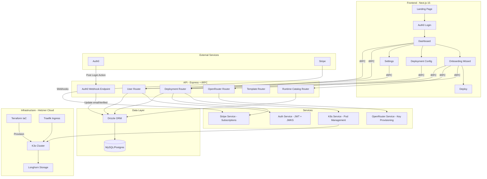

---

# 2. Frontend — Pages & Routes

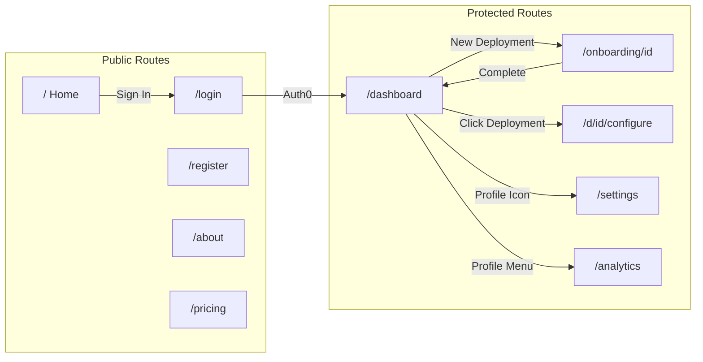

---

# 3. Onboarding Wizard Flow


---

# 4. Backend — API Routers & Procedures

### tRPC Router Map

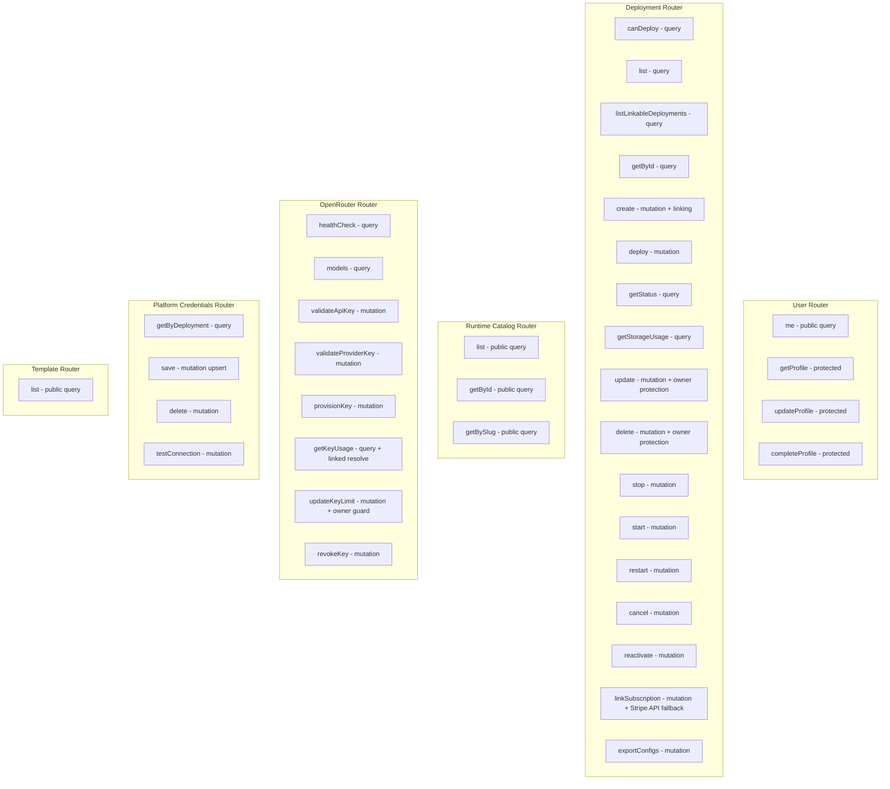

### REST Endpoints (Non-tRPC)

| Method | Path | Auth | Description |
| --- | --- | --- | --- |
| GET | /health | None | K8s liveness/readiness probe |
| POST | /api/stripe/webhook | Stripe sig | Stripe event webhooks |
| POST | /api/stripe/checkout | JWT | Create checkout session |
| POST | /api/stripe/portal | JWT | Create billing portal |
| POST | /api/auth0/email-verified | M2M | Auth0 email verification sync |
| GET | /api/deployments/status/stream | JWT | SSE stream of deployment status changes |
| GET | /api/deployments/:id/logs | JWT | SSE stream of K8s container logs |
| POST | /api/auth0/resend-verification | JWT | Resend Auth0 email verification |
| GET | /debug/db | None | View DB tables (dev only) |

---

# 5. Database Schema

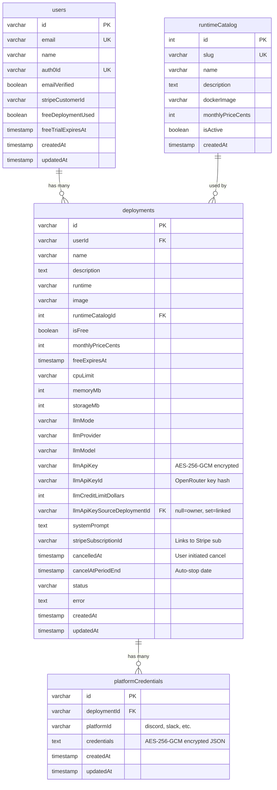

---

# 6. Deployment Flow (End-to-End)

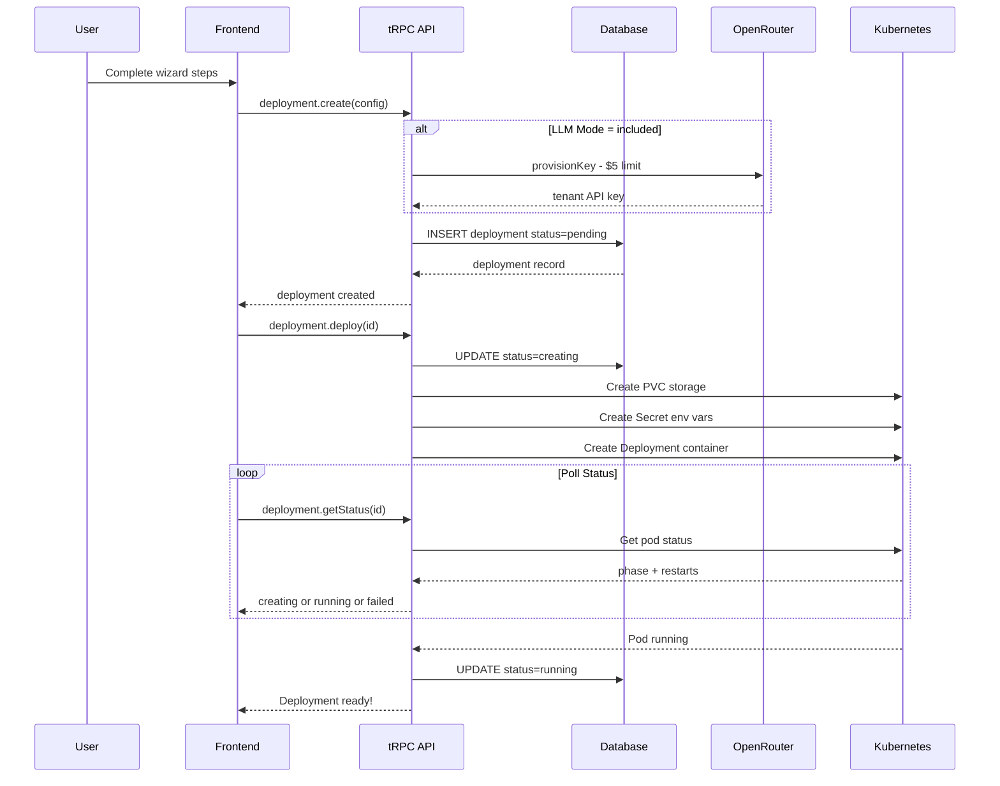

---

# 7. Infrastructure — Hetzner Cloud + Terraform

### Cluster Provisioning Architecture

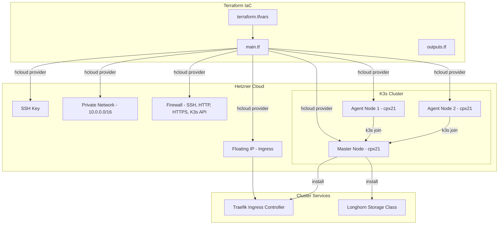

### Default Cluster Specs

| Resource | Default | Notes |
| --- | --- | --- |
| Master Node | cpx21 (3 vCPU, 4GB) | ~$7.59/mo |
| Agent Nodes | 2x cpx21 | Scales via agent_count |
| Network | 10.0.0.0/16 | Internal K3s comms |
| Storage | Longhorn | Default StorageClass |
| Ingress | Traefik | TLS, host-based routing |
| Location | Ashburn (ash) | Also: Falkenstein, Nuremberg, Helsinki |
| K3s Version | v1.29.2+k3s1 | Lightweight Kubernetes |

### Quick Start

```bash
cd infrastructure/terraform
cp terraform.tfvars.example terraform.tfvars
# Edit terraform.tfvars with Hetzner token + SSH key
terraform init
terraform plan
terraform apply
# Fetch kubeconfig
scp root@<MASTER_IP>:/etc/rancher/k3s/k3s.yaml ./kubeconfig.yaml
```

---

# 8. Kubernetes Resource Architecture

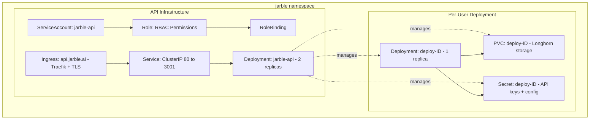

### K8s Resources Per Deployment

| Resource | Details |
| --- | --- |
| PVC | Longhorn, ReadWriteOnce, min 1Gi |
| Secret | DEPLOYMENT_ID, USER_ID, RUNTIME, OPENROUTER_API_KEY |
| Deployment | 1 replica, custom CPU/RAM limits, /data mount |

---

# 9. Auth & Security Flow

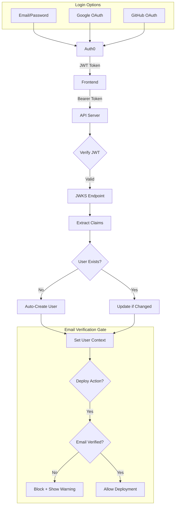

### Auth0 Email Verification Sync

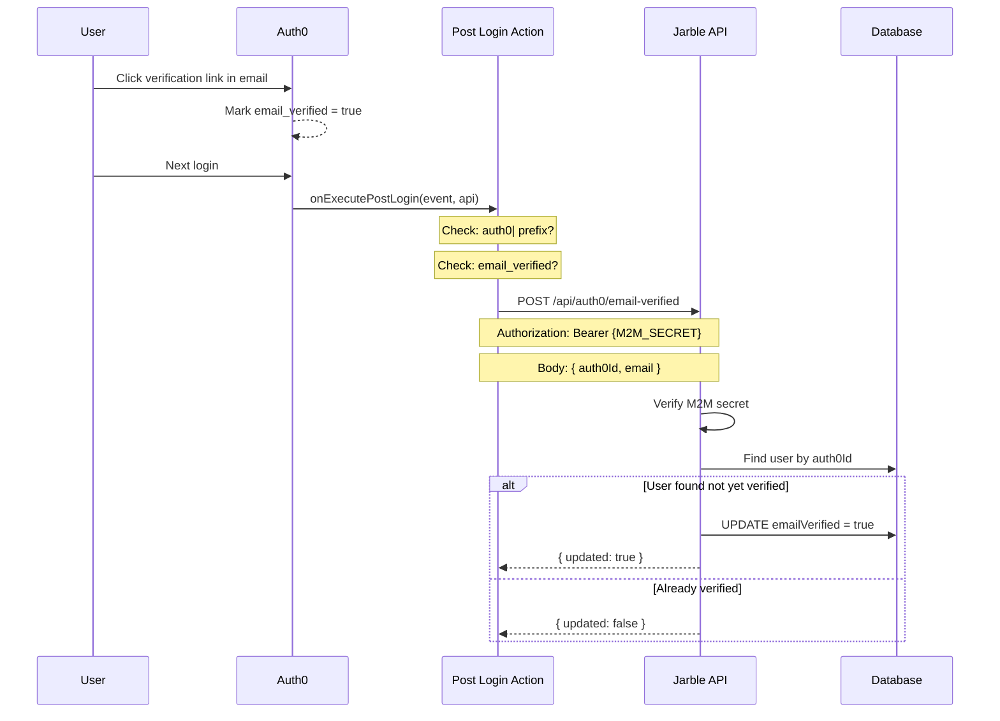

### Auth Details

| Feature | Implementation |
| --- | --- |
| JWT Verification | jose library, JWKS caching |
| User Provisioning | Auto-create on first login with nanoid(12) IDs |
| Email Gate | Deployments blocked until email_verified = true |
| Email Sync | Auth0 Post Login Action → POST /api/auth0/email-verified |
| M2M Auth | Shared secret (AUTH0_M2M_SECRET) in Bearer header |

---

# 10. Payment Flow (Stripe)

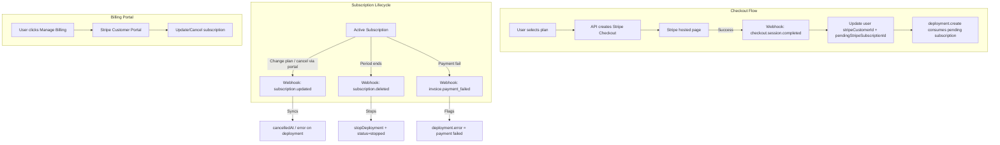

### Stripe Integration Status

| Feature | Status |
| --- | --- |
| Checkout session creation | ✅ Implemented |
| Portal session creation | ✅ Implemented |
| Webhook signature verification | ✅ Implemented |
| checkout.session.completed | ✅ Sets stripeCustomerId + pendingStripeSubscriptionId |
| subscription.updated → sync | ✅ Syncs cancel state + payment errors to deployment |
| subscription.deleted → stop | ✅ Stops deployment via proper WHERE query |
| invoice.payment_failed → flag | ✅ Sets deployment.error with payment warning |
| Subscription → deployment link | ✅ Pending subscription consumed in deployment.create |
| linkSubscription fallback | ✅ tRPC mutation for manual re-linking |

---

# 11. What's Built (Complete)

## Frontend ✅

- [x]  Landing page with hero animation, features grid, integrations marquee
- [x]  Auth0 login/register with Google, GitHub, Email/Password
- [x]  Dashboard with deployment cards, storage meter, email verification banner
- [x]  5-step onboarding wizard (Name → Runtime → LLM → Deploy → WhatsApp)
- [x]  Deploy step blocks unverified email users with warning
- [x]  Deployment configuration (5 tabs: General, Model, Platforms, Skills, Advanced)
- [x]  Settings page + password reset for email/password users
- [x]  Dark mode with localStorage + system preference
- [x]  Profile dropdown on all pages (Dashboard, Linked Deployments, Settings)
- [x]  **Linked Deployments page** — `/deployments` with runtime tabs, credit pool cluster visualization (owner/linked tree with CSS connectors)
- [x]  **Credit Pool Selector in wizard** — Link to existing pool or create new one during onboarding
- [x]  **Credit Plan Selector** — $5/$10/$25/$50/$100 monthly spending cap options
- [x]  **Multi-provider key validation** — Validates API keys for OpenRouter, OpenAI, Anthropic, Google
- [x]  **Hardware config in wizard** — CPU, memory, storage overrides with recommended badges
- [x]  **StatusBadge shared component** — Extracted from Dashboard, used by Dashboard + Linked Deployments
- [x]  **StorageMeter component** — Visual storage usage with color-coded progress bar
- [x]  **ZeroClaw LLM step** — ZeroClaw now has LLM Setup step in wizard (was deploy-only)
- [x]  **Stop/Start/Restart controls** — Per-deployment stop (Square), start (Play), restart (RotateCw) buttons on Dashboard cards
- [x]  **Cancel subscription flow** — Cancel button on DeploymentConfiguration sidebar for paid deployments, confirmation dialog, grace period card (CancellationGracePeriod component)
- [x]  **Config export as ZIP** — Export button during cancellation grace period, base64→Blob browser download
- [x]  **Cancelling badge on Dashboard** — Orange "Cancelling (Xd left)" badge + export button on Dashboard cards
- [x]  **Platform credential storage** — PlatformsTab wired to API (save/delete/test), encrypted credential storage, OpenClaw `openclaw.json` channel config generation
- [x]  **Email verification resend** — "Resend" button on Dashboard banner and Deploy step, calls Auth0 Management API
- [x]  **Deployment log streaming** — Real-time container logs via SSE, auto-scroll, severity-colored lines (ERROR=red, WARN=yellow, INFO=blue)
- [x]  **Real-time status via SSE** — `useStatusStream` hook replaces polling, Dashboard + DeploymentConfiguration cards update instantly on status changes
- [x]  **Usage Analytics dashboard** — `/analytics` page with summary cards (total/active/spend/mode split), status + runtime distribution charts, LLM credit usage meters, sortable per-deployment drill-down table
- [x]  **API Key Management UI** — ModelTab rewritten with 3 context-aware sections: Included Credits (usage meter, credit limit editor, regenerate/revoke), Linked (pool usage, link to owner), BYOK (status badge, validate, update key)
- [x]  **Deployment Logs tab** — Terminal-style log viewer (LogsTab), auto-scroll, pause/resume, clear, download, severity-colored lines, registered in wizardStepConfig for all runtimes

## Backend ✅

- [x]  Auth0 JWT verification + auto user provisioning
- [x]  Deployment CRUD + K8s orchestration (PVC, Secret, Deployment)
- [x]  Free tier system (1 free deployment, 7-day expiry)
- [x]  Multi-LLM provider support (OpenRouter, OpenAI, Anthropic, Google)
- [x]  Auth0 email verification webhook (POST /api/auth0/email-verified)
- [x]  Stripe checkout + portal + webhook handling
- [x]  Multi-database support (MySQL, PostgreSQL, SQLite)
- [x]  **OpenRouter key provisioning** — Auto-provision tenant API keys via OpenRouter Management API
- [x]  **AES-256-GCM encryption** — API keys encrypted before DB storage (`src/utils/encryption.ts`)
- [x]  **Shared Credit Pools (Owner/Linked model)** — `llmApiKeySourceDeploymentId` column links deployments to a shared key
- [x]  **Owner protection** — Cannot delete or switch mode on a credit pool owner with linked children
- [x]  **Linked usage resolution** — `getKeyUsage` follows link chain to owner's key hash
- [x]  **`listLinkableDeployments` query** — Returns owner deployments eligible for linking
- [x]  **Runtime Registry pattern** — `src/runtimes/` with per-runtime handlers for K8s config
- [x]  **Storage usage monitoring** — K8s exec `df -B1 /data` with percentage calculation
- [x]  **Stop/Start/Restart** — K8s replica scaling (0↔1) via `stopDeployment()`, `startDeployment()`, `restartDeployment()` with tRPC mutations + fire-and-forget pod status polling
- [x]  **Cancel/Reactivate mutations** — `cancel` schedules Stripe `cancel_at_period_end`, `reactivate` clears it. DB tracks `cancelledAt` + `cancelAtPeriodEnd`
- [x]  **Config export (ZIP)** — `exportConfigs` mutation execs into K8s pod, reads `/data/config/` files, builds ZIP with `archiver`, returns base64
- [x]  **Stripe webhook `subscription.deleted`** — Auto-stops deployment when billing period ends (finds deployment by `stripeSubscriptionId`, calls `stopDeployment`)
- [x]  **Platform credential storage** — `platform_credentials` table (AES-256-GCM encrypted JSON), `platformCredentials` tRPC router (getByDeployment, save, delete, testConnection), OpenClaw `openclaw.json` channel config + env var fallback injection during deploy
- [x]  **Stripe subscription → deployment sync** — `pendingStripeSubscriptionId` handoff from checkout webhook to `deployment.create`, `subscription.updated` syncs cancel state + payment errors, `invoice.payment_failed` flags deployments, `linkSubscription` fallback mutation
- [x]  **Email verification resend endpoint** — `POST /api/auth0/resend-verification` calls Auth0 Management API to resend verification email
- [x]  **Deployment log streaming** — `GET /api/deployments/:id/logs` SSE endpoint streams K8s container logs via `@kubernetes/client-node` log API
- [x]  **Real-time deployment status SSE** — `GET /api/deployments/status/stream` polls all user deployments every 5s, emits status changes as SSE events
- [x]  **Two-way config sync** — Frontend→PVC: `syncConfigsToPvc()` writes configs to PVC + restarts pod on update. PVC→Frontend: `file-watcher.sh` (inotifywait) detects changes, POSTs to webhook, `syncConfigsFromPvc()` updates DB if values differ
- [x]  **Drizzle migrations regenerated** — Fresh PostgreSQL migrations matching current schema

## Infrastructure ✅

- [x]  Terraform config for Hetzner Cloud K3s cluster
- [x]  Master + configurable agent nodes with auto-join
- [x]  Private networking + firewall rules
- [x]  Floating IP + Longhorn storage + Traefik ingress
- [x]  Auth0 Post Login Action for email verification sync

---

# 12. What's NOT Built Yet — Roadmap

## 🔴 Critical (Must-Have for Launch)

1. ~~**Platform credential storage**~~ — ✅ Done (Session 5). `platform_credentials` table + tRPC router + OpenClaw `openclaw.json` channel config
2. ~~**Stripe subscription → deployment sync**~~ — ✅ Done (Session 6). `pendingStripeSubscriptionId` handoff, all 4 webhook handlers implemented, `linkSubscription` fallback
3. ~~**Drizzle migrations regeneration**~~ — ✅ Done (Session 7). Fresh PostgreSQL migrations generated
4. **WhatsApp QR integration** — Replace mock QR with real WhatsApp Business API
5. ~~**Email verification resend**~~ — ✅ Done (Session 7). Resend button on Dashboard banner + Deploy step

## 🟡 Important (Post-Launch)

1. ~~Deployment logs~~ — ✅ Done (Session 7). SSE endpoint streams K8s container logs
2. ~~Real-time status~~ — ✅ Done (Session 8). SSE-based `useStatusStream` hook replaces polling
3. ~~Usage analytics dashboard~~ — ✅ Done (Session 8). `/analytics` page with summary cards, distribution charts, credit meters
4. ~~API key management~~ — ✅ Done (Session 8). ModelTab rewritten with included/linked/BYOK sections
5. Rate limiting on API routes
6. Terraform CI/CD — GitHub Actions for plan/apply

## 🟢 Nice-to-Have (Future)

1. Team/organization support — Multi-user orgs, RBAC
2. Chat testing playground — In-browser bot testing
3. Skill marketplace — Browse, install pre-built skills
4. Multi-region cluster support
5. Cluster auto-scaling based on deployments

---

# 13. Component Inventory

Shared: ProfileDropdown, IntegrationsMarquee, TemplateSelector, WizardLoader, ErrorBoundary, ThemeToggle, SubscribeButton, StatusBadge, StorageMeter, CancellationGracePeriod

Hooks: useStatusStream (SSE-based real-time deployment status)

Auth: Auth0Provider, LoginButton, LogoutButton

Views: Dashboard, Deployments (Linked Deployments), OnboardingWizard, DeploymentConfiguration, Settings, Analytics

UI Library: 40+ shadcn/ui components (Button, Card, Dialog, Tabs, Toast, Badge, etc.)

---

# 14. Environment Variables

### Frontend (.env.local)

- `NEXT_PUBLIC_AUTH0_DOMAIN` — Auth0 tenant domain
- `NEXT_PUBLIC_AUTH0_CLIENT_ID` — Auth0 application client ID
- `NEXT_PUBLIC_AUTH0_AUDIENCE` — Auth0 API audience

### Backend (.env)

- `DATABASE_URL` — Connection string (required unless SQLite)
- `AUTH0_DOMAIN`, `AUTH0_AUDIENCE` — Auth0 config (required)
- `AUTH0_M2M_SECRET` — Shared secret for email verification webhook
- `STRIPE_SECRET_KEY`, `STRIPE_WEBHOOK_SECRET` — Stripe keys
- `OPENROUTER_API_KEY` — OpenRouter API key for model listing / health checks
- `OPENROUTER_MANAGEMENT_KEY` — OpenRouter Management API key for tenant key provisioning (optional — required for "Included Credits" mode)
- `ENCRYPTION_KEY` — 32-byte hex key for AES-256-GCM API key encryption

### Terraform (terraform.tfvars)

- `hcloud_token` — Hetzner Cloud API token (required)
- `agent_count` — Number of worker nodes (default: 2)
- `location` — Datacenter (ash, fsn1, nbg1, hel1)

### Auth0 Action Secrets

- `JARBLE_API_URL` — API base URL
- `JARBLE_M2M_SECRET` — Must match AUTH0_M2M_SECRET

---

# 15. File Structure Overview

```
monorepo/
├── Jarble-mvp/                        # Frontend (Next.js 15)
│   ├── app/
│   │   ├── page.tsx                   # Landing page
│   │   ├── dashboard/page.tsx         # Dashboard route
│   │   ├── deployments/page.tsx       # Linked Deployments route
│   │   ├── analytics/page.tsx         # Usage Analytics route
│   │   ├── settings/page.tsx          # Settings route
│   │   ├── d/[id]/configure/page.tsx  # Deployment config route
│   │   └── onboarding/[id]/page.tsx   # Onboarding wizard route
│   ├── views/
│   │   ├── Dashboard.tsx              # Main deployment list (SSE real-time status)
│   │   ├── Deployments.tsx            # Linked Deployments (credit pool clusters)
│   │   ├── DeploymentConfiguration.tsx # Config tabs (General, Model, Platforms, Skills, Advanced)
│   │   ├── Analytics.tsx              # Usage analytics dashboard (summary, charts, credit meters, table)
│   │   ├── OnboardingWizard.tsx       # Multi-step wizard with credit pool linking
│   │   ├── Settings.tsx               # Profile settings
│   │   ├── deployment-config/
│   │   │   ├── ModelTab.tsx           # API key management (included/linked/BYOK sections)
│   │   │   └── LogsTab.tsx            # Terminal-style deployment log viewer
│   │   └── onboarding/
│   │       └── wizardStepConfig.ts    # Runtime steps, LLM providers, models, credit plans, hardware options
│   ├── hooks/
│   │   ├── useStatusStream.ts         # SSE hook for real-time deployment status changes
│   │   └── useLogStream.ts            # SSE hook for deployment container log streaming
│   ├── components/
│   │   ├── ProfileDropdown.tsx        # User menu (Dashboard, Linked Deployments, Analytics, Settings)
│   │   ├── StatusBadge.tsx            # Shared status indicator (running, starting, stopped, pending, failed)
│   │   ├── StorageMeter.tsx           # Storage usage bar with color coding
│   │   └── ...                        # 40+ shadcn/ui components
│   └── lib/trpc.ts
│
├── jarble-api-main/                   # Backend (Express + tRPC)
│   ├── src/
│   │   ├── index.ts                   # Server entry + REST webhooks
│   │   ├── trpc/routers/
│   │   │   ├── deployment.ts          # CRUD + linking + owner protection
│   │   │   ├── openrouter.ts          # Key provisioning, usage, validation
│   │   │   ├── user.ts                # Profile management
│   │   │   ├── runtimeCatalog.ts      # Runtime listing + capabilities
│   │   │   ├── platformCredentials.ts # Platform cred CRUD + OpenClaw mappings
│   │   │   └── template.ts            # Static templates
│   │   ├── db/
│   │   │   ├── schema.ts             # MySQL schema (prod)
│   │   │   ├── schema.pg.ts          # PostgreSQL schema (alt)
│   │   │   ├── schema.sqlite.ts      # SQLite schema (dev)
│   │   │   └── init.ts               # SQLite CREATE TABLE + seed
│   │   ├── runtimes/                  # Runtime Registry pattern
│   │   │   ├── index.ts              # Handler resolution
│   │   │   ├── types.ts              # DeploymentFields interface
│   │   │   └── openclaw.ts           # OpenClaw-specific K8s config
│   │   ├── utils/
│   │   │   ├── encryption.ts         # AES-256-GCM encrypt/decrypt
│   │   │   ├── openrouter.ts         # OpenRouter Management API utilities
│   │   │   ├── env.ts                # Environment variable validation
│   │   │   └── logger.ts             # Pino logger
│   │   ├── services/
│   │   │   ├── stripe.ts             # Stripe checkout, portal, subscriptions
│   │   │   └── configSync.ts         # Two-way config sync (Frontend↔PVC)
│   │   └── k8s/                       # K8s orchestration (deploy, stop, start, logs)
│   └── k8s/                           # K8s manifests
│
└── infrastructure/                    # IaC
    ├── terraform/
    │   ├── main.tf
    │   ├── variables.tf
    │   └── outputs.tf
    └── auth0/
        └── post-email-verification-action.js
```

---

<aside>
📚 This document provides a complete snapshot of the Jarble platform as of February 16, 2026 (Session 8). Use the roadmap section to prioritize next steps.

</aside>

---

# 📊 Progress Overview

Visual map of completed features and remaining TODO items:

### Completed Features

```mermaid
flowchart TB
    subgraph DONE_FE["✅ DONE — Frontend"]
        HOME["✅ Landing Page"]
        LOGIN["✅ Auth0 Login"]
        DASH["✅ Dashboard + Storage Meter + SSE Status"]
        WIZARD["✅ Onboarding Wizard + Credit Pool Linking"]
        CONFIG["✅ Deployment Config (5 tabs)"]
        SETTINGS["✅ Settings"]
        EMAILGATE["✅ Email Verification Gate + Resend"]
        DARKMODE["✅ Dark Mode"]
        LINKED["✅ Linked Deployments Page"]
        CREDITUI["✅ Credit Plan Selector"]
        ANALYTICS_FE["✅ Usage Analytics Dashboard"]
        KEYMGMT_FE["✅ API Key Management UI"]
        LOGS_FE["✅ Deployment Log Viewer"]
    end

    subgraph DONE_API["✅ DONE — API"]
        AUTH["✅ Auth0 JWT + JWKS"]
        CRUD["✅ Deployment CRUD + Linking"]
        K8SORCH["✅ K8s Orchestration"]
        FREE["✅ Free Tier System"]
        LLM["✅ Multi-LLM Support (4 providers)"]
        STRIPE_API["✅ Stripe Webhooks"]
        EMAIL_WH["✅ Auth0 Email Webhook + Resend"]
        SYSPROMPT["✅ systemPrompt in DB"]
        ORPROV["✅ OpenRouter Key Provisioning"]
        ENCRYPT["✅ AES-256-GCM Key Encryption"]
        CREDITPOOL["✅ Shared Credit Pools"]
        OWNERGUARD["✅ Owner Protection (delete/update)"]
        STORAGE["✅ Storage Usage Monitoring"]
        STOPSTART_DONE["✅ Stop/Start/Restart Toggle"]
        SSE_STATUS["✅ Real-time Status SSE"]
        LOG_STREAM["✅ Deployment Log Streaming"]
    end

    subgraph DONE_INFRA["✅ DONE — Infrastructure"]
        TERRAFORM["✅ Terraform IaC"]
        K3SMASTER["✅ Master + Agents"]
        LONGHORN["✅ Longhorn Storage"]
        TRAEFIK["✅ Traefik Ingress"]
        AUTH0ACTION["✅ Auth0 Action Script"]
        GHCR["✅ Container Images + GHCR"]
    end

    HOME --> LOGIN --> DASH
    DASH --> WIZARD --> CONFIG
    WIZARD --> CRUD --> K8SORCH
    WIZARD --> CREDITPOOL --> ORPROV
    DASH --> LINKED
    TERRAFORM --> K3SMASTER --> LONGHORN
```

### Remaining Work

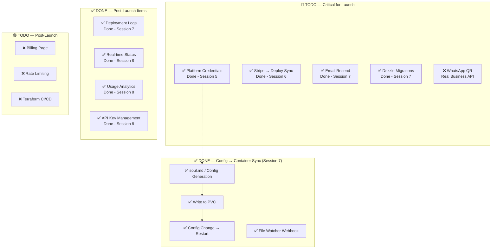

### Feature Dependencies

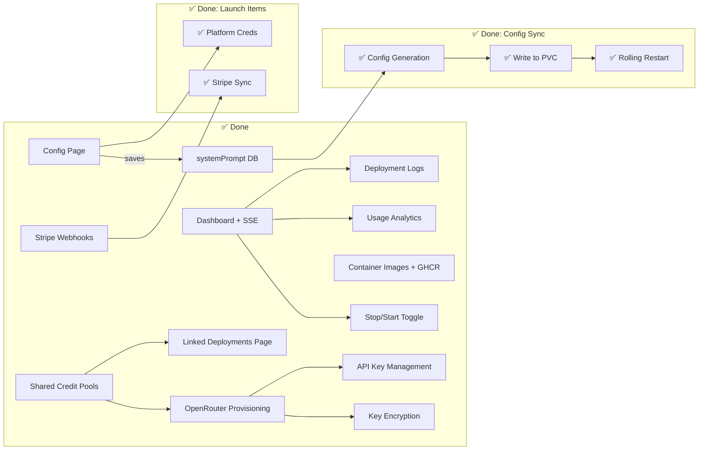

---

# 16. Shared Credit Pools — Architecture (Session 2)

### Owner/Linked Model

Deployments can share a single OpenRouter API key and monthly spending cap. The `llmApiKeySourceDeploymentId` column tracks relationships:

- **null** → deployment owns its own key (is a pool owner)
- **set** → deployment is linked to the owner's pool

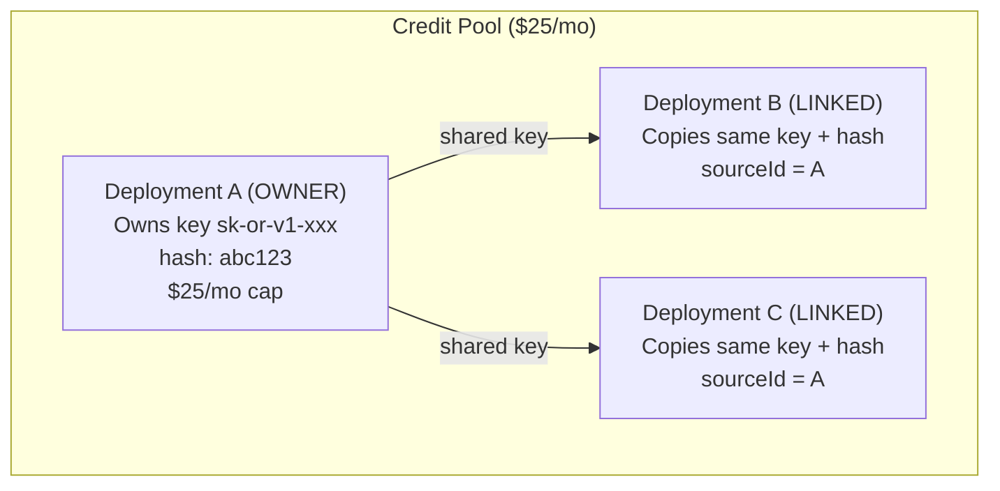

### Key Operations

| Operation | Behavior |
| --- | --- |
| Create + link | Copies encrypted key + hash from root owner (no decryption needed) |
| Create + new pool | Provisions new OpenRouter tenant key via Management API |
| Delete owner with links | **BLOCKED** — error lists linked deployment names |
| Delete linked deployment | Allowed freely — doesn't revoke key |
| Switch owner included → BYOK | **BLOCKED** if has linked children |
| Get usage (linked) | Resolves to owner's key hash, returns owner's usage |
| Update credit limit (linked) | **BLOCKED** — must update owner |
| Transitive links (B→A, C→B) | Always resolved to root: C stores sourceId = A |

### Encryption

API keys are encrypted with AES-256-GCM before DB storage. Key derivation uses `ENCRYPTION_KEY` env var (32-byte hex). Linked deployments copy the already-encrypted key blob from the root owner — no decryption round-trip needed during linking.

**Future:** Migrate encrypted keys from DB to a secret manager (AWS Secrets Manager, Vault, etc.)

### Wizard Linking UI

When creating a deployment with "Included Credits" mode and existing credit pool owners exist:

```
┌──────────────────────────────────┐
│  Credit Pool                     │
│                                  │
│  ⊕ Create New Pool        ✓     │  ← Provisions new OpenRouter key
│    Own spending cap              │
│                                  │
│  🔗 My Main Bot — $25/mo        │  ← Links to existing pool
│    Share the credit pool         │
│                                  │
│  🔗 Test Bot — $5/mo            │  ← Links to existing pool
│    Share the credit pool         │
└──────────────────────────────────┘
```

### Linked Deployments Page (`/deployments`)

Accessible via Profile Dropdown → "Linked Deployments". Groups deployments by runtime, shows credit pool clusters with CSS tree connectors:

```
Runtime: OpenClaw
├── Credit Pool ($25/mo) — 3 deployments
│   ┌─────────────────────┐
│   │  OWNER: My Main Bot │  ← Primary border accent, Crown icon
│   │  $25/mo credit pool │
│   └─────────┬───────────┘
│         ┌───┴───┐
│   ┌─────┴──┐ ┌──┴─────┐
│   │ Bot 2  │ │ Bot 3  │  ← Smaller cards, Link2 icon
│   │ Linked │ │ Linked │
│   └────────┘ └────────┘
│
├── Included Credits (standalone)
│   [Owner cards with no linked children]
│
└── BYOK (own API key)
    [Cards with Key icon]
```

Uses `runtimeNeedsLlm(slug)` from `wizardStepConfig.ts` to determine if a runtime has credit pool concepts. Non-LLM runtimes show a simple card grid instead.

---

# 17. Runtime Registry Pattern (Session 2)

Each runtime can define custom K8s configuration logic via handlers in `src/runtimes/`:

```typescript
// src/runtimes/types.ts
interface DeploymentFields {
  id: string;
  runtime: string;
  llmApiKey: string | null;
  llmProvider: string;
  llmModel: string | null;
  systemPrompt: string | null;
  // ...hardware specs
}

// src/runtimes/openclaw.ts
export function getEnvVars(dep: DeploymentFields): Record<string, string> { ... }
export function getConfigFiles(dep: DeploymentFields): { path: string; content: string }[] { ... }

// src/runtimes/index.ts
export function getHandlerOrNull(runtime: string) { ... }
```

The deployment router calls `getHandlerOrNull(runtime)` to get runtime-specific env vars and config files. Falls back to generic behavior if no handler exists.

---

# 18. wizardStepConfig.ts — Single Source of Truth (Session 2)

This file centralizes ALL configurable wizard and config dashboard data:

| What | Where in file |
| --- | --- |
| Wizard steps per runtime | `RUNTIME_EXTRA_STEPS` |
| Config dashboard tabs per runtime | `RUNTIME_CONFIG_TABS` |
| LLM providers (BYOK grid) | `LLM_PROVIDERS` |
| LLM models (model selector) | `LLM_MODELS` |
| Credit plans ($5–$100) | `CREDIT_PLANS` |
| Hardware options (CPU/RAM/Storage) | `CPU_OPTIONS`, `MEMORY_OPTIONS`, `STORAGE_OPTIONS` |

### Helper Functions

- `getWizardSteps(slug)` — Returns universal + runtime-specific steps
- `getConfigTabs(slug)` — Returns config dashboard tabs for a runtime
- `runtimeNeedsLlm(slug)` — Checks if runtime has "llm" step (used by Linked Deployments page)
- `detectProviderFromKey(key)` — Auto-detects provider from API key prefix
- `getModelsForProvider(id)` — Filters model list by provider
- `getDefaultModelForProvider(id)` — Gets default model for a provider

### Current Runtime Configs

```
openclaw: [LLM Setup → Deploy → Connect WhatsApp]
zeroclaw: [LLM Setup → Deploy]
(unknown): [Deploy]  ← fallback
```

---

# 19. Container Images & GHCR

### Runtime Base Images

| Runtime | Language | Base Image | Gateway Port | GHCR Image |
|---------|----------|------------|-------------|------------|
| OpenClaw | TypeScript/Node.js 22 | `node:22-bookworm-slim` | 18789 | `ghcr.io/jarble-ai/openclaw:latest` |
| ZeroClaw | Rust (~3.4MB binary) | `debian:bookworm-slim` | 3000 | `ghcr.io/jarble-ai/zeroclaw:latest` |

### Architecture

Container is **stateless** (OS + runtime deps + entrypoint). All persistent data on PVC at `/data/`.

First boot: entrypoint installs runtime (`npm install openclaw` or copies zeroclaw binary), writes default config, marks `/data/.initialized`.

Subsequent boots: starts gateway directly from persistent storage.

### PVC Layout

**OpenClaw:** `/data/.openclaw/openclaw.json` (runtime config), `/data/config/soul.md` (system prompt), `/data/runtime/node_modules/` (npm install)

**ZeroClaw:** `/data/config/config.toml` (TOML config), `/data/zeroclaw-data/` (internal data/SQLite)

### Env Var Mapping (K8s Secret → Runtime)

- **OpenClaw:** `OPENROUTER_API_KEY`, `LLM_PROVIDER`, `LLM_MODEL` + platform env var fallbacks (`DISCORD_BOT_TOKEN`, `TELEGRAM_BOT_TOKEN`, `SLACK_BOT_TOKEN`, `SLACK_APP_TOKEN`, etc.)
- **ZeroClaw:** `API_KEY`, `PROVIDER`, `ZEROCLAW_MODEL` + platform env var fallbacks (same as OpenClaw)

### CI/CD

GitHub Actions workflow at `.github/workflows/build-runtime-images.yml`. Triggers on push to `main` when `runtimes/**` changes. Publishes to GHCR with `:latest` and `:sha` tags.

### Files

- `runtimes/openclaw/Dockerfile` + `entrypoint.sh`
- `runtimes/zeroclaw/Dockerfile` + `entrypoint.sh`
- `runtimes/README.md` — Full documentation

### Upstream Projects

- OpenClaw: [github.com/openclaw/openclaw](https://github.com/openclaw/openclaw)
- ZeroClaw: [github.com/openagen/zeroclaw](https://github.com/openagen/zeroclaw)

---

# 20. Deployment Stop/Start/Restart (Session 3)

### How It Works

Deployments can be stopped, started, and restarted from the Dashboard. This uses **K8s replica scaling** — stopping a deployment sets replicas to 0 (pod terminates, PVC persists), starting sets replicas back to 1.

### K8s Layer (`src/k8s/deployment.ts`)

| Function | Action |
|----------|--------|
| `stopDeployment(id)` | Patches K8s deployment replicas → 0 via strategic merge patch |
| `startDeployment(id)` | Patches K8s deployment replicas → 1 |
| `restartDeployment(id)` | Stop → 2s delay → Start |

### tRPC Mutations (`deployment.ts` router)

| Mutation | Validation | DB Status Flow |
|----------|-----------|----------------|
| `stop` | Must be `running` | `running` → `stopped` |
| `start` | Must be `stopped` | `stopped` → `creating` → `running` (or `failed`) |
| `restart` | Must be `running` | `running` → `creating` → `running` (or `failed`) |

**Start/Restart** use fire-and-forget async polling: after scaling up, polls pod status every 2s for up to 60s, updating DB when pod is ready or timeout/failure occurs.

### Frontend (Dashboard.tsx)

- **Running:** Shows Stop (Square, orange) + Restart (RotateCw) buttons
- **Stopped:** Shows Start (Play, green) button
- **Transitioning (creating):** Shows spinner, all buttons disabled
- Start/restart success triggers frontend polling every 3s for 60s to update card status

### Status Flow

```
running ──stop──→ stopped ──start──→ creating ──poll──→ running
   │                                                      │
   └──restart──→ creating ──poll──→ running                │
                                   └──timeout──→ failed    │
```

---

# 21. Known Issues

- **Pre-existing tRPC type errors in frontend:** All files using `trpc.deployment.*` or `trpc.runtimeCatalog.*` show "Property does not exist" TypeScript errors. This is a monorepo type linking issue (types not auto-synced from API). Does NOT affect runtime — Next.js dev server compiles fine. Eventually needs proper tRPC type generation setup.
- **API builds clean:** `npm run build` in jarble-api-main passes with no errors.

---

# 22. Outstanding Work (Shared Credit Pools)

- Testing the full linking flow end-to-end with real deployments
- Secret manager migration (DB encryption is fine for now)
- Additional linkable resource types beyond LLM keys (communications, etc.)
- Unlinking UI (currently no way to unlink a deployment from the frontend config page — would need to be added to DeploymentConfiguration.tsx)

---

# 23. Deployment Cancellation & Config Export (Session 4)

### Cancellation Flow

```
User clicks "Cancel Subscription" (DeploymentConfiguration sidebar)
  → confirm() dialog
  → trpc.deployment.cancel({ id })
    → Validates: not free, has stripeSubscriptionId, not already cancelled
    → Stripe API: subscriptions.update(id, { cancel_at_period_end: true })
    → DB: sets cancelledAt = now(), cancelAtPeriodEnd = current_period_end
  → UI shows CancellationGracePeriod card (orange, with countdown)

During grace period (deployment stays running):
  → User can Export configs (ZIP of /data/config/ from K8s pod)
  → User can Reactivate (clears cancel_at_period_end on Stripe + DB)

At billing period end:
  → Stripe fires customer.subscription.deleted webhook
  → index.ts webhook handler finds deployment by stripeSubscriptionId
  → Calls stopDeployment() → scales K8s replicas to 0
  → Updates DB status to "stopped"
```

### Config Export Flow

```
User clicks "Export" button
  → trpc.deployment.exportConfigs({ id })
    → K8s exec: find /data/config -type f (list files)
    → K8s exec: cat <file> (read each file)
    → archiver creates ZIP in memory
    → Returns { filename: "config-{id}.zip", data: base64 }
  → Frontend: base64 → Blob → browser download
```

### New DB Columns (deployments table)

| Column | Type | Description |
| --- | --- | --- |
| stripeSubscriptionId | varchar(255) | Links deployment to its Stripe subscription |
| cancelledAt | timestamp | When user initiated cancellation |
| cancelAtPeriodEnd | timestamp | Billing period end — auto-stop date |

---

# 24. Platform Credential Storage (Session 5)

### Architecture

Platform credentials (Discord bot tokens, Telegram tokens, Slack tokens, etc.) are stored in the `platform_credentials` DB table as AES-256-GCM encrypted JSON blobs. Each row links a single platform's credentials to a deployment.

### OpenClaw Channel Config (`openclaw.json`)

OpenClaw uses a native `openclaw.json` config file with a `channels` section. At deploy time, the OpenClaw runtime handler writes this file to the PVC:

```json
{
  "agent": { "model": "anthropic/claude-opus-4-6" },
  "channels": {
    "discord": { "token": "...", "enabled": true, "dmPolicy": "pairing" },
    "telegram": { "botToken": "...", "enabled": true, "dmPolicy": "pairing" },
    "slack": { "botToken": "xoxb-...", "appToken": "xapp-...", "enabled": true },
    "whatsapp": { "enabled": true, "dmPolicy": "pairing" }
  }
}
```

OpenClaw also falls back to env vars (`DISCORD_BOT_TOKEN`, `TELEGRAM_BOT_TOKEN`, `SLACK_BOT_TOKEN`, `SLACK_APP_TOKEN`), so both are set during deploy for maximum compatibility.

### Data Flow

```
Frontend PlatformsTab
  → trpc.platformCredentials.save({ deploymentId, platformId, credentials })
    → Server encrypts JSON blob with AES-256-GCM
    → Upserts into platform_credentials table (unique on deploymentId+platformId)

Deploy button
  → trpc.deployment.deploy(id)
    → Loads platform_credentials rows from DB, decrypts each
    → Builds DeploymentFields.platformCredentials map
    → OpenClaw handler: writes openclaw.json with channels section to PVC
    → OpenClaw handler: injects env var fallbacks into K8s Secret
    → ZeroClaw handler: injects env var fallbacks only (no openclaw.json)
```

### Frontend Field → OpenClaw Config Key Mapping

| Platform | Frontend Field | OpenClaw Channel Key | Env Var Fallback |
|----------|---------------|---------------------|------------------|
| Discord | botToken | channels.discord.token | DISCORD_BOT_TOKEN |
| Telegram | botToken | channels.telegram.botToken | TELEGRAM_BOT_TOKEN |
| Slack | botToken | channels.slack.botToken | SLACK_BOT_TOKEN |
| Slack | appToken | channels.slack.appToken | SLACK_APP_TOKEN |
| WhatsApp | (none) | channels.whatsapp.dmPolicy | (QR pairing) |

### Credential Security

- Encrypted at rest with AES-256-GCM (reuses `encryptApiKey`/`decryptApiKey`)
- Masked for frontend display (first 4 + last 4 chars visible)
- Users must re-enter credentials to update (cannot retrieve plaintext)
- Cascade delete when deployment is deleted

---

# 25. Stripe Subscription Sync (Session 6)

### The Problem

The `stripeSubscriptionId` column on deployments was never populated. When a user completed Stripe checkout, only `user.stripeCustomerId` was set. When the user subsequently created a deployment, there was no mechanism to link it to their Stripe subscription. This meant cancel/reactivate mutations (which check `stripeSubscriptionId`) could never work.

### Solution: Pending Subscription Handoff

```
Stripe Checkout → checkout.session.completed webhook
  → Sets user.pendingStripeSubscriptionId + pendingStripeTier
  → (subscription ID from session.subscription)

User creates deployment → deployment.create tRPC mutation
  → If !isFree and isStripeConfigured():
    → Reads user.pendingStripeSubscriptionId
    → Links it to the new deployment
    → Clears pending fields on user (consumed)

Fallback → deployment.linkSubscription tRPC mutation
  → Checks user's pending subscription first
  → Falls back to Stripe API (listActiveSubscriptions) to find unlinked ones
```

### Webhook Handlers (All 4 Implemented)

| Event | Handler | Action |
|-------|---------|--------|
| checkout.session.completed | Stores `pendingStripeSubscriptionId` + `pendingStripeTier` on user | Links subscription on next deployment create |
| customer.subscription.updated | Finds deployment by `stripeSubscriptionId` | Syncs cancel state (portal cancel/reactivate) + payment status (past_due/unpaid → error) |
| customer.subscription.deleted | Finds deployment by `stripeSubscriptionId` | Stops deployment via `stopDeployment()`, clears error |
| invoice.payment_failed | Finds deployment by subscription or user | Sets `deployment.error = "Payment failed"` |

### DB Schema Addition

Added to `users` table (all 3 schema variants):
- `pendingStripeSubscriptionId` — varchar(255), nullable
- `pendingStripeTier` — varchar(50), nullable

### Edge Cases

- **Race condition (webhook vs create)**: Webhook arrives within seconds of redirect; user must fill out forms first. Extremely unlikely. `linkSubscription` fallback covers it.
- **User never creates a deployment**: Pending subscription stays on user harmlessly. Gets overwritten on next checkout.
- **Portal cancel/reactivate**: `subscription.updated` handler syncs `cancelledAt`/`cancelAtPeriodEnd` to DB, keeping in-app UI consistent with Stripe portal actions.

---

# 26. Two-Way Config Sync (Session 7)

### Architecture

Config changes can originate from either the frontend (user edits in config tabs) or from inside the container (manual file edits). A two-way sync ensures both sources stay in sync.

### Frontend → PVC (Push)

```
User saves config (deployment.update / platformCredentials.save)
  → syncConfigsToPvc(deploymentId)
    → Reads deployment + platform creds from DB
    → Runtime handler renders config files (e.g. openclaw.json, soul.md)
    → K8s exec: writes files to /data/config/ inside pod
    → Updates K8s Secret with latest env vars
    → Restarts pod (rolling restart via kubectl rollout)
```

### PVC → Frontend (Pull via File Watcher)

```
file-watcher.sh (runs as background process in container)
  → inotifywait monitors /data/config/ for modify/create/delete
  → On change: POST /api/config-changed { deploymentId, file, event }
    → syncConfigsFromPvc(deploymentId)
      → K8s exec: reads all config files from pod
      → Runtime handler parses files back to structured data
      → Compares with DB values — only updates if different
      → Prevents circular sync (change detection, not blind overwrite)
```

### Files

- `jarble-api-main/src/services/configSync.ts` — Core sync service (syncConfigsToPvc, syncConfigsFromPvc)
- `runtimes/file-watcher.sh` — inotifywait wrapper, shared across runtimes
- `runtimes/openclaw/entrypoint.sh` — Starts file watcher as background process
- `runtimes/zeroclaw/entrypoint.sh` — Same

---

# 27. Session Log

### Session 6 — February 16, 2026

**Commit:** `a41f9a6` — "Add Stripe subscription-to-deployment sync and Export Config button"
**Branch:** `main` (pushed to remote)

#### What was done:

1. **Export Config button fix** — The Export Config button was only visible inside `CancellationGracePeriod` (after cancelling). Added a standalone Export Config button to the always-visible Actions section of the `DeploymentConfiguration` sidebar, so users can export anytime.

2. **Stripe subscription → deployment sync** (the main task) — The `stripeSubscriptionId` column on deployments was never populated. Fixed with:
   - Added `pendingStripeSubscriptionId` + `pendingStripeTier` columns to `users` table (all 3 schema files + SQLite init)
   - `checkout.session.completed` webhook now stores `session.subscription` as pending fields on user
   - `deployment.create` mutation consumes `pendingStripeSubscriptionId` for non-free deployments
   - `customer.subscription.updated` handler: syncs cancel state + payment errors from Stripe portal to DB
   - `customer.subscription.deleted` handler: fixed from full-table scan to proper WHERE query
   - `invoice.payment_failed` handler: flags deployments with error message
   - Added `linkSubscription` tRPC mutation (fallback for edge cases)
   - Added `listActiveSubscriptions()` Stripe helper
   - Fixed checkout route field name mismatch (`tier` vs `runtimeSlug`)

#### Files modified (9):
- `jarble-api-main/src/db/schema.ts` — 2 new user columns
- `jarble-api-main/src/db/schema.pg.ts` — same
- `jarble-api-main/src/db/schema.sqlite.ts` — same
- `jarble-api-main/src/db/init.ts` — SQLite CREATE TABLE updated
- `jarble-api-main/src/index.ts` — All 4 webhook handlers + checkout route fix
- `jarble-api-main/src/services/stripe.ts` — `listActiveSubscriptions()`
- `jarble-api-main/src/trpc/routers/deployment.ts` — Pending sub consumption in create + `linkSubscription` mutation
- `Jarble-mvp/views/DeploymentConfiguration.tsx` — Standalone Export Config button
- `OVERVIEW.md` — Session 6 docs + Section 25

#### Build status: ✅ Clean (`npm run build` passes)

#### What's next (remaining critical roadmap items):
- **Drizzle migrations regeneration** — Current migrations are stale
- **WhatsApp QR integration** — Replace mock QR with real WhatsApp Business API
- **Email verification resend** — Add "Resend" button for unverified users

#### Notes:
- Dev servers: API on port 3001, Frontend on port 3000
- Test deployment is seeded as `isFree: true`, so cancel subscription button won't appear in dev (that's expected — it only shows for paid deployments where `isPaid = !dep.isFree`)
- Commits should NOT include `Co-Authored-By` line (user preference)

### Session 7 — February 16, 2026

**Commits:**
- `4bf215b` — "Add two-way config sync and regenerate Drizzle migrations"
- `4ebb0fa` — "Add deployment log streaming and email verification resend"

**Branch:** `main` (pushed to remote)

#### What was done:

1. **Two-way config sync** — Frontend→PVC: `syncConfigsToPvc()` renders configs from DB, writes to PVC, updates K8s Secret, and restarts the pod. Fires on deployment update and platform credential save/delete. PVC→Frontend: `file-watcher.sh` (inotifywait) detects config changes inside the container and POSTs to `/api/config-changed` webhook. `syncConfigsFromPvc()` reads files from the pod, parses via runtime handler, and updates DB only if values differ (prevents circular sync). Runtime images (OpenClaw + ZeroClaw) now include inotify-tools and curl.

2. **Drizzle migrations regeneration** — Fresh PostgreSQL migrations generated to match current schema.

3. **Deployment log streaming** — SSE endpoint (`GET /api/deployments/:id/logs/stream`) streams K8s pod logs in real-time. tRPC `getLogs` query for one-shot fetch. `useLogStream` hook manages EventSource lifecycle. LogsTab component with terminal-style viewer, auto-scroll, pause/resume, clear, download, severity-colored lines.

4. **Email verification resend** — `resendVerificationEmail` tRPC mutation calls Auth0 Management API. Resend button added to Dashboard banner, Settings page, and OnboardingWizard deploy step. Requires `AUTH0_MGMT_CLIENT_ID`/`AUTH0_MGMT_CLIENT_SECRET` env vars.

#### Files modified (28 across both commits):
- `jarble-api-main/src/services/configSync.ts` — NEW: Two-way config sync service
- `jarble-api-main/src/k8s/deployment.ts` — syncConfigsToPvc + log streaming functions
- `jarble-api-main/src/index.ts` — Config-changed webhook + log stream SSE endpoint
- `jarble-api-main/src/trpc/routers/deployment.ts` — getLogs query + sync calls on update
- `jarble-api-main/src/trpc/routers/platformCredentials.ts` — Sync calls on save/delete
- `jarble-api-main/src/trpc/routers/user.ts` — resendVerificationEmail mutation
- `jarble-api-main/src/utils/env.ts` — AUTH0_MGMT_CLIENT_ID/SECRET vars
- `jarble-api-main/drizzle-pg/` — Fresh PostgreSQL migrations (3 files)
- `runtimes/*/Dockerfile` — inotify-tools + curl added
- `runtimes/*/entrypoint.sh` — file-watcher.sh background process
- `runtimes/*/file-watcher.sh` — inotifywait → POST webhook
- `Jarble-mvp/hooks/useLogStream.ts` — NEW: SSE log streaming hook
- `Jarble-mvp/views/deployment-config/LogsTab.tsx` — NEW: Terminal-style log viewer
- `Jarble-mvp/views/Dashboard.tsx` — Resend verification button
- `Jarble-mvp/views/OnboardingWizard.tsx` — Resend verification button
- `Jarble-mvp/views/Settings.tsx` — Resend verification button
- `Jarble-mvp/views/onboarding/wizardStepConfig.ts` — Logs tab for all runtimes

---

### Session 8 — February 16, 2026

**Commits:**
- `75733af` — "Add real-time deployment status streaming and usage analytics dashboard"
- `094024c` — "Add API key management to Model tab"

**Branch:** `main` (pushed to remote)

#### What was done:

1. **Real-time deployment status via SSE** — New SSE endpoint (`GET /api/deployments/status/stream`) polls all user deployments every 5s and emits status change events. `useStatusStream` hook manages EventSource lifecycle and provides a status override map. Dashboard and DeploymentConfiguration pages replaced `setInterval` polling with push-based SSE for instant status updates.

2. **Usage Analytics dashboard** — New `/analytics` page with: 4 summary cards (total deployments, active count, monthly spend, LLM mode split), status + runtime distribution charts with CSS progress bars, LLM credit usage meters for each included-credits deployment, and a sortable per-deployment drill-down table with storage + credit queries per row. Accessible via ProfileDropdown → "Usage Analytics" menu item.

3. **API Key Management UI** — ModelTab rewritten with 3 context-aware sections:
   - **Included Credits** (`llmMode === "included"`): Key status badge, credit usage progress bar with daily/weekly/monthly breakdown, editable credit limit with Update button, Regenerate Key + Revoke Key actions with confirmation dialogs
   - **Linked** (`llmApiKeySourceDeploymentId` set): Shared pool usage meter (read-only), "Go to Pool Owner" button
   - **BYOK** (`llmMode === "byok"`): Configured/Not Set status badge, key update input with Validate button, provider key validation

#### Files modified (10):
- `jarble-api-main/src/index.ts` — SSE status stream endpoint
- `Jarble-mvp/hooks/useStatusStream.ts` — NEW: SSE status stream hook
- `Jarble-mvp/app/analytics/page.tsx` — NEW: Analytics route
- `Jarble-mvp/views/Analytics.tsx` — NEW: Full analytics view (~705 lines)
- `Jarble-mvp/views/Dashboard.tsx` — Replaced polling with useStatusStream
- `Jarble-mvp/views/DeploymentConfiguration.tsx` — Integrated useStatusStream + passed deployment/deploymentId to ModelTab
- `Jarble-mvp/components/ProfileDropdown.tsx` — Added "Usage Analytics" menu item
- `Jarble-mvp/views/deployment-config/ModelTab.tsx` — Rewritten with 3 key management sections (~541 lines)
- `Jarble-mvp/views/deployment-config/types.ts` — Added ModelTabProps interface

#### What's next (remaining roadmap items):
- **WhatsApp QR integration** — Replace mock QR with real WhatsApp Business API
- **Rate limiting** on API routes
- **Terraform CI/CD** — GitHub Actions for plan/apply
- **Billing page** — Dedicated billing/invoices UI

### Session 9 — February 17, 2026

**Branch:** `main`

#### What was done:

**Production Deployment Readiness** — Fixed all blockers preventing the API from being deployed to the K3s cluster.

1. **Dockerfile fix** — Updated both stages from `node:20-alpine` to `node:22-alpine`. Added `drizzle-pg/` migration folder and `entrypoint.sh` to the production image. Changed CMD to run entrypoint (migrate → seed → start).

2. **Migration runner** (`src/db/migrate.pg.ts`) — Standalone script using `drizzle-orm/node-postgres/migrator` to apply PostgreSQL migrations at boot. Avoids needing `drizzle-kit` (devDependency) in the production image.

3. **Production seed** (`src/db/seed.pg.ts`) — Idempotent `INSERT ... ON CONFLICT DO NOTHING` for openclaw + zeroclaw runtime catalog rows. Uses raw `pg.Pool.query()`.

4. **Entrypoint script** (`entrypoint.sh`) — Runs migrations, seeds runtime catalog, then `exec node dist/index.js`.

5. **API CI workflow** (`.github/workflows/build-api-image.yml`) — Builds and pushes `ghcr.io/jarble-ai/api:latest` (+ `:sha` tag) on push to main when `jarble-api-main/**` changes. Modeled after `build-runtime-images.yml`.

6. **K8s manifest fixes** (`k8s/deployment.yaml`):
   - Image: `jarble/api:latest` → `ghcr.io/jarble-ai/api:latest`
   - RBAC: Added `pods/log` resource with `get` verb (log streaming was missing this)
   - Added commented-out `imagePullSecrets` for private repo future-proofing

7. **Secrets template** (`k8s/secrets.yaml.example`) — Updated from MySQL to PostgreSQL `DATABASE_URL`, added `DB_PROVIDER`, `API_KEY_ENCRYPTION_KEY`, Auth0 management vars, OpenRouter management key, Stripe price IDs. Labeled REQUIRED vs OPTIONAL.

#### Files modified/created (8):
- `jarble-api-main/Dockerfile` — node:22, copy migrations + entrypoint
- `jarble-api-main/entrypoint.sh` — NEW: migrate → seed → start
- `jarble-api-main/src/db/migrate.pg.ts` — NEW: drizzle-orm migrator runner
- `jarble-api-main/src/db/seed.pg.ts` — NEW: idempotent runtime_catalog seed
- `.github/workflows/build-api-image.yml` — NEW: API image CI
- `jarble-api-main/k8s/deployment.yaml` — image ref, RBAC, imagePullSecrets
- `jarble-api-main/k8s/secrets.yaml.example` — PostgreSQL + missing env vars
- `OVERVIEW.md` — Session 9 log

#### Build status: ✅ Clean (`npm run build` passes, `dist/db/migrate.pg.js` + `dist/db/seed.pg.js` confirmed)

#### Deployment flow after these changes:
1. Push to `main` → CI builds `ghcr.io/jarble-ai/api:latest`
2. On cluster: `kubectl apply -f secrets.yaml` (from template) + `kubectl apply -f deployment.yaml`
3. Pod boots → `entrypoint.sh` runs migrations (idempotent) → seeds catalog → starts server

#### What's next (remaining roadmap items):
- **WhatsApp QR integration** — Replace mock QR with real WhatsApp Business API
- **Rate limiting** on API routes
- **Terraform CI/CD** — GitHub Actions for plan/apply
- **Billing page** — Dedicated billing/invoices UI
- **TLS/cert-manager** — Ingress has Traefik annotation but no certificate resources

#### Notes:
- Commits should NOT include `Co-Authored-By` line (user preference)

---

# 29. Session 10 — Billing Page

**Date:** February 17, 2026
**Machine:** Desktop (continued from Session 9)

#### What was done:
- **Stripe helpers** — Added `listInvoices(customerId)` and `getSubscriptionDetails(subscriptionId)` to `services/stripe.ts`
- **Billing tRPC router** — Created `trpc/routers/billing.ts` with 3 procedures:
  - `billing.getOverview` — aggregates monthly spend, active sub count, next billing date, payment method last4
  - `billing.getInvoices` — maps Stripe invoices to DTOs (id, date, description, amount, status, PDF URL)
  - `billing.getSubscriptions` — enriches DB deployment data with Stripe period dates via `Promise.allSettled`
- **Frontend billing page** — Created `/billing` route and `views/Billing.tsx` with:
  - 4 overview cards (Monthly Spend, Active Subscriptions, Next Payment, Payment Method)
  - Subscriptions table with status badges (active/cancelling/past_due), period display, config page links
  - Invoice history table with PDF download links
  - Manage Billing card (opens Stripe portal via `POST /api/stripe/portal`)
  - Auth guards, loading/empty states, framer-motion animations
- **ProfileDropdown** — Added Billing menu item between Usage Analytics and Profile Settings

#### Files changed:
| File | Action |
|------|--------|
| `jarble-api-main/src/services/stripe.ts` | Modified — added `listInvoices`, `getSubscriptionDetails` |
| `jarble-api-main/src/trpc/routers/billing.ts` | Created — 3 tRPC procedures |
| `jarble-api-main/src/trpc/index.ts` | Modified — registered `billingRouter` |
| `Jarble-mvp/app/billing/page.tsx` | Created — route shell |
| `Jarble-mvp/views/Billing.tsx` | Created — full billing view |
| `Jarble-mvp/components/ProfileDropdown.tsx` | Modified — added Billing menu item |

#### Build status: ✅ API builds clean. Frontend has pre-existing type error in Analytics.tsx (unrelated to billing changes).

#### What's next (remaining roadmap items):
- **WhatsApp QR integration** — Replace mock QR with real WhatsApp Business API
- **Rate limiting** on API routes
- **Terraform CI/CD** — GitHub Actions for plan/apply
- **TLS/cert-manager** — Ingress has Traefik annotation but no certificate resources

---

# 30. Session 11 — WhatsApp QR Pairing

**Date:** February 17, 2026

#### What was done:
- **WhatsApp QR pairing flow** — Replaced mock QR grid with real Baileys QR code streaming from OpenClaw inside K8s pods
- **Backend SSE endpoint** — `GET /api/deployments/:id/whatsapp/qr` streams QR data via K8s exec into running pod, runs `openclaw channels login --channel whatsapp`, parses stdout for QR strings and connection status
- **K8s exec streaming** — Added `streamExecInPod()` (line-by-line streaming exec, unlike `execInPod()` which waits for exit) and `findPodForDeployment()` helpers to `deployment.ts`
- **WhatsApp status tRPC** — Added `checkWhatsAppStatus` query and `markWhatsAppConnected` mutation to `platformCredentialsRouter`
- **Frontend QR hook** — Created `useQrStream` hook (mirrors `useLogStream` pattern) with EventSource for `qr`, `connected`, `timeout`, `error` events
- **Reusable QR modal** — Created `WhatsAppQrModal` component with QR display, connecting/timeout/error states, auto-close on success
- **PlatformsTab integration** — WhatsApp section now shows real status check + "Start QR Pairing" button (or "Re-pair" if connected), hides Save/Test buttons
- **OnboardingWizard integration** — `StepConnectWhatsApp` now renders real QR from `useQrStream`, auto-starts when deployment is ready, captures `createdDeploymentId` from deploy mutation
- **react-qr-code** dependency added to frontend

#### Files changed:
| File | Action |
|------|--------|
| `jarble-api-main/src/k8s/deployment.ts` | Modified — added `findPodForDeployment()`, `streamExecInPod()` |
| `jarble-api-main/src/index.ts` | Modified — added WhatsApp QR SSE endpoint |
| `jarble-api-main/src/trpc/routers/platformCredentials.ts` | Modified — added `checkWhatsAppStatus`, `markWhatsAppConnected` |
| `Jarble-mvp/hooks/useQrStream.ts` | Created — SSE hook for QR streaming |
| `Jarble-mvp/components/WhatsAppQrModal.tsx` | Created — reusable QR pairing dialog |
| `Jarble-mvp/views/deployment-config/PlatformsTab.tsx` | Modified — real QR pairing for WhatsApp |
| `Jarble-mvp/views/OnboardingWizard.tsx` | Modified — real QR in wizard, captures deployment ID |

#### Build status: ✅ API builds clean.

#### Architecture note:
The QR flow uses K8s exec (`streamExecInPod`) to run `openclaw channels login` inside the pod and stream stdout via SSE. Baileys QR strings are detected by heuristic (length > 50, contains commas/@) and rendered client-side with `react-qr-code`. When connected, the SSE endpoint auto-saves a `platformCredentials` row for WhatsApp and triggers config sync. The QR data format may need runtime tuning based on actual OpenClaw output.

#### What's next (remaining roadmap items):
- **Rate limiting** on API routes
- **Terraform CI/CD** — GitHub Actions for plan/apply
- **TLS/cert-manager** — Ingress has Traefik annotation but no certificate resources

---

# 31. Session 12 — TLS + Rate Limiting

**Date:** February 17, 2026

#### What was done:

**TLS/cert-manager:**
- Created `k8s/cert-manager.yaml` — Let's Encrypt ClusterIssuer with HTTP-01 solver through Traefik
- Updated Ingress in `k8s/deployment.yaml` — added `cert-manager.io/cluster-issuer` annotation and `spec.tls` block with `secretName: jarble-api-tls`
- Updated `infrastructure/terraform/main.tf` — cert-manager v1.14.5 installed in K3s master user_data after Longhorn

**Rate limiting (express-rate-limit):**
- Created `src/middleware/rateLimit.ts` — three tiers:
  - `globalLimiter`: 300 req/min per IP (all traffic, skips /health + webhooks)
  - `authLimiter`: 120 req/min per user ID (tRPC endpoints)
  - `stripeActionLimiter`: 10 req/min per user ID (checkout + portal)
- User ID extracted via lightweight JWT base64url decode (no signature verification — full verify happens in route handlers)
- Applied `app.set("trust proxy", 1)` so `req.ip` returns real client IP behind Traefik
- SSE endpoints exempt (long-lived connections, JWT-authenticated)
- Uses `standardHeaders: "draft-7"` for `RateLimit-*` response headers

#### Files changed:
| File | Action |
|------|--------|
| `jarble-api-main/k8s/cert-manager.yaml` | Created — ClusterIssuer |
| `jarble-api-main/k8s/deployment.yaml` | Modified — Ingress TLS |
| `infrastructure/terraform/main.tf` | Modified — cert-manager install |
| `jarble-api-main/src/middleware/rateLimit.ts` | Created — rate limiting |
| `jarble-api-main/src/index.ts` | Modified — applied limiters |
| `jarble-api-main/package.json` | Modified — added express-rate-limit |

#### Build status: ✅ API builds clean.

#### Deployment order for TLS (fresh cluster):
1. `terraform apply` → provisions K3s + cert-manager
2. `kubectl apply -f k8s/cert-manager.yaml` → creates ClusterIssuer
3. `kubectl apply -f k8s/deployment.yaml` → Ingress triggers certificate issuance

#### What's next (remaining roadmap items):
- **Terraform CI/CD** — GitHub Actions for plan/apply
- **Deploy to production** — Build Docker images, apply secrets, apply manifests

---

# 32. Session 13 — Terraform CI/CD

**Date:** February 17, 2026

#### What was done:

**Remote state backend (Terraform Cloud):**
- Created `infrastructure/terraform/backend.tf` — Terraform Cloud backend with local execution mode (TFC stores state + locking only, plan/apply runs in GHA or locally)
- Organization: `jarble`, workspace: `jarble-infrastructure`
- Removed `.terraform.lock.hcl` from `.gitignore` to ensure reproducible provider versions across environments

**SSH key CI compatibility:**
- Added `ssh_public_key` variable to `variables.tf` — accepts key content directly for CI (via `TF_VAR_ssh_public_key`)
- Updated `main.tf` SSH key resource with conditional: uses content if provided, falls back to file path for local dev

**GitHub Actions workflow (`.github/workflows/terraform.yml`):**
- **PR trigger**: `infrastructure/terraform/**` changes → fmt check, validate, plan, post plan as PR comment (update-or-create pattern)
- **Push to main**: plan + apply with `environment: production` manual approval gate
- **Manual dispatch**: `plan-only`, `apply`, and `destroy` modes
- **Destroy safety**: typed confirmation string (`destroy-jarble-infrastructure`) + environment approval — two layers
- Secrets: `HCLOUD_TOKEN`, `TF_API_TOKEN`, `SSH_PUBLIC_KEY` (all via `TF_VAR_*` env vars)
- Uses `hashicorp/setup-terraform@v3` with `cli_config_credentials_token` for TFC auth
- Plan uses `-detailed-exitcode` (0 = no changes, 2 = changes, 1 = error)

**Documentation:**
- Updated `infrastructure/terraform/README.md` with CI/CD section (triggers, manual dispatch modes, required secrets, local dev instructions)
- Updated `terraform.tfvars.example` with CI variable comment
- Updated `DEVELOPER-GUIDE.md` with Sessions 11-13 additions: rate limiting (Section 5), WhatsApp QR pairing (Section 9), TLS/cert-manager + Terraform CI/CD (Section 15), CI/CD pipeline table (Section 20)

#### Files changed:
| File | Action |
|------|--------|
| `infrastructure/terraform/backend.tf` | Created — Terraform Cloud backend |
| `infrastructure/terraform/variables.tf` | Modified — added `ssh_public_key` variable |
| `infrastructure/terraform/main.tf` | Modified — conditional SSH key logic |
| `infrastructure/terraform/.gitignore` | Modified — allow `.terraform.lock.hcl` |
| `.github/workflows/terraform.yml` | Created — full CI/CD workflow |
| `infrastructure/terraform/terraform.tfvars.example` | Modified — CI variable comment |
| `infrastructure/terraform/README.md` | Modified — CI/CD section |

#### Pre-requisites (manual, before first CI run):
1. Sign up for Terraform Cloud, create org + workspace (execution mode: Local)
2. Migrate local state: `terraform login && terraform init`
3. Add GitHub secrets: `HCLOUD_TOKEN`, `TF_API_TOKEN`, `SSH_PUBLIC_KEY`
4. Create `production` environment with required reviewer

#### What's next (remaining roadmap items):
- **Deploy to production** — Build Docker images, apply secrets, apply manifests

---

# 33. Dev Servers

- Frontend: `npm run dev` → localhost:3000 (from `Jarble-mvp/`)
- API: `npm run dev` → localhost:3001 (from `jarble-api-main/`)