# Complete Overview & Roadmap

<aside>
📅 Last updated: February 16, 2026 (Session 3 — Container Images + GHCR + Stop/Start Toggle)

</aside>

Jarble is a **no-code AI deployment platform** that lets users deploy AI-powered bots (powered by LLMs) to messaging platforms in under 2 minutes — no coding required.

---

# 1. Platform Architecture

### Tech Stack

| Layer | Technology |
| --- | --- |
| Frontend | Next.js 15 (App Router), React 18, TypeScript |
| Styling | Tailwind CSS v4, shadcn/ui (40+ components), Framer Motion |
| API | Express + tRPC, SuperJSON serialization |
| Database | Drizzle ORM — MySQL (prod), PostgreSQL (alt), SQLite (dev) |
| Auth | Auth0 (Email/Password, Google OAuth, GitHub OAuth) |
| Payments | Stripe (subscriptions, checkout, webhooks) |
| Infrastructure | Hetzner Cloud, Terraform IaC, K3s (Longhorn, Traefik) |
| LLM Providers | OpenRouter, OpenAI, Anthropic, Google |
| State Management | React Query + tRPC hooks |

### System Architecture Diagram

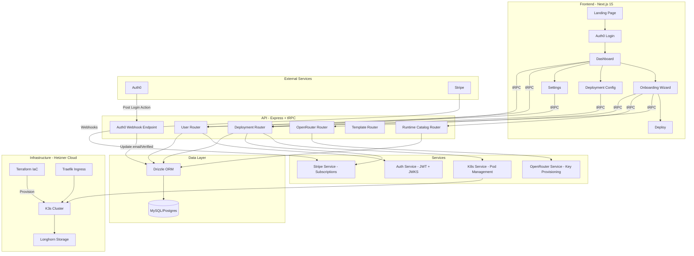

---

# 2. Frontend — Pages & Routes

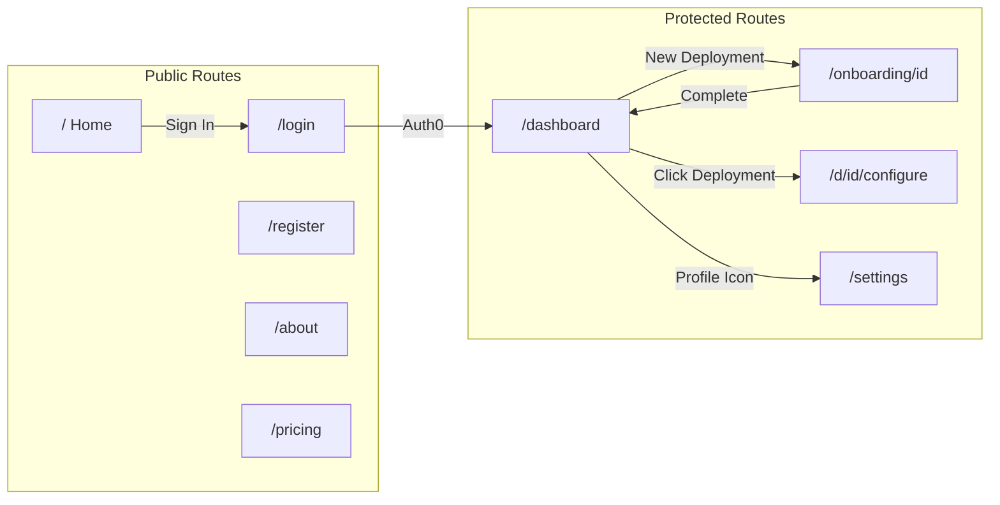

---

# 3. Onboarding Wizard Flow

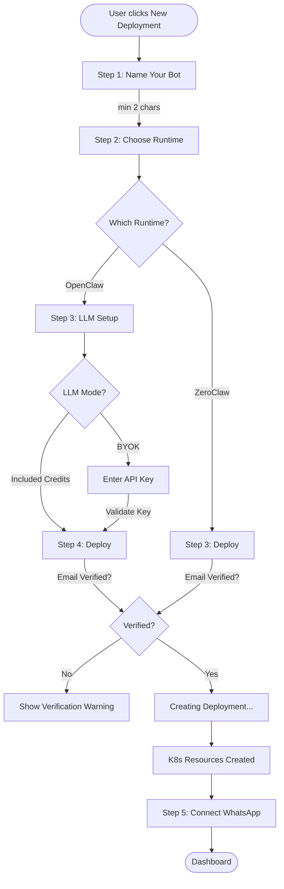

---

# 4. Backend — API Routers & Procedures

### tRPC Router Map

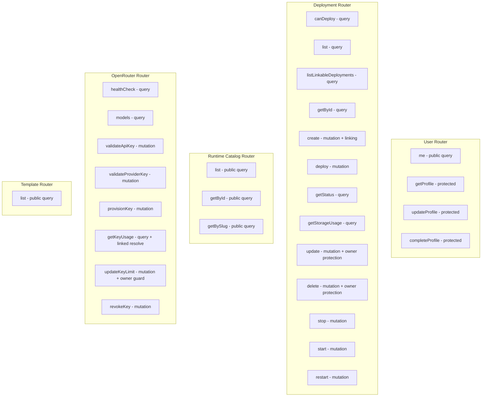

### REST Endpoints (Non-tRPC)

| Method | Path | Auth | Description |
| --- | --- | --- | --- |
| GET | /health | None | K8s liveness/readiness probe |
| POST | /api/stripe/webhook | Stripe sig | Stripe event webhooks |
| POST | /api/stripe/checkout | JWT | Create checkout session |
| POST | /api/stripe/portal | JWT | Create billing portal |
| POST | /api/auth0/email-verified | M2M | Auth0 email verification sync |
| GET | /debug/db | None | View DB tables (dev only) |

---

# 5. Database Schema

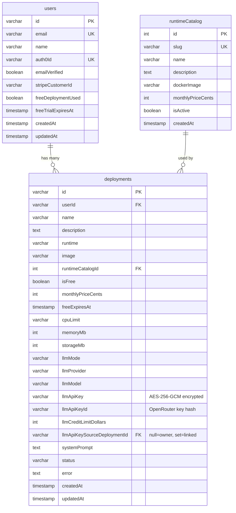

---

# 6. Deployment Flow (End-to-End)

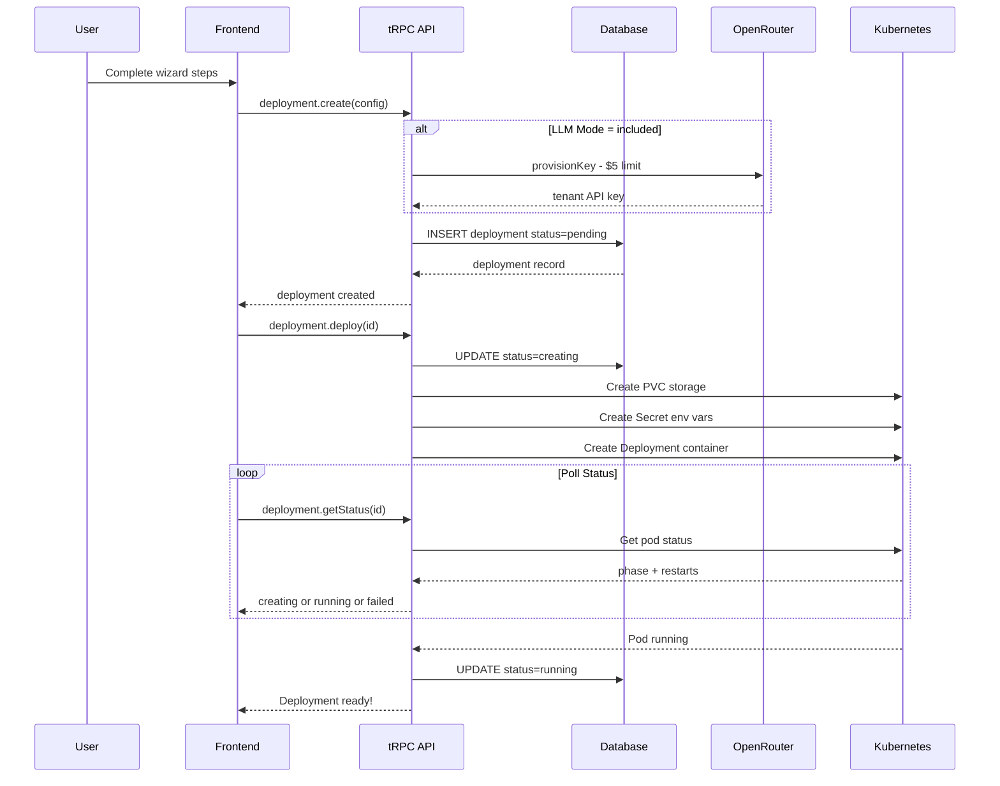

---

# 7. Infrastructure — Hetzner Cloud + Terraform

### Cluster Provisioning Architecture

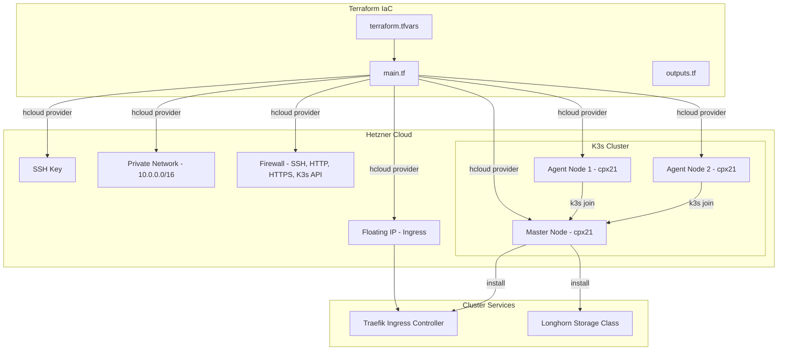

### Default Cluster Specs

| Resource | Default | Notes |
| --- | --- | --- |
| Master Node | cpx21 (3 vCPU, 4GB) | ~$7.59/mo |
| Agent Nodes | 2x cpx21 | Scales via agent_count |
| Network | 10.0.0.0/16 | Internal K3s comms |
| Storage | Longhorn | Default StorageClass |
| Ingress | Traefik | TLS, host-based routing |
| Location | Ashburn (ash) | Also: Falkenstein, Nuremberg, Helsinki |
| K3s Version | v1.29.2+k3s1 | Lightweight Kubernetes |

### Quick Start

```bash
cd infrastructure/terraform
cp terraform.tfvars.example terraform.tfvars
# Edit terraform.tfvars with Hetzner token + SSH key
terraform init
terraform plan
terraform apply
# Fetch kubeconfig
scp root@<MASTER_IP>:/etc/rancher/k3s/k3s.yaml ./kubeconfig.yaml
```

---

# 8. Kubernetes Resource Architecture

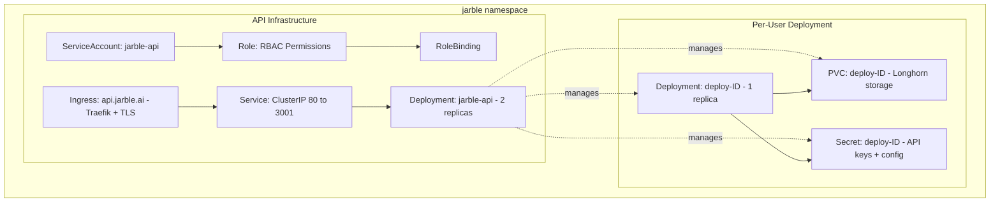

### K8s Resources Per Deployment

| Resource | Details |
| --- | --- |
| PVC | Longhorn, ReadWriteOnce, min 1Gi |
| Secret | DEPLOYMENT_ID, USER_ID, RUNTIME, OPENROUTER_API_KEY |
| Deployment | 1 replica, custom CPU/RAM limits, /data mount |

---

# 9. Auth & Security Flow

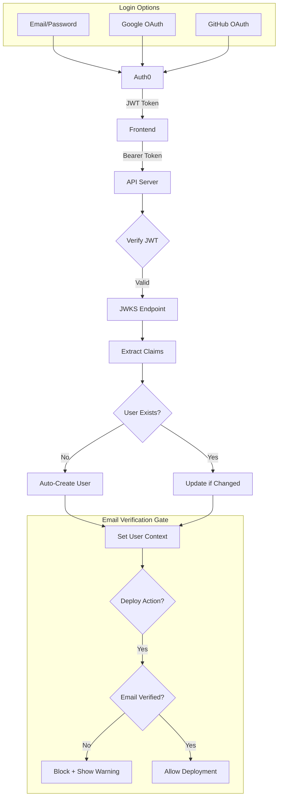

### Auth0 Email Verification Sync

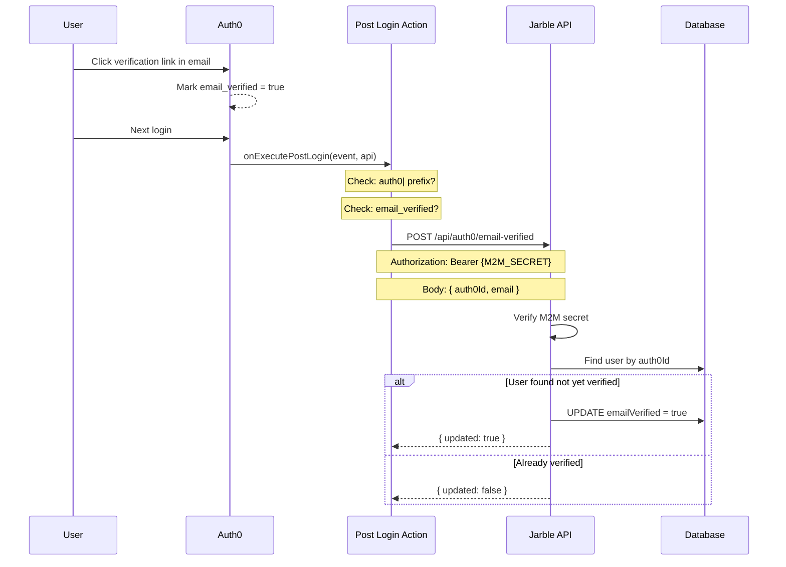

### Auth Details

| Feature | Implementation |
| --- | --- |
| JWT Verification | jose library, JWKS caching |
| User Provisioning | Auto-create on first login with nanoid(12) IDs |
| Email Gate | Deployments blocked until email_verified = true |
| Email Sync | Auth0 Post Login Action → POST /api/auth0/email-verified |
| M2M Auth | Shared secret (AUTH0_M2M_SECRET) in Bearer header |

---

# 10. Payment Flow (Stripe)

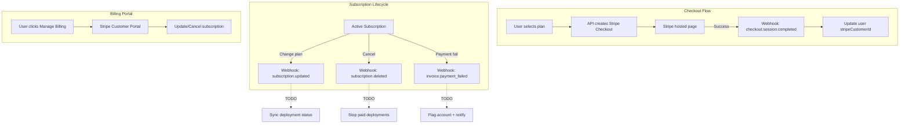

### Stripe Integration Status

| Feature | Status |
| --- | --- |
| Checkout session creation | ✅ Implemented |
| Portal session creation | ✅ Implemented |
| Webhook signature verification | ✅ Implemented |
| checkout.session.completed | ✅ Implemented |
| subscription.updated → sync | ❌ TODO |
| subscription.deleted → stop | ❌ TODO |
| invoice.payment_failed → flag | ❌ TODO |

---

# 11. What's Built (Complete)

## Frontend ✅

- [x]  Landing page with hero animation, features grid, integrations marquee
- [x]  Auth0 login/register with Google, GitHub, Email/Password
- [x]  Dashboard with deployment cards, storage meter, email verification banner
- [x]  5-step onboarding wizard (Name → Runtime → LLM → Deploy → WhatsApp)
- [x]  Deploy step blocks unverified email users with warning
- [x]  Deployment configuration (5 tabs: General, Model, Platforms, Skills, Advanced)
- [x]  Settings page + password reset for email/password users
- [x]  Dark mode with localStorage + system preference
- [x]  Profile dropdown on all pages (Dashboard, Linked Deployments, Settings)
- [x]  **Linked Deployments page** — `/deployments` with runtime tabs, credit pool cluster visualization (owner/linked tree with CSS connectors)
- [x]  **Credit Pool Selector in wizard** — Link to existing pool or create new one during onboarding
- [x]  **Credit Plan Selector** — $5/$10/$25/$50/$100 monthly spending cap options
- [x]  **Multi-provider key validation** — Validates API keys for OpenRouter, OpenAI, Anthropic, Google
- [x]  **Hardware config in wizard** — CPU, memory, storage overrides with recommended badges
- [x]  **StatusBadge shared component** — Extracted from Dashboard, used by Dashboard + Linked Deployments
- [x]  **StorageMeter component** — Visual storage usage with color-coded progress bar
- [x]  **ZeroClaw LLM step** — ZeroClaw now has LLM Setup step in wizard (was deploy-only)
- [x]  **Stop/Start/Restart controls** — Per-deployment stop (Square), start (Play), restart (RotateCw) buttons on Dashboard cards

## Backend ✅

- [x]  Auth0 JWT verification + auto user provisioning
- [x]  Deployment CRUD + K8s orchestration (PVC, Secret, Deployment)
- [x]  Free tier system (1 free deployment, 7-day expiry)
- [x]  Multi-LLM provider support (OpenRouter, OpenAI, Anthropic, Google)
- [x]  Auth0 email verification webhook (POST /api/auth0/email-verified)
- [x]  Stripe checkout + portal + webhook handling
- [x]  Multi-database support (MySQL, PostgreSQL, SQLite)
- [x]  **OpenRouter key provisioning** — Auto-provision tenant API keys via OpenRouter Management API
- [x]  **AES-256-GCM encryption** — API keys encrypted before DB storage (`src/utils/encryption.ts`)
- [x]  **Shared Credit Pools (Owner/Linked model)** — `llmApiKeySourceDeploymentId` column links deployments to a shared key
- [x]  **Owner protection** — Cannot delete or switch mode on a credit pool owner with linked children
- [x]  **Linked usage resolution** — `getKeyUsage` follows link chain to owner's key hash
- [x]  **`listLinkableDeployments` query** — Returns owner deployments eligible for linking
- [x]  **Runtime Registry pattern** — `src/runtimes/` with per-runtime handlers for K8s config
- [x]  **Storage usage monitoring** — K8s exec `df -B1 /data` with percentage calculation
- [x]  **Stop/Start/Restart** — K8s replica scaling (0↔1) via `stopDeployment()`, `startDeployment()`, `restartDeployment()` with tRPC mutations + fire-and-forget pod status polling

## Infrastructure ✅

- [x]  Terraform config for Hetzner Cloud K3s cluster
- [x]  Master + configurable agent nodes with auto-join
- [x]  Private networking + firewall rules
- [x]  Floating IP + Longhorn storage + Traefik ingress
- [x]  Auth0 Post Login Action for email verification sync

---

# 12. What's NOT Built Yet — Roadmap

## 🔴 Critical (Must-Have for Launch)

1. **Platform credential storage** — Wire PlatformsTab to API, save WhatsApp/Discord credentials to DB
2. **Stripe subscription → deployment sync** — When subscription changes/cancels, update deployment
3. **Drizzle migrations regeneration** — Current migrations stale
4. **WhatsApp QR integration** — Replace mock QR with real WhatsApp Business API
5. **Email verification resend** — Add "Resend" button for unverified users

## 🟡 Important (Post-Launch)

1. Deployment logs — Stream container logs from K8s
2. Real-time status — WebSocket/SSE instead of polling
3. Usage analytics dashboard
4. API key management — Rotate, revoke, regenerate
5. Rate limiting on API routes
6. Terraform CI/CD — GitHub Actions for plan/apply

## 🟢 Nice-to-Have (Future)

1. Team/organization support — Multi-user orgs, RBAC
2. Chat testing playground — In-browser bot testing
3. Skill marketplace — Browse, install pre-built skills
4. Multi-region cluster support
5. Cluster auto-scaling based on deployments

---

# 13. Component Inventory

Shared: ProfileDropdown, IntegrationsMarquee, TemplateSelector, WizardLoader, ErrorBoundary, ThemeToggle, PlatformConfigForm, SubscribeButton, StatusBadge, StorageMeter

Auth: Auth0Provider, LoginButton, LogoutButton

Views: Dashboard, Deployments (Linked Deployments), OnboardingWizard, DeploymentConfiguration, Settings

UI Library: 40+ shadcn/ui components (Button, Card, Dialog, Tabs, Toast, Badge, etc.)

---

# 14. Environment Variables

### Frontend (.env.local)

- `NEXT_PUBLIC_AUTH0_DOMAIN` — Auth0 tenant domain
- `NEXT_PUBLIC_AUTH0_CLIENT_ID` — Auth0 application client ID
- `NEXT_PUBLIC_AUTH0_AUDIENCE` — Auth0 API audience

### Backend (.env)

- `DATABASE_URL` — Connection string (required unless SQLite)
- `AUTH0_DOMAIN`, `AUTH0_AUDIENCE` — Auth0 config (required)
- `AUTH0_M2M_SECRET` — Shared secret for email verification webhook
- `STRIPE_SECRET_KEY`, `STRIPE_WEBHOOK_SECRET` — Stripe keys
- `OPENROUTER_API_KEY` — OpenRouter API key for model listing / health checks
- `OPENROUTER_MANAGEMENT_KEY` — OpenRouter Management API key for tenant key provisioning (optional — required for "Included Credits" mode)
- `ENCRYPTION_KEY` — 32-byte hex key for AES-256-GCM API key encryption

### Terraform (terraform.tfvars)

- `hcloud_token` — Hetzner Cloud API token (required)
- `agent_count` — Number of worker nodes (default: 2)
- `location` — Datacenter (ash, fsn1, nbg1, hel1)

### Auth0 Action Secrets

- `JARBLE_API_URL` — API base URL
- `JARBLE_M2M_SECRET` — Must match AUTH0_M2M_SECRET

---

# 15. File Structure Overview

```
monorepo/
├── Jarble-mvp/                        # Frontend (Next.js 15)
│   ├── app/
│   │   ├── page.tsx                   # Landing page
│   │   ├── dashboard/page.tsx         # Dashboard route
│   │   ├── deployments/page.tsx       # Linked Deployments route
│   │   ├── settings/page.tsx          # Settings route
│   │   ├── d/[id]/configure/page.tsx  # Deployment config route
│   │   └── onboarding/[id]/page.tsx   # Onboarding wizard route
│   ├── views/
│   │   ├── Dashboard.tsx              # Main deployment list
│   │   ├── Deployments.tsx            # Linked Deployments (credit pool clusters)
│   │   ├── DeploymentConfiguration.tsx # Config tabs (General, Model, Platforms, Skills, Advanced)
│   │   ├── OnboardingWizard.tsx       # Multi-step wizard with credit pool linking
│   │   ├── Settings.tsx               # Profile settings
│   │   └── onboarding/
│   │       └── wizardStepConfig.ts    # Runtime steps, LLM providers, models, credit plans, hardware options
│   ├── components/
│   │   ├── ProfileDropdown.tsx        # User menu (Dashboard, Linked Deployments, Settings)
│   │   ├── StatusBadge.tsx            # Shared status indicator (running, starting, stopped, pending, failed)
│   │   ├── StorageMeter.tsx           # Storage usage bar with color coding
│   │   └── ...                        # 40+ shadcn/ui components
│   └── lib/trpc.ts
│
├── jarble-api-main/                   # Backend (Express + tRPC)
│   ├── src/
│   │   ├── index.ts                   # Server entry + REST webhooks
│   │   ├── trpc/routers/
│   │   │   ├── deployment.ts          # CRUD + linking + owner protection
│   │   │   ├── openrouter.ts          # Key provisioning, usage, validation
│   │   │   ├── user.ts                # Profile management
│   │   │   ├── runtimeCatalog.ts      # Runtime listing + capabilities
│   │   │   └── template.ts            # Static templates
│   │   ├── db/
│   │   │   ├── schema.ts             # MySQL schema (prod)
│   │   │   ├── schema.pg.ts          # PostgreSQL schema (alt)
│   │   │   ├── schema.sqlite.ts      # SQLite schema (dev)
│   │   │   └── init.ts               # SQLite CREATE TABLE + seed
│   │   ├── runtimes/                  # Runtime Registry pattern
│   │   │   ├── index.ts              # Handler resolution
│   │   │   ├── types.ts              # DeploymentFields interface
│   │   │   └── openclaw.ts           # OpenClaw-specific K8s config
│   │   ├── utils/
│   │   │   ├── encryption.ts         # AES-256-GCM encrypt/decrypt
│   │   │   ├── openrouter.ts         # OpenRouter Management API utilities
│   │   │   ├── env.ts                # Environment variable validation
│   │   │   └── logger.ts             # Pino logger
│   │   ├── services/                  # Auth + Stripe
│   │   └── k8s/                       # K8s orchestration
│   └── k8s/                           # K8s manifests
│
└── infrastructure/                    # IaC
    ├── terraform/
    │   ├── main.tf
    │   ├── variables.tf
    │   └── outputs.tf
    └── auth0/
        └── post-email-verification-action.js
```

---

<aside>
📚 This document provides a complete snapshot of the Jarble platform as of February 16, 2026. Use the roadmap section to prioritize next steps.

</aside>

---

# 📊 Progress Overview

Visual map of completed features and remaining TODO items:

### Completed Features

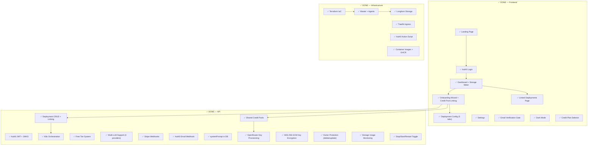

### Remaining Work

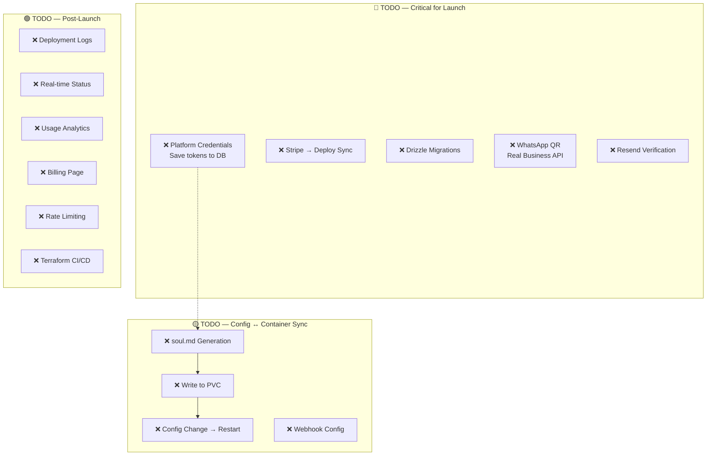

### Feature Dependencies

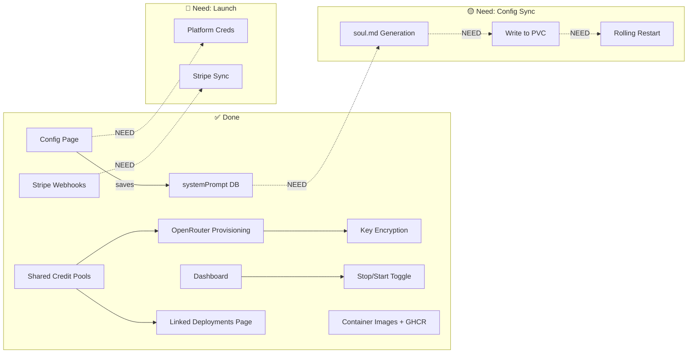

---

# 16. Shared Credit Pools — Architecture (Session 2)

### Owner/Linked Model

Deployments can share a single OpenRouter API key and monthly spending cap. The `llmApiKeySourceDeploymentId` column tracks relationships:

- **null** → deployment owns its own key (is a pool owner)
- **set** → deployment is linked to the owner's pool

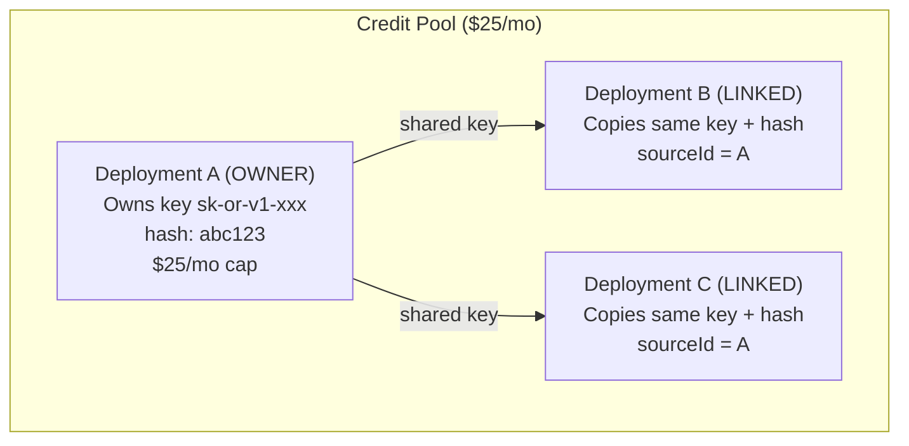

### Key Operations

| Operation | Behavior |
| --- | --- |
| Create + link | Copies encrypted key + hash from root owner (no decryption needed) |
| Create + new pool | Provisions new OpenRouter tenant key via Management API |
| Delete owner with links | **BLOCKED** — error lists linked deployment names |
| Delete linked deployment | Allowed freely — doesn't revoke key |
| Switch owner included → BYOK | **BLOCKED** if has linked children |
| Get usage (linked) | Resolves to owner's key hash, returns owner's usage |
| Update credit limit (linked) | **BLOCKED** — must update owner |
| Transitive links (B→A, C→B) | Always resolved to root: C stores sourceId = A |

### Encryption

API keys are encrypted with AES-256-GCM before DB storage. Key derivation uses `ENCRYPTION_KEY` env var (32-byte hex). Linked deployments copy the already-encrypted key blob from the root owner — no decryption round-trip needed during linking.

**Future:** Migrate encrypted keys from DB to a secret manager (AWS Secrets Manager, Vault, etc.)

### Wizard Linking UI

When creating a deployment with "Included Credits" mode and existing credit pool owners exist:

```
┌──────────────────────────────────┐
│  Credit Pool                     │
│                                  │
│  ⊕ Create New Pool        ✓     │  ← Provisions new OpenRouter key
│    Own spending cap              │
│                                  │
│  🔗 My Main Bot — $25/mo        │  ← Links to existing pool
│    Share the credit pool         │
│                                  │
│  🔗 Test Bot — $5/mo            │  ← Links to existing pool
│    Share the credit pool         │
└──────────────────────────────────┘
```

### Linked Deployments Page (`/deployments`)

Accessible via Profile Dropdown → "Linked Deployments". Groups deployments by runtime, shows credit pool clusters with CSS tree connectors:

```
Runtime: OpenClaw
├── Credit Pool ($25/mo) — 3 deployments
│   ┌─────────────────────┐
│   │  OWNER: My Main Bot │  ← Primary border accent, Crown icon
│   │  $25/mo credit pool │
│   └─────────┬───────────┘
│         ┌───┴───┐
│   ┌─────┴──┐ ┌──┴─────┐
│   │ Bot 2  │ │ Bot 3  │  ← Smaller cards, Link2 icon
│   │ Linked │ │ Linked │
│   └────────┘ └────────┘
│
├── Included Credits (standalone)
│   [Owner cards with no linked children]
│
└── BYOK (own API key)
    [Cards with Key icon]
```

Uses `runtimeNeedsLlm(slug)` from `wizardStepConfig.ts` to determine if a runtime has credit pool concepts. Non-LLM runtimes show a simple card grid instead.

---

# 17. Runtime Registry Pattern (Session 2)

Each runtime can define custom K8s configuration logic via handlers in `src/runtimes/`:

```typescript
// src/runtimes/types.ts
interface DeploymentFields {
  id: string;
  runtime: string;
  llmApiKey: string | null;
  llmProvider: string;
  llmModel: string | null;
  systemPrompt: string | null;
  // ...hardware specs
}

// src/runtimes/openclaw.ts
export function getEnvVars(dep: DeploymentFields): Record<string, string> { ... }
export function getConfigFiles(dep: DeploymentFields): { path: string; content: string }[] { ... }

// src/runtimes/index.ts
export function getHandlerOrNull(runtime: string) { ... }
```

The deployment router calls `getHandlerOrNull(runtime)` to get runtime-specific env vars and config files. Falls back to generic behavior if no handler exists.

---

# 18. wizardStepConfig.ts — Single Source of Truth (Session 2)

This file centralizes ALL configurable wizard and config dashboard data:

| What | Where in file |
| --- | --- |
| Wizard steps per runtime | `RUNTIME_EXTRA_STEPS` |
| Config dashboard tabs per runtime | `RUNTIME_CONFIG_TABS` |
| LLM providers (BYOK grid) | `LLM_PROVIDERS` |
| LLM models (model selector) | `LLM_MODELS` |
| Credit plans ($5–$100) | `CREDIT_PLANS` |
| Hardware options (CPU/RAM/Storage) | `CPU_OPTIONS`, `MEMORY_OPTIONS`, `STORAGE_OPTIONS` |

### Helper Functions

- `getWizardSteps(slug)` — Returns universal + runtime-specific steps
- `getConfigTabs(slug)` — Returns config dashboard tabs for a runtime
- `runtimeNeedsLlm(slug)` — Checks if runtime has "llm" step (used by Linked Deployments page)
- `detectProviderFromKey(key)` — Auto-detects provider from API key prefix
- `getModelsForProvider(id)` — Filters model list by provider
- `getDefaultModelForProvider(id)` — Gets default model for a provider

### Current Runtime Configs

```
openclaw: [LLM Setup → Deploy → Connect WhatsApp]
zeroclaw: [LLM Setup → Deploy]
(unknown): [Deploy]  ← fallback
```

---

# 19. Container Images & GHCR

### Runtime Base Images

| Runtime | Language | Base Image | Gateway Port | GHCR Image |
|---------|----------|------------|-------------|------------|
| OpenClaw | TypeScript/Node.js 22 | `node:22-bookworm-slim` | 18789 | `ghcr.io/jarble-ai/openclaw:latest` |
| ZeroClaw | Rust (~3.4MB binary) | `debian:bookworm-slim` | 3000 | `ghcr.io/jarble-ai/zeroclaw:latest` |

### Architecture

Container is **stateless** (OS + runtime deps + entrypoint). All persistent data on PVC at `/data/`.

First boot: entrypoint installs runtime (`npm install openclaw` or copies zeroclaw binary), writes default config, marks `/data/.initialized`.

Subsequent boots: starts gateway directly from persistent storage.

### PVC Layout

**OpenClaw:** `/data/.openclaw/openclaw.json` (runtime config), `/data/config/soul.md` (system prompt), `/data/runtime/node_modules/` (npm install)

**ZeroClaw:** `/data/config/config.toml` (TOML config), `/data/zeroclaw-data/` (internal data/SQLite)

### Env Var Mapping (K8s Secret → Runtime)

- **OpenClaw:** `OPENROUTER_API_KEY`, `LLM_PROVIDER`, `LLM_MODEL`
- **ZeroClaw:** `API_KEY`, `PROVIDER`, `ZEROCLAW_MODEL`

### CI/CD

GitHub Actions workflow at `.github/workflows/build-runtime-images.yml`. Triggers on push to `main` when `runtimes/**` changes. Publishes to GHCR with `:latest` and `:sha` tags.

### Files

- `runtimes/openclaw/Dockerfile` + `entrypoint.sh`
- `runtimes/zeroclaw/Dockerfile` + `entrypoint.sh`
- `runtimes/README.md` — Full documentation

### Upstream Projects

- OpenClaw: [github.com/openclaw/openclaw](https://github.com/openclaw/openclaw)
- ZeroClaw: [github.com/openagen/zeroclaw](https://github.com/openagen/zeroclaw)

---

# 20. Deployment Stop/Start/Restart (Session 3)

### How It Works

Deployments can be stopped, started, and restarted from the Dashboard. This uses **K8s replica scaling** — stopping a deployment sets replicas to 0 (pod terminates, PVC persists), starting sets replicas back to 1.

### K8s Layer (`src/k8s/deployment.ts`)

| Function | Action |
|----------|--------|
| `stopDeployment(id)` | Patches K8s deployment replicas → 0 via strategic merge patch |
| `startDeployment(id)` | Patches K8s deployment replicas → 1 |
| `restartDeployment(id)` | Stop → 2s delay → Start |

### tRPC Mutations (`deployment.ts` router)

| Mutation | Validation | DB Status Flow |
|----------|-----------|----------------|
| `stop` | Must be `running` | `running` → `stopped` |
| `start` | Must be `stopped` | `stopped` → `creating` → `running` (or `failed`) |
| `restart` | Must be `running` | `running` → `creating` → `running` (or `failed`) |

**Start/Restart** use fire-and-forget async polling: after scaling up, polls pod status every 2s for up to 60s, updating DB when pod is ready or timeout/failure occurs.

### Frontend (Dashboard.tsx)

- **Running:** Shows Stop (Square, orange) + Restart (RotateCw) buttons
- **Stopped:** Shows Start (Play, green) button
- **Transitioning (creating):** Shows spinner, all buttons disabled
- Start/restart success triggers frontend polling every 3s for 60s to update card status

### Status Flow

```
running ──stop──→ stopped ──start──→ creating ──poll──→ running
   │                                                      │
   └──restart──→ creating ──poll──→ running                │
                                   └──timeout──→ failed    │
```

---

# 21. Known Issues

- **Pre-existing tRPC type errors in frontend:** All files using `trpc.deployment.*` or `trpc.runtimeCatalog.*` show "Property does not exist" TypeScript errors. This is a monorepo type linking issue (types not auto-synced from API). Does NOT affect runtime — Next.js dev server compiles fine. Eventually needs proper tRPC type generation setup.
- **API builds clean:** `npm run build` in jarble-api-main passes with no errors.

---

# 22. Outstanding Work (Shared Credit Pools)

- Testing the full linking flow end-to-end with real deployments
- Secret manager migration (DB encryption is fine for now)
- Additional linkable resource types beyond LLM keys (communications, etc.)
- Unlinking UI (currently no way to unlink a deployment from the frontend config page — would need to be added to DeploymentConfiguration.tsx)

---

# 23. Dev Servers

- Frontend: `npm run dev` → localhost:3000 (from `Jarble-mvp/`)
- API: `npm run dev` → localhost:3001 (from `jarble-api-main/`)