# Jarble API Endpoints Reference

> Complete reference for every API endpoint in the Jarble platform. Covers all 174 tRPC procedures and 34 REST endpoints.
> Last updated: March 23, 2026 (Session 20)

---

## Table of Contents

1. [Request Flow](#1-request-flow)
2. [Authentication](#2-authentication)
3. [Rate Limiting](#3-rate-limiting)
4. [tRPC Procedures](#4-trpc-procedures)
   - [User Router](#user-router-6-procedures)
   - [Deployment Router](#deployment-router-37-procedures)
   - [OpenRouter Router](#openrouter-router-10-procedures)
   - [Billing Router](#billing-router-4-procedures)
   - [Platform Credentials Router](#platform-credentials-router-7-procedures)
   - [Runtime Catalog Router](#runtime-catalog-router-4-procedures)
   - [Template Router](#template-router-4-procedures)
   - [Skills Router](#skills-router-4-procedures)
   - [Marketplace Router](#marketplace-router-23-procedures)
   - [Services Router](#services-router-26-procedures)
   - [Benchmarks Router](#benchmarks-router-14-procedures)
   - [Flows Router](#flows-router-8-procedures)
   - [Admin Router](#admin-router-19-procedures)
   - [Agent Credits Router](#agent-credits-router-4-procedures)
   - [API Keys Router](#api-keys-router-4-procedures)
5. [REST Endpoints](#5-rest-endpoints)
   - [Webhooks](#webhooks)
   - [Payment Routes](#payment-routes)
   - [SSE Streaming](#sse-streaming)
   - [Health & Debug](#health--debug)
6. [Summary Table](#6-summary-table)

---

## 1. Request Flow

Every request passes through the following middleware chain:

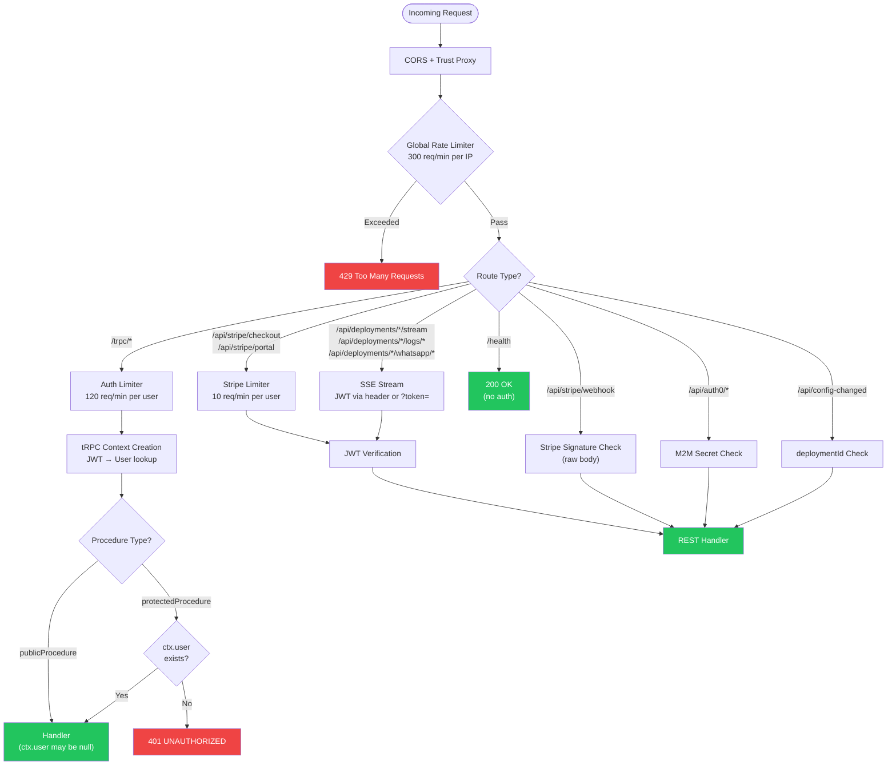
```mermaid
flowchart TD
    REQ([Incoming Request]) --> CORS["CORS + Trust Proxy"]
    CORS --> GLOBAL{"Global Rate Limiter<br/>300 req/min per IP"}

    GLOBAL -->|Exceeded| REJECT["429 Too Many Requests"]
    GLOBAL -->|Pass| ROUTE{"Route Type?"}

    ROUTE -->|"/api/stripe/webhook"| WEBHOOK["Stripe Signature Check<br/>(raw body)"]
    ROUTE -->|"/api/stripe/checkout<br/>/api/stripe/portal"| STRIPE_RL["Stripe Limiter<br/>10 req/min per user"]
    ROUTE -->|"/api/auth0/*"| M2M["M2M Secret Check"]
    ROUTE -->|"/api/config-changed"| CONFIG["deploymentId Check"]
    ROUTE -->|"/api/deployments/*/stream<br/>/api/deployments/*/logs/*<br/>/api/deployments/*/whatsapp/*"| SSE["SSE Stream<br/>JWT via header or ?token="]
    ROUTE -->|"/trpc/*"| AUTH_RL["Auth Limiter<br/>120 req/min per user"]
    ROUTE -->|"/health"| HEALTH["200 OK<br/>(no auth)"]

    STRIPE_RL --> JWT_CHECK["JWT Verification"]
    AUTH_RL --> TRPC_CTX["tRPC Context Creation<br/>JWT → User lookup"]
    SSE --> JWT_CHECK

    TRPC_CTX --> PROC{"Procedure Type?"}
    PROC -->|publicProcedure| HANDLER["Handler<br/>(ctx.user may be null)"]
    PROC -->|protectedProcedure| AUTH_CHECK{"ctx.user<br/>exists?"}
    AUTH_CHECK -->|No| UNAUTH["401 UNAUTHORIZED"]
    AUTH_CHECK -->|Yes| HANDLER

    JWT_CHECK --> HANDLER_REST["REST Handler"]
    WEBHOOK --> HANDLER_REST
    M2M --> HANDLER_REST
    CONFIG --> HANDLER_REST

    style REJECT fill:#ef4444,color:#fff
    style UNAUTH fill:#ef4444,color:#fff
    style HANDLER fill:#22c55e,color:#fff
    style HANDLER_REST fill:#22c55e,color:#fff
    style HEALTH fill:#22c55e,color:#fff
```

---

## 2. Authentication

### JWT Verification Flow

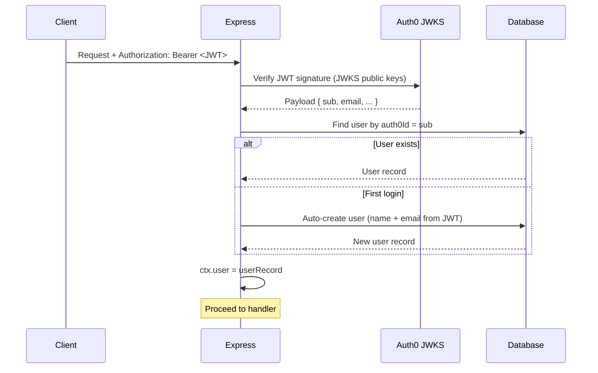
```mermaid
sequenceDiagram
    participant Client
    participant Express
    participant Auth0 as Auth0 JWKS
    participant DB as Database

    Client->>Express: Request + Authorization: Bearer <JWT>
    Express->>Auth0: Verify JWT signature (JWKS public keys)
    Auth0-->>Express: Payload { sub, email, ... }
    Express->>DB: Find user by auth0Id = sub

    alt User exists
        DB-->>Express: User record
    else First login
        Express->>DB: Auto-create user (name + email from JWT)
        DB-->>Express: New user record
    end

    Express->>Express: ctx.user = userRecord
    Note over Express: Proceed to handler
```

### Auth Methods by Endpoint Type

| Endpoint Type | Auth Method | Where Token Lives |
|---|---|---|
| tRPC procedures | JWT Bearer token | `Authorization` header |
| SSE streams | JWT token | `Authorization` header OR `?token=` query param |
| Stripe webhook | Stripe signature | `stripe-signature` header |
| Auth0 webhook | M2M shared secret | `Authorization: Bearer <M2M_SECRET>` |
| Config changed | Deployment ID | Request body (pod-only) |
| Health check | None | N/A |

---

## 3. Rate Limiting

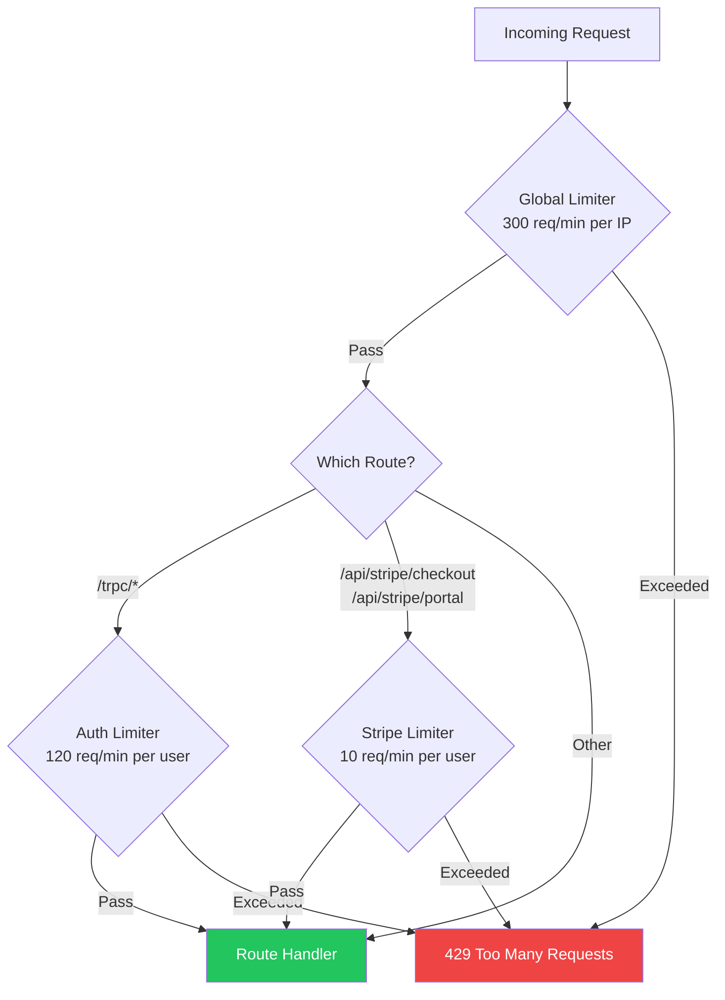
```mermaid
graph TD
    REQ["Incoming Request"] --> GLOBAL{"Global Limiter<br/>300 req/min per IP"}

    GLOBAL -->|Pass| ROUTE{"Which Route?"}
    GLOBAL -->|Exceeded| REJECT["429 Too Many Requests"]

    ROUTE -->|"/trpc/*"| AUTH{"Auth Limiter<br/>120 req/min per user"}
    ROUTE -->|"/api/stripe/checkout<br/>/api/stripe/portal"| STRIPE{"Stripe Limiter<br/>10 req/min per user"}
    ROUTE -->|Other| HANDLER["Route Handler"]

    AUTH -->|Pass| HANDLER
    AUTH -->|Exceeded| REJECT
    STRIPE -->|Pass| HANDLER
    STRIPE -->|Exceeded| REJECT

    style REJECT fill:#ef4444,color:#fff
    style HANDLER fill:#22c55e,color:#fff
```

| Limiter | Scope | Limit | Key | Exempt Routes |
|---------|-------|-------|-----|---------------|
| `globalLimiter` | All traffic | 300/min | Client IP | `/health`, `/api/stripe/webhook`, `/api/auth0/email-verified` |
| `authLimiter` | tRPC endpoints | 120/min | User ID (JWT `sub`) | -- |
| `stripeActionLimiter` | Payment actions | 10/min | User ID (JWT `sub`) | -- |

**User identification:** The rate limiter extracts the `sub` claim from the JWT by base64url-decoding the payload. Falls back to client IP if no token present.

**Response headers:** All limiters use `standardHeaders: "draft-7"` (`RateLimit-Limit`, `RateLimit-Remaining`, `RateLimit-Reset`).

---

## 4. tRPC Procedures

All tRPC endpoints are at `/trpc/<router>.<procedure>`. Types flow automatically to the frontend via `@trpc/react-query`.

### Router Architecture


```mermaid
graph TD
    CLIENT["Frontend<br/>trpc.router.procedure.useQuery()"] -->|"HTTP POST/GET"| TRPC["/trpc endpoint"]

    TRPC --> DEPLOYMENT["deployment<br/>37 procedures"]
    TRPC --> OPENROUTER["openrouter<br/>10 procedures"]
    TRPC --> USER["user<br/>6 procedures"]
    TRPC --> BILLING["billing<br/>4 procedures"]
    TRPC --> PLATCREDS["platformCredentials<br/>7 procedures"]
    TRPC --> RUNTIME_CAT["runtimeCatalog<br/>4 procedures"]
    TRPC --> TEMPLATE["template<br/>4 procedures"]
    TRPC --> SKILLS["skills<br/>4 procedures"]
    TRPC --> MARKETPLACE["marketplace<br/>23 procedures"]
    TRPC --> SERVICES["services<br/>26 procedures"]
    TRPC --> BENCHMARKS["benchmarks<br/>14 procedures"]
    TRPC --> FLOWS["flows<br/>8 procedures"]
    TRPC --> ADMIN["admin<br/>19 procedures"]
    TRPC --> AGENTCREDITS["agentCredits<br/>4 procedures"]
    TRPC --> APIKEYS["apiKeys<br/>4 procedures"]

    DEPLOYMENT --> DB[("Database")]
    DEPLOYMENT --> K8S["K8s Cluster"]
    OPENROUTER --> OR_API["OpenRouter API"]
    BILLING --> STRIPE_API["Stripe API"]
    PLATCREDS --> DB
    USER --> DB
    RUNTIME_CAT --> DB
    SKILLS --> DB
    MARKETPLACE --> DB
    MARKETPLACE --> MFVAL["Manifest Validator"]
    SERVICES --> DB
    SERVICES --> SVCPROXY["Service Proxy<br/>(HMAC + Circuit Breaker)"]
    FLOWS --> DB
    FLOWS --> LLM["LLM (generateFromPrompt)"]
    ADMIN --> DB
    ADMIN --> K8S
    ADMIN --> PROMETHEUS["Prometheus API"]
    AGENTCREDITS --> DB
    APIKEYS --> DB
```

---

### User Router (6 procedures)

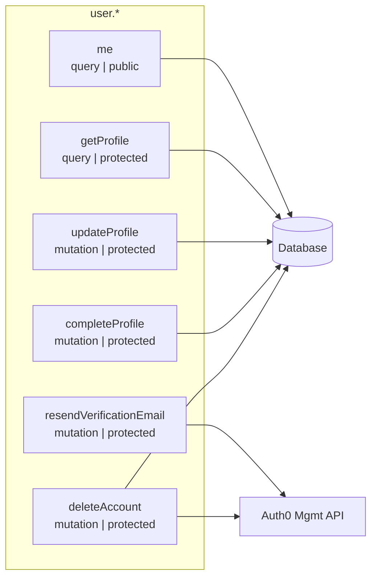
```mermaid
graph LR
    subgraph user["user.*"]
        ME["me<br/>query | public"]
        GP["getProfile<br/>query | protected"]
        UP["updateProfile<br/>mutation | protected"]
        CP["completeProfile<br/>mutation | protected"]
        RE["resendVerificationEmail<br/>mutation | protected"]
        DA["deleteAccount<br/>mutation | protected"]
    end

    ME --> DB[("Database")]
    GP --> DB
    UP --> DB
    CP --> DB
    RE --> AUTH0["Auth0 Mgmt API"]
    DA --> DB
    DA --> AUTH0
```

| Procedure | Type | Auth | Input | Description |
|---|---|---|---|---|
| `user.me` | query | public | -- | Returns current user from context (null if unauthenticated) |
| `user.getProfile` | query | protected | -- | Full user profile from DB |
| `user.updateProfile` | mutation | protected | `{ name?: string, email?: string }` | Update name and/or email |
| `user.completeProfile` | mutation | protected | `{ firstName: string, lastName: string }` | Set name after email verification (email auth flow) |
| `user.resendVerificationEmail` | mutation | protected | -- | Resend Auth0 verification email. Errors if already verified |
| `user.deleteAccount` | mutation | protected | `{ confirmation: "DELETE" }` | Hard-delete user account and all associated deployments |

---

### Deployment Router (37 procedures)


```mermaid
graph TD
    subgraph Queries["Queries"]
        CAN["canDeploy"]
        LIST["list"]
        LINKABLE["listLinkableDeployments"]
        BYID["getById"]
        COMPCAT["getComponentCatalog"]
        STATUS["getStatus"]
        STORAGE["getStorageUsage"]
        LOGS["getLogs"]
    end

    subgraph Lifecycle["Lifecycle Mutations"]
        CREATE["create"]
        DEPLOY["deploy"]
        STOP["stop"]
        START["start"]
        RESTART["restart"]
        DELETE["delete"]
    end

    subgraph Config["Config Mutations"]
        UPDATE["update"]
        EXPORT["exportConfigs"]
        DEFCOMP["defineComponent"]
        DELCOMP["deleteComponent"]
    end

    subgraph Billing["Billing Mutations"]
        CANCEL["cancel"]
        REACT["reactivate"]
        LINKSUB["linkSubscription"]
    end

    CREATE -->|"fire-and-forget"| DEPLOY
    STOP -->|"scale 0"| START
    CANCEL -->|"undo"| REACT

    STATUS --> K8S["K8s API"]
    DEPLOY --> K8S
    STOP --> K8S
    START --> K8S
    RESTART --> K8S
    DELETE --> K8S
    EXPORT --> K8S

    CANCEL --> STRIPE["Stripe API"]
    REACT --> STRIPE
    LINKSUB --> STRIPE
```

| Procedure | Type | Input | Description |
|---|---|---|---|
| `deployment.canDeploy` | query | -- | Check free tier status (`freeUsed`, `freeExpired`, `freeExpiresAt`) |
| `deployment.list` | query | -- | All user deployments, newest first, with runtime catalog data |
| `deployment.listLinkableDeployments` | query | -- | Deployments eligible as credit pool owners (included mode, not linked) |
| `deployment.getById` | query | `{ id }` | Single deployment with ownership check |
| `deployment.getComponentCatalog` | query | `{ id }` | List custom component definitions saved to this deployment's PVC |
| `deployment.getStatus` | query | `{ id }` | Live pod status from K8s (running/failed/pending/creating/not_found) |
| `deployment.getStorageUsage` | query | `{ id }` | Live storage usage via `df` in pod (`usedGb`, `allocatedGb`) |
| `deployment.getLogs` | query | `{ id, tailLines?: 1-5000 }` | Pod logs snapshot (non-streaming, default 200 lines) |
| `deployment.create` | mutation | See below | Create DB record + optional LLM key provisioning. Does NOT deploy |
| `deployment.deploy` | mutation | `deploymentId` | Trigger K8s deployment (fire-and-forget). Creates PVC + Secret + Deployment |
| `deployment.defineComponent` | mutation | `{ id, name, description, template }` | Save a custom component definition to the deployment's PVC |
| `deployment.deleteComponent` | mutation | `{ id, name }` | Delete a custom component definition from the deployment's PVC |
| `deployment.update` | mutation | `{ id, name?, systemPrompt?, llmMode?, llmProvider?, llmModel?, llmApiKey?, ... }` | Update settings. Syncs config to PVC if running |
| `deployment.stop` | mutation | `{ id }` | Scale K8s replicas to 0. PVC preserved |
| `deployment.start` | mutation | `{ id }` | Scale K8s replicas to 1 (fire-and-forget) |
| `deployment.restart` | mutation | `{ id }` | Delete pod + reschedule (fire-and-forget) |
| `deployment.cancel` | mutation | `{ id }` | Cancel Stripe subscription at period end |
| `deployment.reactivate` | mutation | `{ id }` | Remove `cancel_at_period_end` flag on Stripe |
| `deployment.linkSubscription` | mutation | `{ deploymentId }` | Link pending/unlinked Stripe subscription to deployment |
| `deployment.exportConfigs` | mutation | `{ id }` | Export PVC config files as base64-encoded ZIP |
| `deployment.delete` | mutation | `{ id }` | Delete deployment + all K8s resources. Blocks if credit pool owner with children |
| `deployment.platformFork` | mutation | `{ sourceId, name?, resourceTier, llmProvider?, llmModel? }` | Admin-only. Fork a deployment as a platform agent with chosen resource tier and platform LLM mode |

#### `deployment.create` Input Schema

```typescript
{
  name: string                           // required, min 1 char
  runtimeCatalogId: number               // required
  platform?: string
  image?: string                         // custom Docker image
  llmMode?: "included" | "byok" | "platform"  // default: "byok"; "platform" uses AGENT_LLM_API_KEY
  llmProvider?: "openrouter" | "openai" | "anthropic" | "google"
  llmModel?: string                      // e.g., "anthropic/claude-sonnet-4-20250514"
  llmApiKey?: string                     // required if llmMode="byok"
  systemPrompt?: string
  creditLimitDollars?: number            // 1-1000, included mode only
  linkToDeploymentId?: string            // link to existing credit pool
  cpuLimit?: string                      // e.g., "2.0"
  memoryMb?: number                      // RAM in MB
  storageMb?: number                     // storage in MB
}
```

---

### OpenRouter Router (10 procedures)

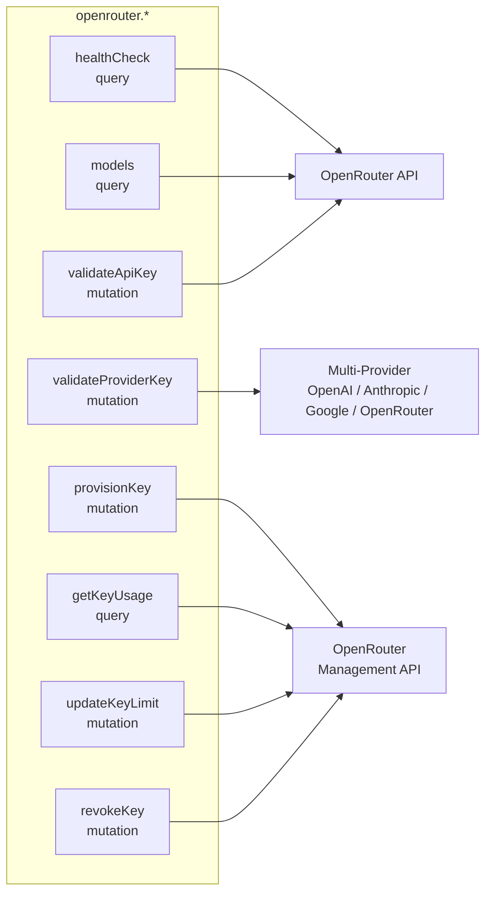
```mermaid
graph LR
    subgraph openrouter["openrouter.*"]
        HC["healthCheck<br/>query"]
        MODELS["models<br/>query"]
        VAL["validateApiKey<br/>mutation"]
        VALP["validateProviderKey<br/>mutation"]
        PROV["provisionKey<br/>mutation"]
        USAGE["getKeyUsage<br/>query"]
        UPD["updateKeyLimit<br/>mutation"]
        REV["revokeKey<br/>mutation"]
    end

    HC --> OR["OpenRouter API"]
    MODELS --> OR
    VAL --> OR
    VALP --> MULTI["Multi-Provider<br/>OpenAI / Anthropic / Google / OpenRouter"]
    PROV --> MGMT["OpenRouter<br/>Management API"]
    USAGE --> MGMT
    UPD --> MGMT
    REV --> MGMT
```

| Procedure | Type | Input | Description |
|---|---|---|---|
| `openrouter.healthCheck` | query | -- | Test OpenRouter connectivity using server API key |
| `openrouter.models` | query | -- | List all available models from OpenRouter |
| `openrouter.validateApiKey` | mutation | `{ apiKey }` | Validate an OpenRouter key (legacy) |
| `openrouter.validateProviderKey` | mutation | `{ provider, apiKey }` | Multi-provider key validation (OpenAI, Anthropic, Google, OpenRouter). **Dev bypass:** accepts `dev-*` keys in SQLite/dev mode |
| `openrouter.provisionKey` | mutation | `{ deploymentId, limitDollars? }` | Provision tenant API key via Management API. Encrypts + stores |
| `openrouter.getKeyUsage` | query | `{ deploymentId }` | Credit usage for "included" mode deployments. Resolves to owner if linked |
| `openrouter.updateKeyLimit` | mutation | `{ deploymentId, limitDollars: 1-1000 }` | Update monthly credit cap. Must be owner (not linked) |
| `openrouter.revokeKey` | mutation | `{ deploymentId }` | Disable tenant key, clear from DB, switch to BYOK mode |

---

### Billing Router (4 procedures)

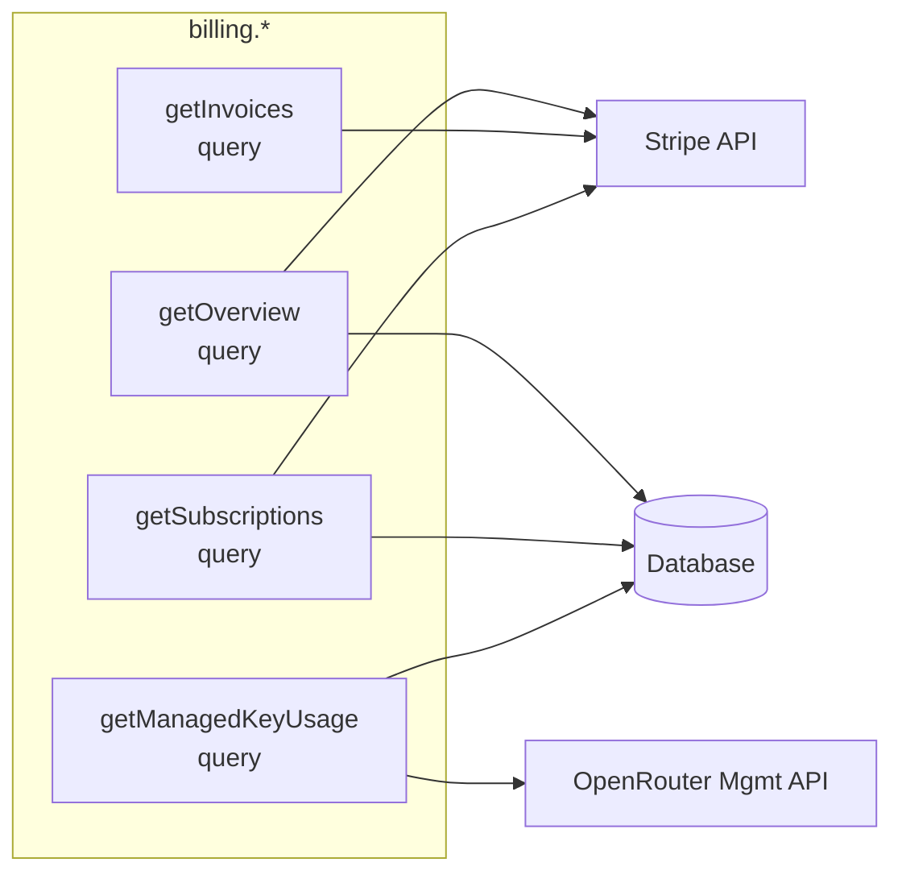
```mermaid
graph LR
    subgraph billing["billing.*"]
        OVERVIEW["getOverview<br/>query"]
        INV["getInvoices<br/>query"]
        SUBS["getSubscriptions<br/>query"]
        MKU["getManagedKeyUsage<br/>query"]
    end

    OVERVIEW --> STRIPE["Stripe API"]
    INV --> STRIPE
    SUBS --> STRIPE
    OVERVIEW --> DB[("Database")]
    SUBS --> DB
    MKU --> DB
    MKU --> OR_MGMT["OpenRouter Mgmt API"]
```

| Procedure | Type | Input | Description |
|---|---|---|---|
| `billing.getOverview` | query | -- | Billing summary: total monthly spend, active subs count, next billing date, payment method last4 |
| `billing.getInvoices` | query | -- | All Stripe invoices (id, date, amount, status, PDF URL) |
| `billing.getSubscriptions` | query | -- | Subscription details per deployment (Stripe status, billing period, cancellation info) |
| `billing.getManagedKeyUsage` | query | `{ deploymentId }` | OpenRouter credit usage for a specific "included" mode deployment. Resolves to pool owner's key if linked |

#### `billing.getOverview` Output

```typescript
{
  totalMonthlyCents: number         // sum of all paid deployments
  activeSubscriptionCount: number
  nextBillingDate: string | null    // ISO date from first active subscription
  paymentMethodLast4: string | null // card last 4 digits
}
```

---

### Platform Credentials Router (7 procedures)

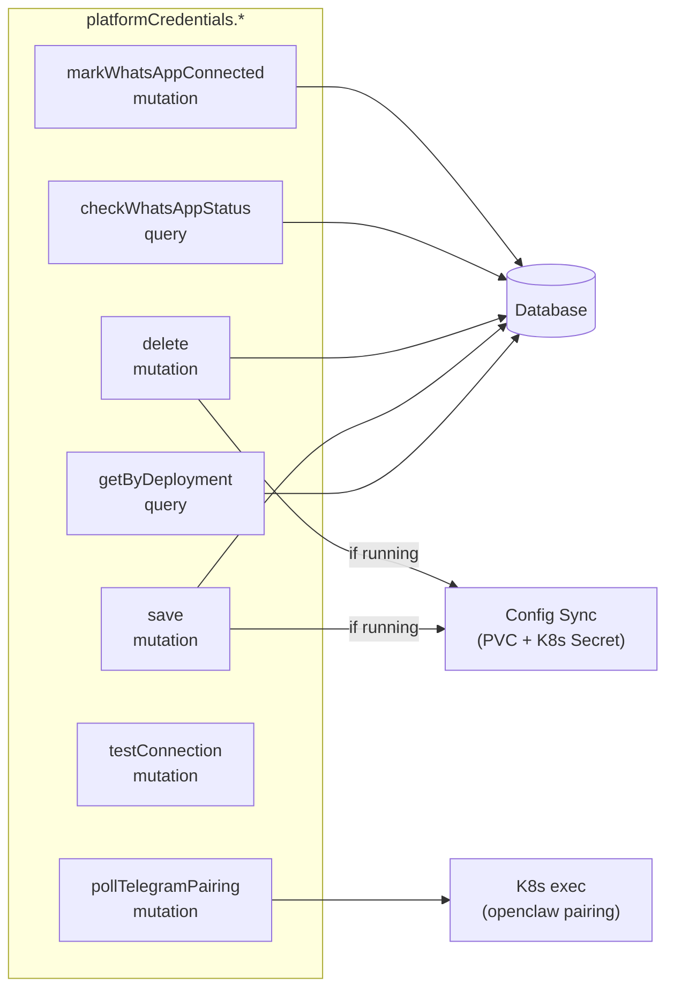
```mermaid
graph LR
    subgraph platformCredentials["platformCredentials.*"]
        GET["getByDeployment<br/>query"]
        SAVE["save<br/>mutation"]
        DEL["delete<br/>mutation"]
        WA_CHECK["checkWhatsAppStatus<br/>query"]
        WA_MARK["markWhatsAppConnected<br/>mutation"]
        TEST["testConnection<br/>mutation"]
        TGPOLL["pollTelegramPairing<br/>mutation"]
    end

    GET --> DB[("Database")]
    SAVE --> DB
    SAVE -->|"if running"| K8S["Config Sync<br/>(PVC + K8s Secret)"]
    DEL --> DB
    DEL -->|"if running"| K8S
    WA_CHECK --> DB
    WA_MARK --> DB
    TGPOLL --> K8SEXEC["K8s exec<br/>(openclaw pairing)"]
```

| Procedure | Type | Input | Description |
|---|---|---|---|
| `platformCredentials.getByDeployment` | query | `{ deploymentId }` | List credentials with masked values (first4 + last4 visible) |
| `platformCredentials.save` | mutation | `{ deploymentId, platformId, credentials }` | Upsert encrypted credentials. Syncs to PVC if running |
| `platformCredentials.delete` | mutation | `{ deploymentId, platformId }` | Delete credentials. Syncs to PVC if running |
| `platformCredentials.checkWhatsAppStatus` | query | `{ deploymentId }` | Check if WhatsApp is connected (DB row exists) |
| `platformCredentials.markWhatsAppConnected` | mutation | `{ deploymentId }` | Mark WhatsApp connected (called by QR SSE endpoint) |
| `platformCredentials.testConnection` | mutation | `{ deploymentId, platformId, credentials }` | Validate credential format (required fields present) |
| `platformCredentials.pollTelegramPairing` | mutation | `{ deploymentId }` | Poll for pending Telegram pairing codes via K8s exec. Auto-approves on match |

#### Supported Platforms

| Platform | Credential Fields | K8s Env Vars |
|---|---|---|
| Discord | `botToken` | `DISCORD_BOT_TOKEN` |
| Telegram | `botToken` | `TELEGRAM_BOT_TOKEN` |
| Slack | `botToken`, `appToken` | `SLACK_BOT_TOKEN`, `SLACK_APP_TOKEN` |
| WhatsApp | (QR pairing) | -- |
| Teams | `appId`, `appPassword` | `TEAMS_APP_ID`, `TEAMS_APP_PASSWORD` |
| Messenger | `pageAccessToken`, `verifyToken` | `MESSENGER_PAGE_ACCESS_TOKEN`, `MESSENGER_VERIFY_TOKEN` |
| Web | `allowedDomains` | -- |

---

### Runtime Catalog Router (4 procedures)

| Procedure | Type | Auth | Input | Description |
|---|---|---|---|---|
| `runtimeCatalog.list` | query | public | -- | All active runtimes (OpenClaw, ZeroClaw, etc.) |
| `runtimeCatalog.getById` | query | public | `{ id: number }` | Single runtime by catalog ID |
| `runtimeCatalog.getBySlug` | query | public | `{ slug }` | Single runtime by slug (e.g., "openclaw") |
| `runtimeCatalog.getCapabilities` | query | public | `{ slug }` | Runtime capabilities + config files from handler registry |

---

### Template Router (4 procedures)

| Procedure | Type | Auth | Input | Description |
|---|---|---|---|---|
| `template.list` | query | public | -- | All active persona templates from DB |
| `template.getById` | query | public | `{ id }` | Single persona template by ID |
| `template.getByCategory` | query | public | `{ category }` | Templates filtered by category |
| `template.getCategories` | query | public | -- | Distinct categories with counts |

---

### Skills Router (4 procedures)

| Procedure | Type | Auth | Input | Description |
|---|---|---|---|---|
| `skills.listCatalog` | query | protected | -- | All active skills in the platform catalog (Web Search, Weather, Calculator, etc.) |
| `skills.listForDeployment` | query | protected | `{ deploymentId }` | Skills installed on a specific deployment |
| `skills.install` | mutation | protected | `{ deploymentId, skillId }` | Install a skill on a deployment (idempotent) |
| `skills.uninstall` | mutation | protected | `{ deploymentId, skillId }` | Remove a skill from a deployment |

---

### Marketplace Router (23 procedures)

The marketplace enables creators to publish and sell custom canvas components. Two tiers exist: **Template** (safe JSON, auto-approved) and **Sandbox** (arbitrary HTML/JS in a double-iframe, requires admin review).

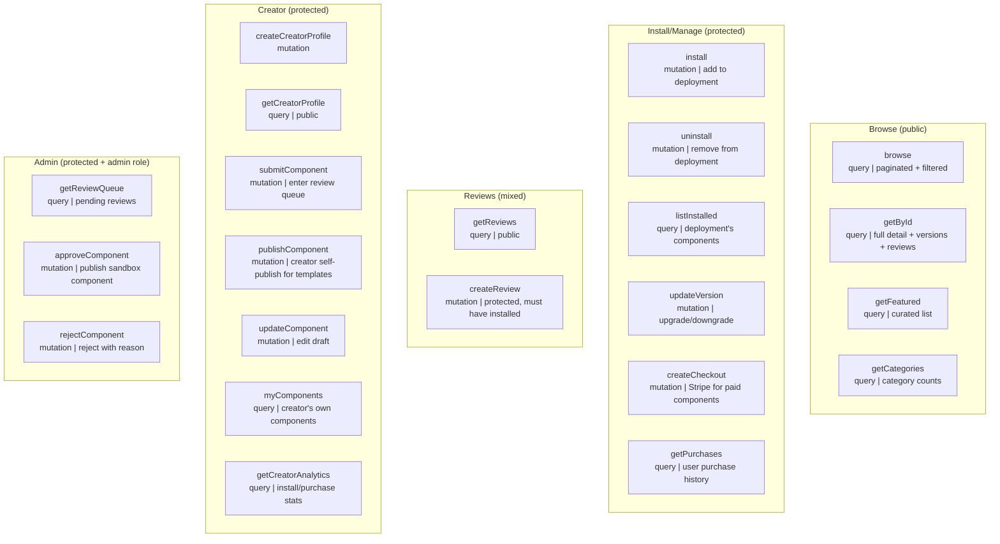
```mermaid
graph TD
    subgraph Browse["Browse (public)"]
        B1["browse<br/>query | paginated + filtered"]
        B2["getById<br/>query | full detail + versions + reviews"]
        B3["getFeatured<br/>query | curated list"]
        B4["getCategories<br/>query | category counts"]
    end

    subgraph Install["Install/Manage (protected)"]
        I1["install<br/>mutation | add to deployment"]
        I2["uninstall<br/>mutation | remove from deployment"]
        I3["listInstalled<br/>query | deployment's components"]
        I4["updateVersion<br/>mutation | upgrade/downgrade"]
        I5["createCheckout<br/>mutation | Stripe for paid components"]
        I6["getPurchases<br/>query | user purchase history"]
    end

    subgraph Reviews["Reviews (mixed)"]
        R1["getReviews<br/>query | public"]
        R2["createReview<br/>mutation | protected, must have installed"]
    end

    subgraph Creator["Creator (protected)"]
        C1["createCreatorProfile<br/>mutation"]
        C2["getCreatorProfile<br/>query | public"]
        C3["submitComponent<br/>mutation | enter review queue"]
        C4["publishComponent<br/>mutation | creator self-publish for templates"]
        C5["updateComponent<br/>mutation | edit draft"]
        C6["myComponents<br/>query | creator's own components"]
        C7["getCreatorAnalytics<br/>query | install/purchase stats"]
    end

    subgraph Admin["Admin (protected + admin role)"]
        A1["getReviewQueue<br/>query | pending reviews"]
        A2["approveComponent<br/>mutation | publish sandbox component"]
        A3["rejectComponent<br/>mutation | reject with reason"]
    end
```

| Procedure | Type | Auth | Description |
|---|---|---|---|
| `marketplace.browse` | query | public | Paginated component browser with category/tier/pricing/sort/search filters |
| `marketplace.getById` | query | public | Full component detail with versions, creator profile, and reviews |
| `marketplace.getFeatured` | query | public | Curated featured component list |
| `marketplace.getCategories` | query | public | Category list with component counts |
| `marketplace.install` | mutation | protected | Install a component on a deployment. Creates `component_installs` record |
| `marketplace.uninstall` | mutation | protected | Remove an installed component from a deployment |
| `marketplace.listInstalled` | query | protected | All components installed on a specific deployment |
| `marketplace.updateVersion` | mutation | protected | Upgrade or downgrade an installed component to a specific version |
| `marketplace.createCheckout` | mutation | protected | Create Stripe checkout for paid components (placeholder — returns not-implemented) |
| `marketplace.getPurchases` | query | protected | All components the user has purchased |
| `marketplace.getReviews` | query | public | Paginated reviews for a component |
| `marketplace.createReview` | mutation | protected | Submit a 1-5 star review. User must have the component installed |
| `marketplace.createCreatorProfile` | mutation | protected | Create or update a creator profile (display name, bio, website) |
| `marketplace.getCreatorProfile` | query | public | Public creator profile with their published components |
| `marketplace.submitComponent` | mutation | protected | Submit a new component for review. Validates name uniqueness. Template tier: auto-approved |
| `marketplace.publishComponent` | mutation | protected | Creator self-publishes a template component (skips review) |
| `marketplace.updateComponent` | mutation | protected | Update component metadata (display name, description, tags, etc.) |
| `marketplace.myComponents` | query | protected | All components created by the authenticated user |
| `marketplace.getCreatorAnalytics` | query | protected | Creator dashboard: install counts, purchase revenue, rating averages |
| `marketplace.getReviewQueue` | query | protected (admin) | All components pending admin review |
| `marketplace.approveComponent` | mutation | protected (admin) | Approve a pending component submission. Sets status to `published` |
| `marketplace.rejectComponent` | mutation | protected (admin) | Reject a pending component with a reason message |
| `marketplace.builtinSchemas` | query | public | Returns all built-in component schemas for use in the component editor |

---

### Services Router (26 procedures)

The services marketplace enables users to install pre-built bundles of components, skills, and bot instruction snippets. Two hosting models: **Package** (self-hosted, buyer runs on their own pod) and **Hosted/Remote** (creator hosts APIs, buyer gets proxy access via ServiceCard).

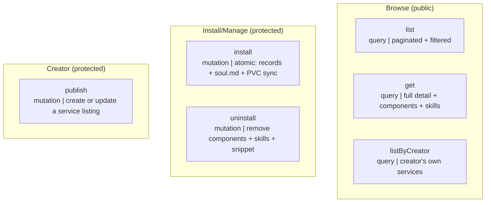
```mermaid
graph TD
    subgraph Browse["Browse (public)"]
        SV1["list<br/>query | paginated + filtered"]
        SV2["get<br/>query | full detail + components + skills"]
        SV6["listByCreator<br/>query | creator's own services"]
    end

    subgraph Install["Install/Manage (protected)"]
        SV3["install<br/>mutation | atomic: records + soul.md + PVC sync"]
        SV4["uninstall<br/>mutation | remove components + skills + snippet"]
    end

    subgraph Creator["Creator (protected)"]
        SV5["publish<br/>mutation | create or update a service listing"]
    end
```

| Procedure | Type | Auth | Description |
|---|---|---|---|
| `services.list` | query | public | Paginated service browser with category/hostingModel/search filters |
| `services.get` | query | public | Full service detail with components, skills, creator profile |
| `services.install` | mutation | protected | Atomic install: creates `serviceInstalls` + `componentInstalls` + `deploymentSkills` records, appends `instructionSnippet` to soul.md, triggers single `syncConfigsToPvc()`. For hosted services: calls install handshake POST to creator API + stores encrypted per-install HMAC signing secret |
| `services.uninstall` | mutation | protected | Removes `serviceInstalls`, `componentInstalls`, `deploymentSkills` records and strips instruction snippet from soul.md. Triggers `syncConfigsToPvc()` |
| `services.listInstalled` | query | protected | All services installed on a specific deployment |
| `services.publish` | mutation | protected | Create or update a service listing with component/skill associations and ServiceCard JSON |
| `services.listByCreator` | query | public | All services published by a given creator profile |
| `services.getServiceStatus` | query | protected | Health status of an installed service (circuit breaker state, last heartbeat) |
| `services.checkForUpdates` | query | protected | Compare installed service version to latest published version |
| `services.upgradeService` | mutation | protected | Upgrade an installed service to a new version, re-running install handshake if hosted |
| `services.listHostedByDeployment` | query | protected | List hosted services enabled for a specific deployment |
| `services.hostedServiceStats` | query | protected | Aggregate usage stats for a hosted service (calls, errors, p50 latency) |
| `services.creatorInstalls` | query | protected | Install counts and trend for services the caller created |
| `services.creatorUsage` | query | protected | API call volume breakdown for the creator's hosted services |
| `services.rotateSigningSecret` | mutation | protected | Rotate the per-install HMAC signing secret for a hosted service |
| `services.createDraft` | mutation | protected | Create a new unpublished service draft |
| `services.updateDraft` | mutation | protected | Update a draft service listing (metadata, components, skills, ServiceCard) |
| `services.testInstall` | mutation | protected | Dry-run the install handshake against a draft service (validates ServiceCard + connectivity) |
| `services.testUninstall` | mutation | protected | Dry-run the uninstall flow for a draft service |
| `services.submitForReview` | mutation | protected | Submit a draft service for admin review |
| `services.listMyServices` | query | protected | All services owned by the authenticated user (all statuses) |
| `services.adminList` | query | protected (admin) | All services paginated with status filter (admin view) |
| `services.adminApprove` | mutation | protected (admin) | Publish a submitted service |
| `services.adminReject` | mutation | protected (admin) | Reject a submitted service with a reason |
| `services.listDeploymentComponents` | query | protected | Components installed on a deployment via services |
| `services.listDeploymentSkills` | query | protected | Skills installed on a deployment via services |

#### ServiceCard (Hosted Services)

For hosted services (`hostingModel: "hosted"`), the publisher provides a **ServiceCard** JSON blob describing their remote API:

```typescript
{
  remoteApiEndpoint: string          // Creator's API base URL
  authType: "hmac" | "bearer"        // Authentication method
  skills: [
    {
      name: string                   // Skill identifier (routes proxy requests)
      description: string
      inputSchema?: object           // JSON Schema for input validation
      outputSchema?: object          // JSON Schema for output validation (warn-only)
    }
  ]
  rateLimits?: {
    requestsPerMinute?: number       // Per-deployment+service rate limit
    requestsPerDay?: number
  }
  health?: {
    endpoint: string                 // GET endpoint for health checks
    intervalMinutes?: number
  }
}
```

Buyer pods never call creator APIs directly — all requests go through `POST /api/services/proxy/:deploymentId/:serviceId/:skillName`, which:
1. Looks up `serviceCredentials` (per-install HMAC signing secret)
2. Validates input against the skill's `inputSchema`
3. Checks per-deployment+service rate limit (from ServiceCard)
4. Checks circuit breaker (open after 5 consecutive failures, 60s reset)
5. Adds `Authorization` and `X-Jarble-Signature` (HMAC-SHA256) headers
6. Forwards request body to creator API
7. Validates response against `outputSchema` (warn-only)

---

### Benchmarks Router (14 procedures)

The benchmarks router implements the Agent Forking Flywheel discovery layer: a hierarchical domain taxonomy, per-deployment multi-axis ratings, leaderboards, service performance metrics, and admin curation tools.

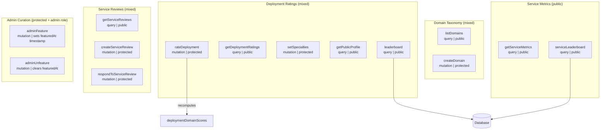
```mermaid
graph TD
    subgraph Domains["Domain Taxonomy (mixed)"]
        BM1["listDomains<br/>query | public"]
        BM2["createDomain<br/>mutation | protected"]
    end

    subgraph Ratings["Deployment Ratings (mixed)"]
        BM3["rateDeployment<br/>mutation | protected"]
        BM4["getDeploymentRatings<br/>query | public"]
        BM5["setSpecialties<br/>mutation | protected"]
        BM6["getPublicProfile<br/>query | public"]
        BM7["leaderboard<br/>query | public"]
    end

    subgraph ServiceMetrics["Service Metrics (public)"]
        BM8["getServiceMetrics<br/>query | public"]
        BM9["serviceLeaderboard<br/>query | public"]
    end

    subgraph ServiceReviews["Service Reviews (mixed)"]
        BM10["getServiceReviews<br/>query | public"]
        BM11["createServiceReview<br/>mutation | protected"]
        BM12["respondToServiceReview<br/>mutation | protected"]
    end

    subgraph Admin["Admin Curation (protected + admin role)"]
        BM13["adminFeature<br/>mutation | sets featuredAt timestamp"]
        BM14["adminUnfeature<br/>mutation | clears featuredAt"]
    end

    BM3 -->|"recomputes"| SCORES["deploymentDomainScores"]
    BM7 --> DB[("Database")]
    BM9 --> DB
```

| Procedure | Type | Auth | Input | Description |
|---|---|---|---|---|
| `benchmarks.listDomains` | query | public | `{ parentId? }` | List root domains (parentId omitted) or children of a parent |
| `benchmarks.createDomain` | mutation | protected | `{ name (kebab-case slug), displayName, description?, parentId?, icon? }` | Create a new domain. Name must be unique kebab-case |
| `benchmarks.rateDeployment` | mutation | protected | `{ deploymentId, domainId, accuracy, helpfulness, creativity: 1-5, comment? }` | Upsert a rating for a deployment in a domain. Recomputes `deploymentDomainScores` aggregates (avg * 100 scale, confidence: low/medium/high) |
| `benchmarks.getDeploymentRatings` | query | public | `{ deploymentId }` | All ratings for a deployment with domain names |
| `benchmarks.setSpecialties` | mutation | protected | `{ deploymentId, specialties: string[], bio?, showcasePrompts? }` | Set public profile fields. Ownership verified |
| `benchmarks.getPublicProfile` | query | public | `{ deploymentId }` | Full public profile: name, specialties, bio, showcase prompts, domain scores, installed services, fork stats. Requires `isPublic: true` |
| `benchmarks.leaderboard` | query | public | `{ domainSlug, metric: overall\|accuracy\|helpfulness\|creativity, limit: 1-100 }` | Domain leaderboard. Filters public deployments with >= 3 ratings |
| `benchmarks.getServiceMetrics` | query | public | `{ serviceId, period: 24h\|7d\|30d }` | Service benchmark aggregates (latency, uptime, error rate) for a time period |
| `benchmarks.serviceLeaderboard` | query | public | `{ metric: reliability\|speed\|popularity, limit: 1-100 }` | Service leaderboard by reliability (uptime), speed (p50 latency), or popularity (install count) |
| `benchmarks.getServiceReviews` | query | public | `{ serviceId, limit, offset }` | Paginated service reviews with creator responses and user names |
| `benchmarks.createServiceReview` | mutation | protected | `{ serviceId, rating: 1-5, title?, body? }` | Submit a service review. One review per user per service. Recomputes `avgRating` on `marketplaceServices` |
| `benchmarks.respondToServiceReview` | mutation | protected | `{ reviewId, response }` | Service creator responds to a review. Ownership verified via `creatorProfiles` |
| `benchmarks.adminFeature` | mutation | protected (admin) | `{ deploymentId }` | Set `featuredAt` timestamp on a public deployment. Adds +10 pts to forkability score |
| `benchmarks.adminUnfeature` | mutation | protected (admin) | `{ deploymentId }` | Clear `featuredAt` timestamp |

---

### Flows Router (8 procedures)

The flows router provides CRUD for orchestration flow definitions and execution history. Flows are visual DAGs (directed acyclic graphs) of nodes and edges that chain deployments, transforms, conditions, and outputs into multi-step agent pipelines. Node types: `deployment`, `transform`, `condition`, `output`.

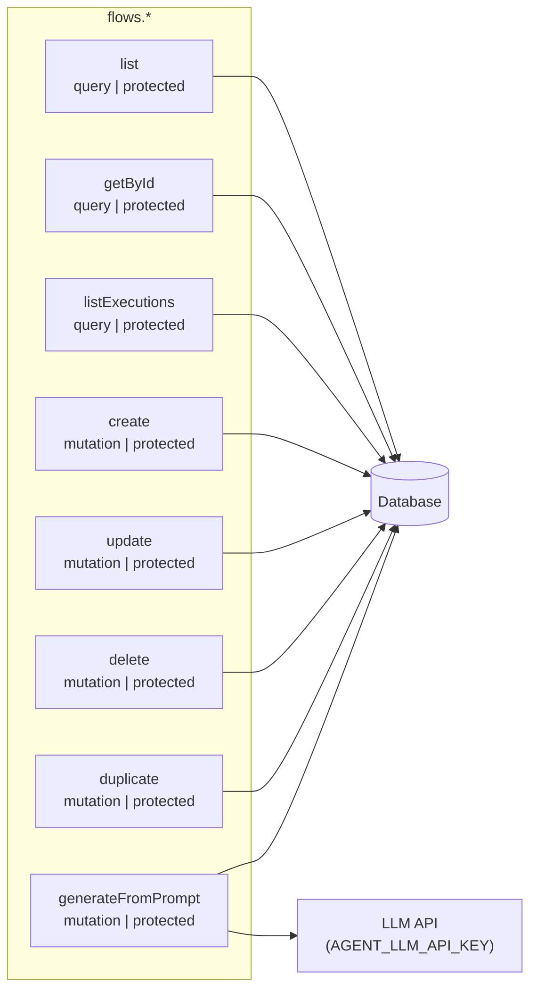
```mermaid
graph LR
    subgraph flows["flows.*"]
        LIST["list<br/>query | protected"]
        BYID["getById<br/>query | protected"]
        EXECS["listExecutions<br/>query | protected"]
        CREATE["create<br/>mutation | protected"]
        UPDATE["update<br/>mutation | protected"]
        DELETE["delete<br/>mutation | protected"]
        DUP["duplicate<br/>mutation | protected"]
        GEN["generateFromPrompt<br/>mutation | protected"]
    end

    LIST --> DB[("Database")]
    BYID --> DB
    EXECS --> DB
    CREATE --> DB
    UPDATE --> DB
    DELETE --> DB
    DUP --> DB
    GEN --> LLM["LLM API<br/>(AGENT_LLM_API_KEY)"]
    GEN --> DB
```

| Procedure | Type | Input | Description |
|---|---|---|---|
| `flows.list` | query | `{ status?, limit?, offset? }` | List the current user's flows. Optional `status` filter: `draft`, `published`, `archived`. Ordered by `updatedAt` descending |
| `flows.getById` | query | `{ id }` | Single flow with up to 20 recent executions included |
| `flows.listExecutions` | query | `{ flowId, limit?, offset? }` | Paginated execution history for a flow |
| `flows.create` | mutation | `{ name, description?, definition, status? }` | Create a new flow. `definition` is `{ nodes: FlowNode[], edges: FlowEdge[] }`. Returns `{ id }` |
| `flows.update` | mutation | `{ id, name?, description?, definition?, status?, isPublic? }` | Update an existing flow. Verifies ownership |
| `flows.delete` | mutation | `{ id, hard?: boolean }` | Soft-delete (archive) or hard-delete a flow. Hard delete cascades to executions |
| `flows.duplicate` | mutation | `{ sourceFlowId, name? }` | Fork a flow (own or public). Sets `forkedFromId`, increments source `forkCount`. Returns `{ id }` |
| `flows.generateFromPrompt` | mutation | `{ prompt, availableDeployments? }` | Call the Workflow Agent LLM to generate a `FlowDefinition` from a natural language description. Returns `{ definition, summary, estimatedSteps, parallelizable }` — unsaved, ready to pass to `create` |

#### Flow Node Schema

```typescript
{
  id: string                         // Unique within the flow
  type: "deployment" | "transform" | "condition" | "output"
  label: string                      // Display name
  position: { x: number, y: number } // Canvas position
  deploymentId?: string              // References a user deployment (type="deployment")
  serviceId?: string                 // Marketplace service
  skillName?: string                 // Skill to invoke
  config?: Record<string, unknown>   // Node-specific configuration
}
```

---

### Admin Router (19 procedures)

The admin router is gated by `adminProcedure` — the caller must have `role: "super_admin"` in the database (set by `ADMIN_USER_IDS` env var on first login, or via `admin.updateUserRole`). All mutations write to the audit log.

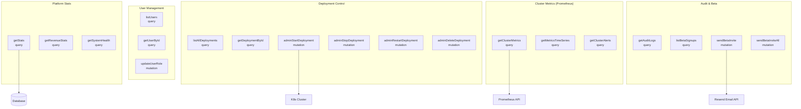
```mermaid
graph TD
    subgraph Stats["Platform Stats"]
        A1["getStats<br/>query"]
        A2["getRevenueStats<br/>query"]
        A3["getSystemHealth<br/>query"]
    end

    subgraph Users["User Management"]
        A4["listUsers<br/>query"]
        A5["getUserById<br/>query"]
        A6["updateUserRole<br/>mutation"]
    end

    subgraph Deployments["Deployment Control"]
        A7["listAllDeployments<br/>query"]
        A8["getDeploymentById<br/>query"]
        A9["adminStartDeployment<br/>mutation"]
        A10["adminStopDeployment<br/>mutation"]
        A11["adminRestartDeployment<br/>mutation"]
        A12["adminDeleteDeployment<br/>mutation"]
    end

    subgraph Metrics["Cluster Metrics (Prometheus)"]
        A13["getClusterMetrics<br/>query"]
        A14["getMetricsTimeSeries<br/>query"]
        A15["getClusterAlerts<br/>query"]
    end

    subgraph Audit["Audit & Beta"]
        A16["getAuditLogs<br/>query"]
        A17["listBetaSignups<br/>query"]
        A18["sendBetaInvite<br/>mutation"]
        A19["sendBetaInviteAll<br/>mutation"]
    end

    A1 --> DB[("Database")]
    A13 --> PROM["Prometheus API"]
    A9 --> K8S["K8s Cluster"]
    A18 --> EMAIL["Resend Email API"]
```

| Procedure | Type | Input | Description |
|---|---|---|---|
| `admin.getStats` | query | -- | Platform totals: users, deployments (active + total), chat sessions, total revenue cents |
| `admin.listUsers` | query | `{ page?, limit?, search? }` | Paginated user list with deployment counts. `search` matches name or email |
| `admin.getUserById` | query | `{ userId }` | User detail with their deployments. Excludes sensitive fields (`llmApiKey`, `auth0Id`) |
| `admin.updateUserRole` | mutation | `{ userId, role: "user" \| "super_admin" }` | Promote or demote a user. Self-demotion guard: admins cannot remove their own role |
| `admin.listAllDeployments` | query | `{ page?, limit?, status?, search? }` | All deployments across all users with owner email/name joined |
| `admin.getDeploymentById` | query | `{ id }` | Single deployment detail. Excludes `llmApiKey` and other sensitive fields |
| `admin.adminStartDeployment` | mutation | `{ id }` | Start a deployment on behalf of any user. Writes audit log |
| `admin.adminStopDeployment` | mutation | `{ id }` | Stop a deployment on behalf of any user. Writes audit log |
| `admin.adminRestartDeployment` | mutation | `{ id }` | Restart a deployment on behalf of any user. Writes audit log |
| `admin.adminDeleteDeployment` | mutation | `{ id }` | Hard-delete any deployment: removes K8s resources, cancels Stripe subscription, deletes DB record |
| `admin.getRevenueStats` | query | -- | MRR, active subscription count, free deployment count, paid deployment count |
| `admin.getSystemHealth` | query | -- | Deployment status distribution counts (running/stopped/creating/failed/etc.) |
| `admin.getAuditLogs` | query | `{ page?, limit?, action?, userId? }` | Paginated audit log with actor name/email joined. Filterable by action type or user |
| `admin.getClusterMetrics` | query | -- | K8s cluster metrics via Prometheus: per-node CPU/memory/disk %, running pod count, recent restarts. Returns `{ available: false }` if Prometheus unreachable |
| `admin.getMetricsTimeSeries` | query | `{ queryKey, range: "1h"\|"6h"\|"24h"\|"7d" }` | Time-series data for a Prometheus metric query key over the given range |
| `admin.getClusterAlerts` | query | -- | Active Prometheus alerting rules. Returns `{ available: false }` if Prometheus unreachable |
| `admin.listBetaSignups` | query | `{ status?: "pending"\|"invited"\|"all" }` | Beta waitlist signups. Includes `emailConfigured` flag |
| `admin.sendBetaInvite` | mutation | `{ signupId }` | Send beta welcome email to one signup via Resend. Marks status as `invited`. Requires `RESEND_API_KEY` |
| `admin.sendBetaInviteAll` | mutation | -- | Batch-send beta invites to all `pending` signups. Returns `{ sent, failed, total }` |

---

### Agent Credits Router (4 procedures)

| Procedure | Type | Auth | Input | Description |
|---|---|---|---|---|
| `agentCredits.getBalance` | query | protected | -- | Current credit balance for the authenticated user |
| `agentCredits.getHistory` | query | protected | `{ limit?, offset? }` | Paginated credit transaction history |
| `agentCredits.purchase` | mutation | protected | `{ credits: number }` | Initiate a credit purchase via Stripe checkout |
| `agentCredits.getCallHistory` | query | protected | `{ limit?, offset? }` | History of agent-to-agent calls made by the user with credits charged |

---

### API Keys Router (4 procedures)

| Procedure | Type | Auth | Input | Description |
|---|---|---|---|---|
| `apiKeys.list` | query | protected | -- | All API keys for the authenticated user (hashed values, prefix shown) |
| `apiKeys.create` | mutation | protected | `{ name, scopes }` | Create a new API key (`jrbl_...` prefix, SHA-256 hashed). Returns the plaintext key once only |
| `apiKeys.revoke` | mutation | protected | `{ keyId }` | Permanently revoke an API key |
| `apiKeys.getUsage` | query | protected | `{ keyId }` | Request counts and last-used timestamp for a key |

---

## 5. REST Endpoints

REST endpoints handle use cases that don't fit tRPC: webhooks (external POST), SSE streaming (long-lived connections), and file uploads.

### Webhooks

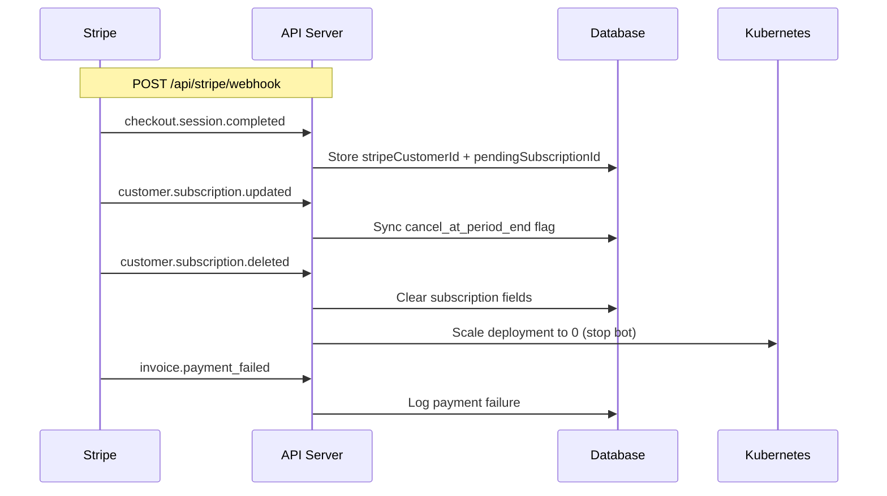
```mermaid
sequenceDiagram
    participant Stripe
    participant API as API Server
    participant DB as Database
    participant K8S as Kubernetes

    Note over Stripe,API: POST /api/stripe/webhook
    Stripe->>API: checkout.session.completed
    API->>DB: Store stripeCustomerId + pendingSubscriptionId

    Stripe->>API: customer.subscription.updated
    API->>DB: Sync cancel_at_period_end flag

    Stripe->>API: customer.subscription.deleted
    API->>DB: Clear subscription fields
    API->>K8S: Scale deployment to 0 (stop bot)

    Stripe->>API: invoice.payment_failed
    API->>DB: Log payment failure
```

| Method | Path | Auth | Rate Limit | Description |
|---|---|---|---|---|
| POST | `/api/stripe/webhook` | Stripe signature (`stripe-signature` header) | Exempt | Handles 4 event types: `checkout.session.completed`, `customer.subscription.updated`, `customer.subscription.deleted`, `invoice.payment_failed`. **Idempotent** — deduplicates via `processedWebhookEvents` table |
| POST | `/api/auth0/email-verified` | M2M Bearer secret (`AUTH0_M2M_SECRET`) | Exempt | Auth0 Post Login Action webhook. Updates `emailVerified` flag in DB |
| POST | `/api/config-changed` | deploymentId in body | Global | Called by pod file-watcher when PVC config files change. Triggers reverse sync (PVC → DB) |
| POST | `/api/tambo-agent` | JWT Bearer | 120 req/min | Chat endpoint. Streams bot response as SSE with text deltas and `jarble_ui` UI block events. Proxies to pod via OpenClaw gateway. `sendEvent` is wrapped in try/catch — non-serializable data sends a fallback error event instead of crashing the stream |
| POST | `/api/beta-signup` | None | Global | Public beta waitlist signup. Body: `{ name, email, useCase?, experience? }`. Stores in `beta_signups` table. Returns `{ success: true }` |

---

### Payment Routes

| Method | Path | Auth | Rate Limit | Description |
|---|---|---|---|---|
| POST | `/api/stripe/checkout` | JWT Bearer | 10 req/min per user | Creates Stripe checkout session. Returns checkout URL or portal redirect flag |
| POST | `/api/stripe/portal` | JWT Bearer | 10 req/min per user | Creates Stripe billing portal session for subscription management |

---

### SSE Streaming

All SSE endpoints accept JWT via `Authorization` header **or** `?token=` query parameter (EventSource can't set headers).

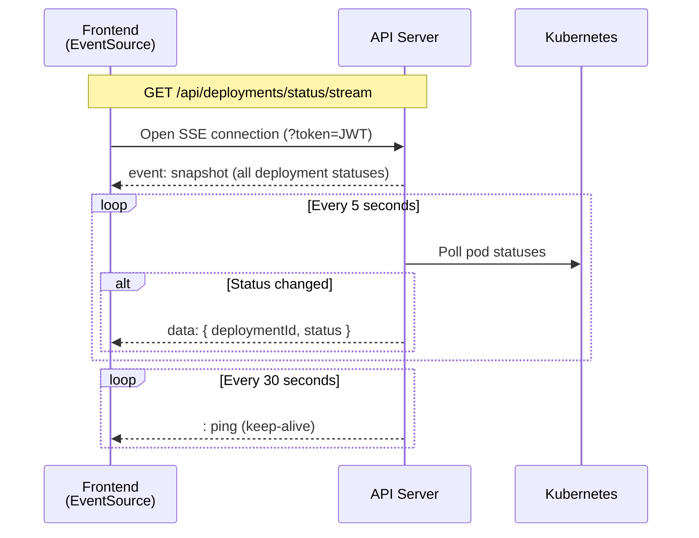
```mermaid
sequenceDiagram
    participant FE as Frontend<br/>(EventSource)
    participant API as API Server
    participant K8S as Kubernetes

    Note over FE,API: GET /api/deployments/status/stream
    FE->>API: Open SSE connection (?token=JWT)
    API-->>FE: event: snapshot (all deployment statuses)

    loop Every 5 seconds
        API->>K8S: Poll pod statuses
        alt Status changed
            API-->>FE: data: { deploymentId, status }
        end
    end

    loop Every 30 seconds
        API-->>FE: : ping (keep-alive)
    end
```

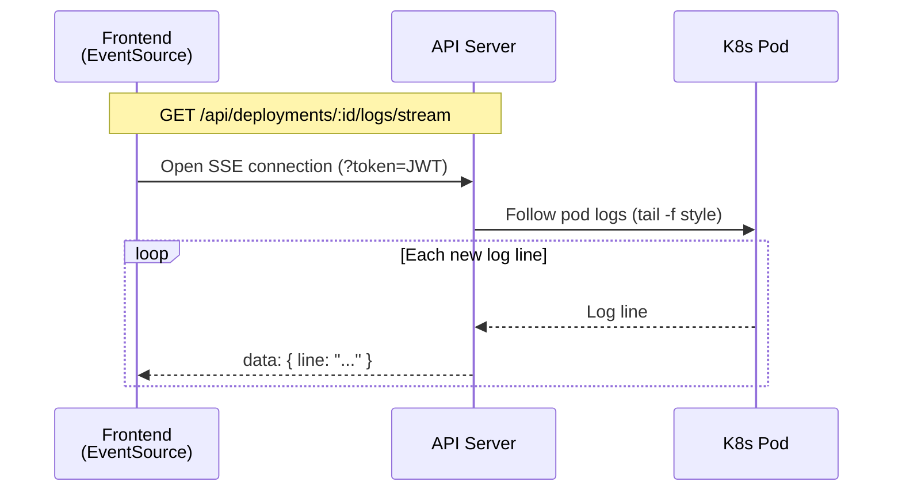
```mermaid
sequenceDiagram
    participant FE as Frontend<br/>(EventSource)
    participant API as API Server
    participant K8S as K8s Pod

    Note over FE,API: GET /api/deployments/:id/logs/stream
    FE->>API: Open SSE connection (?token=JWT)

    API->>K8S: Follow pod logs (tail -f style)

    loop Each new log line
        K8S-->>API: Log line
        API-->>FE: data: { line: "..." }
    end
```

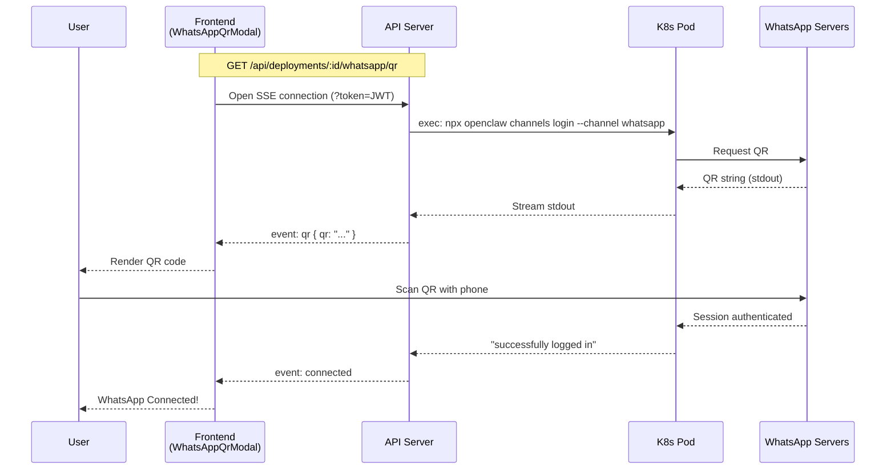
```mermaid
sequenceDiagram
    participant User
    participant FE as Frontend<br/>(WhatsAppQrModal)
    participant API as API Server
    participant K8S as K8s Pod
    participant WA as WhatsApp Servers

    Note over FE,API: GET /api/deployments/:id/whatsapp/qr
    FE->>API: Open SSE connection (?token=JWT)
    API->>K8S: exec: npx openclaw channels login --channel whatsapp

    K8S->>WA: Request QR
    WA-->>K8S: QR string (stdout)
    K8S-->>API: Stream stdout
    API-->>FE: event: qr { qr: "..." }
    FE-->>User: Render QR code

    User->>WA: Scan QR with phone
    WA-->>K8S: Session authenticated
    K8S-->>API: "successfully logged in"
    API-->>FE: event: connected
    FE-->>User: WhatsApp Connected!
```

| Method | Path | Auth | Events | Description |
|---|---|---|---|---|
| GET | `/api/deployments/status/stream` | JWT (header or `?token=`) | `snapshot`, delta `data`, `: ping` | Real-time status for all user deployments. Polls K8s every 5s, sends deltas |
| GET | `/api/deployments/:id/logs/stream` | JWT (header or `?token=`) | `data` (log lines), `end`, `error`, `: ping` | Live pod log streaming. `?tailLines=` (default 100, max 1000) |
| GET | `/api/deployments/:id/whatsapp/qr` | JWT (header or `?token=`) | `qr`, `connected`, `log`, `timeout`, `error`, `: ping` | WhatsApp QR pairing via K8s exec. 90-second timeout |
| POST | `/api/tambo-agent` | JWT Bearer | `TEXT_MESSAGE_START`, `TEXT_MESSAGE_CONTENT` (delta), `TEXT_MESSAGE_END`, `UI_BLOCK_START`, `UI_BLOCK_PROPS`, `UI_BLOCK_END`, `RUN_FINISHED`, `CUSTOM` (`jarble.agent.call.start` / `jarble.agent.call.end`) | Chat SSE. Proxies to OpenClaw gateway. Library URLs validated server-side against TRUSTED_CDN_ORIGINS. Agent call events are fanned out from `agentCallEvents` EventEmitter |

---

### Artifact Workspace

The bot pods maintain a `/data/workspace/` directory with a `manifest.json` (array of artifact metadata) and per-artifact `{id}.json` files. These endpoints exec into the pod to read/write those files, following the same auth + ownership pattern as other pod-exec routes.

| Method | Path | Auth | Rate Limit | Description |
|---|---|---|---|---|
| GET | `/api/deployments/:id/artifact/list` | JWT Bearer | global | List all artifact metadata from pod workspace manifest |
| GET | `/api/deployments/:id/artifact/:artifactId` | JWT Bearer | global | Fetch a single artifact JSON from pod workspace |
| POST | `/api/deployments/:id/artifact/sync` | JWT Bearer | 1 req/s per deployment | Upsert an artifact (create or update) in pod workspace. Rate-limited to prevent excessive exec calls |
| DELETE | `/api/deployments/:id/artifact/:artifactId` | JWT Bearer | global | Delete an artifact from pod workspace and remove from manifest |

### Flow Execution

Flow execution endpoints power the orchestration flow engine. A flow is a directed acyclic graph (DAG) of nodes (deployment calls, transforms, conditions, outputs). Execution is started via POST, which returns an `executionId`. The client connects to the SSE stream endpoint for live progress. Paused flows (human-in-the-loop nodes) are resumed via the resume endpoint.

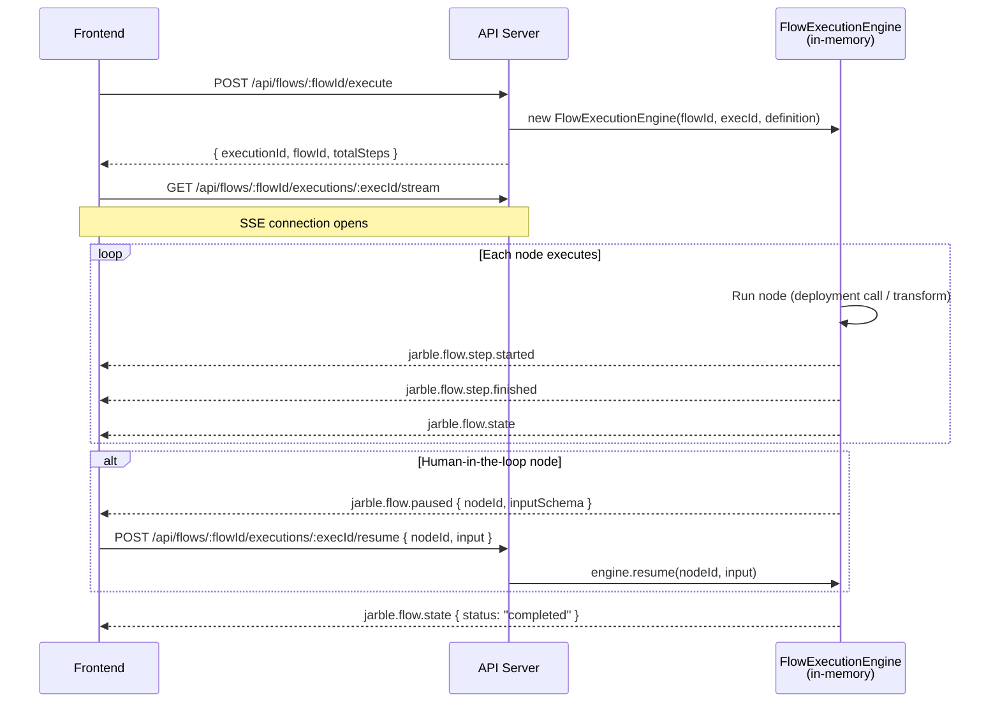
```mermaid
sequenceDiagram
    participant FE as Frontend
    participant API as API Server
    participant ENGINE as FlowExecutionEngine<br/>(in-memory)

    FE->>API: POST /api/flows/:flowId/execute
    API->>ENGINE: new FlowExecutionEngine(flowId, execId, definition)
    API-->>FE: { executionId, flowId, totalSteps }

    FE->>API: GET /api/flows/:flowId/executions/:execId/stream
    Note over FE,API: SSE connection opens

    loop Each node executes
        ENGINE->>ENGINE: Run node (deployment call / transform)
        ENGINE-->>FE: jarble.flow.step.started
        ENGINE-->>FE: jarble.flow.step.finished
        ENGINE-->>FE: jarble.flow.state
    end

    alt Human-in-the-loop node
        ENGINE-->>FE: jarble.flow.paused { nodeId, inputSchema }
        FE->>API: POST /api/flows/:flowId/executions/:execId/resume { nodeId, input }
        API->>ENGINE: engine.resume(nodeId, input)
    end

    ENGINE-->>FE: jarble.flow.state { status: "completed" }
```

| Method | Path | Auth | Rate Limit | Description |
|---|---|---|---|---|
| POST | `/api/flows/:flowId/execute` | JWT Bearer | 5 concurrent per user | Start flow execution. Loads definition from DB (falls back to body for ad-hoc). Returns `{ executionId, flowId, totalSteps }`. Starts engine in background |
| GET | `/api/flows/:flowId/executions/:execId/stream` | JWT (header or `?token=`) | 5 concurrent per user | SSE stream for live execution progress. Sends a `jarble.flow.snapshot` on connect for catchup, then live events |
| POST | `/api/flows/:flowId/executions/:execId/resume` | JWT Bearer | Global | Resume a paused execution at a specific node with user-provided input |

#### Flow SSE Events

| Event Type | When Emitted | Key Fields |
|---|---|---|
| `jarble.flow.snapshot` | On SSE connect (catch-up) | `executionId`, `status`, `stepResults`, `pausedAtNodeId` |
| `jarble.flow.step.started` | Node begins executing | `nodeId`, `label`, `index`, `total` |
| `jarble.flow.step.finished` | Node completes or fails | `nodeId`, `status`, `result`, `error`, `durationMs`, `credits` |
| `jarble.flow.step.iteration` | Node retries (loop) | `nodeId`, `iteration`, `maxIterations` |
| `jarble.flow.state` | After each step | `status`, `completedSteps`, `totalSteps`, `totalCredits` |
| `jarble.flow.paused` | Human-in-the-loop node hit | `nodeId`, `label`, `inputSchema` |
| `jarble.flow.error` | Fatal execution error | `error` |
| `jarble.flow.substep.started` | Nested flow step begins | `parentNodeId`, `nodeId`, `label`, `index`, `total` |
| `jarble.flow.substep.finished` | Nested flow step ends | `parentNodeId`, `nodeId`, `status`, `result`, `error` |

---

### Service Proxy

| Method | Path | Auth | Rate Limit | Description |
|---|---|---|---|---|
| POST | `/api/services/proxy/:deploymentId/:serviceId/:skillName` | JWT Bearer | Per ServiceCard limits | Proxies skill-call requests from buyer deployments to creator remote APIs. Validates `deploymentId` ownership, checks circuit breaker, validates input against skill schema, adds HMAC-SHA256 signature, forwards to creator API. Max response: 1 MB, timeout: 30s |

### Agent Hub

The agent hub enables bot pods to delegate work to other marketplace agents. When `POST /api/agent-hub/call` is handled, it emits on `agentCallEvents` (an in-process EventEmitter), which the active chat SSE handler picks up and forwards to the frontend as `CUSTOM` events named `jarble.agent.call.start` / `jarble.agent.call.end`.

| Method | Path | Auth | Rate Limit | Description |
|---|---|---|---|---|
| POST | `/api/agent-hub/call` | JWT Bearer or `X-Gateway-Token` + `X-Deployment-ID` (pod auth) | global | Execute an agent-to-agent call. Verifies caller deployment ownership, runs `executeAgentCall()`, emits start/end events on `agentCallEvents`. Returns `{ success, result, creditsCharged, callId }`. 402 on insufficient credits, 404 on unknown agent |
| GET | `/api/agent-hub/discover` | None | global | Search published marketplace services. Query params: `q` (text search), `category`, `limit` (max 50, default 20). Returns services with their skill list and `creditsPerCall` |

#### Agent Call SSE Event Flow

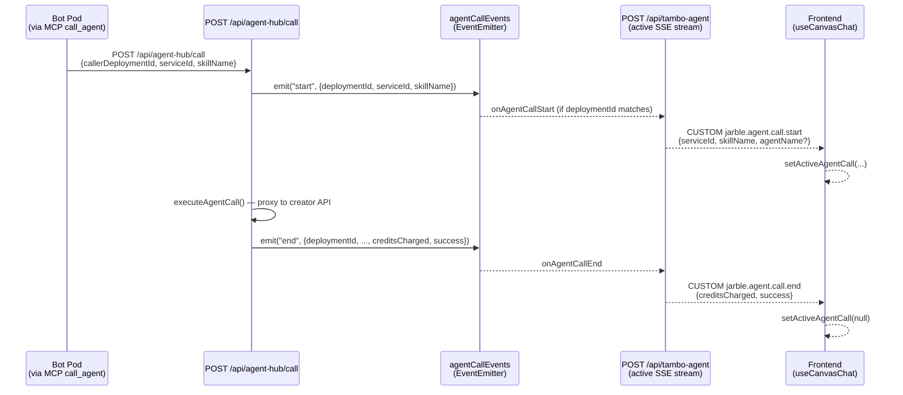
```mermaid
sequenceDiagram
    participant Pod as Bot Pod<br/>(via MCP call_agent)
    participant HUB as POST /api/agent-hub/call
    participant EE as agentCallEvents<br/>(EventEmitter)
    participant SSE as POST /api/tambo-agent<br/>(active SSE stream)
    participant FE as Frontend<br/>(useCanvasChat)

    Pod->>HUB: POST /api/agent-hub/call<br/>{callerDeploymentId, serviceId, skillName}
    HUB->>EE: emit("start", {deploymentId, serviceId, skillName})
    EE-->>SSE: onAgentCallStart (if deploymentId matches)
    SSE-->>FE: CUSTOM jarble.agent.call.start<br/>{serviceId, skillName, agentName?}
    FE-->>FE: setActiveAgentCall(...)

    HUB->>HUB: executeAgentCall() — proxy to creator API
    HUB->>EE: emit("end", {deploymentId, ..., creditsCharged, success})
    EE-->>SSE: onAgentCallEnd
    SSE-->>FE: CUSTOM jarble.agent.call.end<br/>{creditsCharged, success}
    FE-->>FE: setActiveAgentCall(null)
```

### Diagnostic & MCP

| Method | Path | Auth | Description |
|---|---|---|---|
| GET | `/api/deployments/:id/diagnose` | JWT Bearer | Health diagnostics for a deployment. Runs pod status, storage, and gateway connectivity checks with per-check 5s timeouts. Returns `overallHealth: "healthy" \| "degraded" \| "unhealthy"` + per-check details and suggestions |
| POST | `/api/deployments/:id/mcp/invoke` | JWT Bearer | MCP tool call proxy. Routes allowed tool calls (save_canvas_file, render_ui, list_components, etc.) to the bot pod via K8s exec |
| POST | `/api/mcp/:deploymentId` | JWT Bearer | MCP Streamable HTTP — initialize and call tools (Claude Desktop, Cursor, external clients) |
| GET | `/api/mcp/:deploymentId` | JWT Bearer | MCP SSE stream for server-to-client notifications (keyed by `mcp-session-id` header) |
| DELETE | `/api/mcp/:deploymentId` | JWT Bearer | Close and clean up an MCP session |

### Public REST API

Unauthenticated endpoints for the Agent Forking Flywheel discovery layer. Intended for embed widgets, partner integrations, and external consumers. Served at `/api/public/*`.

| Method | Path | Auth | Cache | Description |
|---|---|---|---|---|
| GET | `/api/public/leaderboard/:domainSlug` | None | 60s public | Domain leaderboard. Query params: `metric` (overall/accuracy/helpfulness/creativity), `limit` (1-100). Includes forkability score for each entry. Minimum 3 ratings required |
| GET | `/api/public/agents/:deploymentId/profile` | None | 30s public | Full public agent profile: specialties, bio, showcase prompts, domain scores, installed services, fork count, forkability score. Returns 404 if not public |

### Pod Compose

| Method | Path | Auth | Description |
|---|---|---|---|
| POST | `/api/pod/compose` | Pod gateway token (`X-Deployment-Id` + `X-Gateway-Token`) | Fans out up to 8 component agent calls in parallel via `Promise.allSettled()`. Body: `{ title, components: [{ intent, style?, data? }], theme? }`. Returns `{ blocks: jarble_ui[], dashboardId, errors[] }`. Each block is a serialized sandbox component. Timeout: 60s per component. Uses `AGENT_LLM_API_KEY` / `AGENT_LLM_PROVIDER` / `AGENT_LLM_MODEL` |

### Health & Debug

| Method | Path | Auth | Description |
|---|---|---|---|
| GET | `/health` | None | K8s liveness/readiness probe. Returns `{ status: "ok", timestamp }` |
| GET | `/debug/db` | None | **Dev only** (`NODE_ENV=development`). Dumps all DB tables |
| POST | `/debug/deployment/:id/status` | None | **Dev only**. Force-set a deployment's status |
| POST | `/debug/seed-deployment` | None | **Dev only**. Seed a test deployment |
| POST | `/debug/deployment/:id/sync-config` | None | **Dev only**. Trigger a config sync |

---

## 6. Summary Table

| Category | Count | Auth | Rate Limit | Streaming |
|----------|-------|------|-----------|-----------|
| tRPC Queries | 87 | public/protected/admin | 120 req/min | No |
| tRPC Mutations | 87 | protected/admin | 120 req/min | No |
| REST Webhooks | 5 | signature/M2M/deploymentId/none/none | global/exempt | No |
| REST Payment | 2 | JWT Bearer | 10 req/min | No |
| REST Chat | 1 | JWT Bearer | 120 req/min | Yes |
| REST Artifact | 4 | JWT Bearer | global/1/s | No |
| REST Flow Execution | 3 | JWT Bearer | 5 concurrent | Mixed |
| REST Service Proxy | 1 | JWT Bearer | Per ServiceCard | No |
| REST Agent Hub | 2 | JWT/gateway or none | global | No |
| REST Public API | 2 | None | global | No |
| REST Pod Compose | 1 | Pod gateway token | global | No |
| SSE Streams | 3 | JWT (header or query) | 120 req/min | Yes |
| MCP Endpoints | 5 | JWT Bearer | global | Mixed |
| Health/Debug | 5 | none | exempt | No |
| **Total** | **208** | -- | -- | -- |

### Quick Reference by Router

| Router | Queries | Mutations | Total |
|--------|---------|-----------|-------|
| `deployment` | 14 | 23 | 37 |
| `openrouter` | 3 | 7 | 10 |
| `user` | 2 | 4 | 6 |
| `runtimeCatalog` | 4 | 0 | 4 |
| `billing` | 4 | 0 | 4 |
| `platformCredentials` | 2 | 5 | 7 |
| `template` | 4 | 0 | 4 |
| `skills` | 2 | 2 | 4 |
| `marketplace` | 12 | 11 | 23 |
| `services` | 14 | 12 | 26 |
| `benchmarks` | 7 | 7 | 14 |
| `flows` | 3 | 5 | 8 |
| `admin` | 12 | 7 | 19 |
| `agentCredits` | 3 | 1 | 4 |
| `apiKeys` | 2 | 2 | 4 |
| **tRPC Total** | **88** | **86** | **174** |
| REST endpoints | -- | -- | **34** |
| **Grand Total** | -- | -- | **208** |

### Key Files

| File | What It Contains |
|---|---|
| `jarble-api-main/src/index.ts` | Express server — mounts all route modules |
| `jarble-api-main/src/routes/sse.ts` | SSE streams: status, logs, whatsapp/qr |
| `jarble-api-main/src/routes/tamboAgent.ts` | POST /api/tambo-agent chat SSE endpoint |
| `jarble-api-main/src/routes/canvasFiles.ts` | POST /api/deployments/:id/mcp/invoke proxy |
| `jarble-api-main/src/routes/mcp.ts` | MCP Streamable HTTP (POST/GET/DELETE) |
| `jarble-api-main/src/routes/diagnose.ts` | GET /api/deployments/:id/diagnose |
| `jarble-api-main/src/trpc/index.ts` | tRPC router composition (15 routers) |
| `jarble-api-main/src/trpc/middleware.ts` | `publicProcedure`, `protectedProcedure`, `adminProcedure` definitions |
| `jarble-api-main/src/middleware/rateLimit.ts` | Three-tier rate limiting configuration |
| `jarble-api-main/src/services/auth.ts` | Auth0 JWT verification + user provisioning |
| `jarble-api-main/src/services/stripe.ts` | Stripe checkout, portal, subscriptions |
| `jarble-api-main/src/services/configSync.ts` | Two-way PVC config sync + K8s Secret update |
| `jarble-api-main/src/services/openclawGateway.ts` | WebSocket + exec chat with OpenClaw |
| `jarble-api-main/src/services/manifestValidator.ts` | Marketplace component manifest validation |
| `jarble-api-main/src/services/statusReconciler.ts` | Background DB↔K8s status reconciler |
| `jarble-api-main/src/services/subscriptionEnforcement.ts` | Background subscription validation (5-min cycle) |
| `jarble-api-main/src/services/storageEnforcement.ts` | Background storage quota enforcement (5-min cycle) |
| `jarble-api-main/src/utils/uiBlockParser.ts` | Brace-depth jarble_ui parser + library URL validation |
| `jarble-api-main/src/utils/pricing.ts` | Hardware-based pricing calculator ($10/vCPU, $2.50/GB RAM, $0.08/GB storage) |
| `jarble-api-main/src/trpc/routers/deployment.ts` | 37 procedures (CRUD, lifecycle, billing, canvas components) |
| `jarble-api-main/src/trpc/routers/openrouter.ts` | 10 procedures (LLM key management) |
| `jarble-api-main/src/trpc/routers/user.ts` | 6 procedures (profile, email verification, account deletion) |
| `jarble-api-main/src/trpc/routers/billing.ts` | 4 procedures (overview, invoices, subscriptions, managed key usage) |
| `jarble-api-main/src/trpc/routers/platformCredentials.ts` | 7 procedures (credential CRUD, WhatsApp QR, Telegram pairing) |
| `jarble-api-main/src/trpc/routers/runtimeCatalog.ts` | 4 procedures (runtime listing) |
| `jarble-api-main/src/trpc/routers/skills.ts` | 4 procedures (skills catalog, install/uninstall) |
| `jarble-api-main/src/trpc/routers/marketplace.ts` | 23 procedures (browse, install, review, creator, admin, builtin schemas) |
| `jarble-api-main/src/trpc/routers/services.ts` | 26 procedures (service marketplace full lifecycle + admin + creator analytics) |
| `jarble-api-main/src/trpc/routers/template.ts` | 4 procedures (persona templates) |
| `jarble-api-main/src/trpc/routers/flows.ts` | 8 procedures (flow CRUD, executions, LLM-based generation) |
| `jarble-api-main/src/trpc/routers/admin.ts` | 19 procedures (user mgmt, deployment control, Prometheus metrics, audit logs, beta signups) |
| `jarble-api-main/src/trpc/routers/agentCredits.ts` | 4 procedures (credit balance, history, purchase) |
| `jarble-api-main/src/trpc/routers/apiKeys.ts` | 4 procedures (CRUD for developer API keys) |
| `jarble-api-main/src/routes/artifact.ts` | GET/POST/DELETE /api/deployments/:id/artifact/* (workspace artifact sync) |
| `jarble-api-main/src/routes/flowExecution.ts` | POST /execute, GET /stream, POST /resume (flow execution SSE) |
| `jarble-api-main/src/routes/beta.ts` | POST /api/beta-signup (public beta waitlist) |
| `jarble-api-main/src/services/flowEngine.ts` | `FlowExecutionEngine` — DAG traversal, node execution, pause/resume, SSE events |
| `jarble-api-main/src/services/auditLog.ts` | `logAdminAction()` — writes admin actions to the `audit_logs` table |
| `jarble-api-main/src/services/email.ts` | `sendBetaWelcomeEmail()` via Resend API |
| `jarble-api-main/src/services/prometheus.ts` | Prometheus query wrappers (`queryInstant`, `queryRange`, `getActiveAlerts`) |
| `jarble-api-main/src/routes/serviceProxy.ts` | POST /api/services/proxy/:deploymentId/:serviceId/:skillName (HMAC-signed skill proxy) |
| `jarble-api-main/src/services/serviceCard.ts` | ServiceCard Zod schema for creator API descriptor |
| `jarble-api-main/src/services/circuitBreaker.ts` | Per-service circuit breaker (5 failures → open, 60s reset) |
| `jarble-api-main/src/services/serviceHealthCheck.ts` | Background health pinger for remote services (5-min cycle) |
| `jarble-api-main/src/utils/hmac.ts` | HMAC-SHA256 request signing (generateSigningSecret, signRequest) |
| `jarble-api-main/src/utils/agentCallEvents.ts` | In-process EventEmitter bridge for agent-to-agent call notifications (start/end events) |
| `jarble-api-main/src/routes/agentHub.ts` | POST /api/agent-hub/call and GET /api/agent-hub/discover |
| `jarble-api-main/src/utils/jsonSchemaValidation.ts` | JSON Schema validator for service skill input/output |
| `jarble-api-main/src/middleware/serviceRateLimit.ts` | Per-deployment+service rate limiter (from ServiceCard limits) |
| `shared/component-manifest/index.ts` | COMPONENT_MANIFEST + derived exports — consumed by all layers |
| `scripts/check-manifest.ts` | CI check verifying manifest ↔ registry sync |
| `jarble-api-main/src/trpc/routers/benchmarks.ts` | 14 procedures (domain taxonomy, ratings, leaderboard, service metrics, service reviews, admin curation) |
| `jarble-api-main/src/routes/publicApi.ts` | GET /api/public/leaderboard/:domainSlug and GET /api/public/agents/:deploymentId/profile |
| `jarble-api-main/src/routes/compose.ts` | POST /api/pod/compose — parallel dashboard composition (fan-out to component agent) |
| `jarble-api-main/src/utils/forkability.ts` | computeForkabilityScore() — 0-100 score from 7 criteria |
| `jarble-api-main/src/k8s/constants.ts` | RESOURCE_TIERS — small/medium/large resource presets for platform agents |
